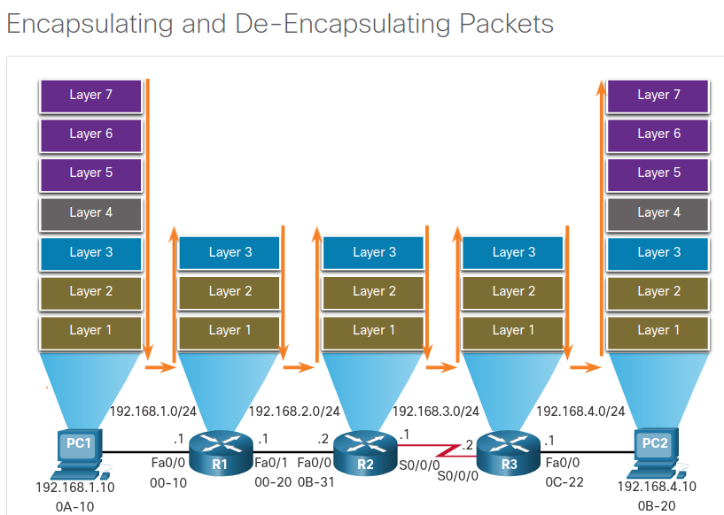
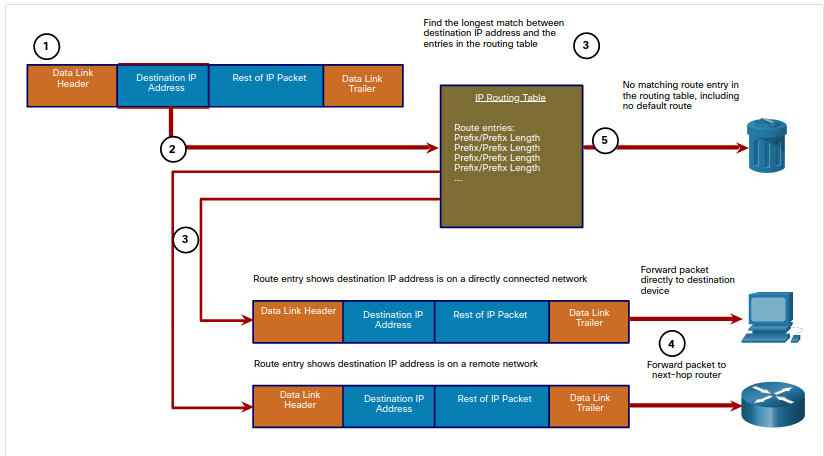
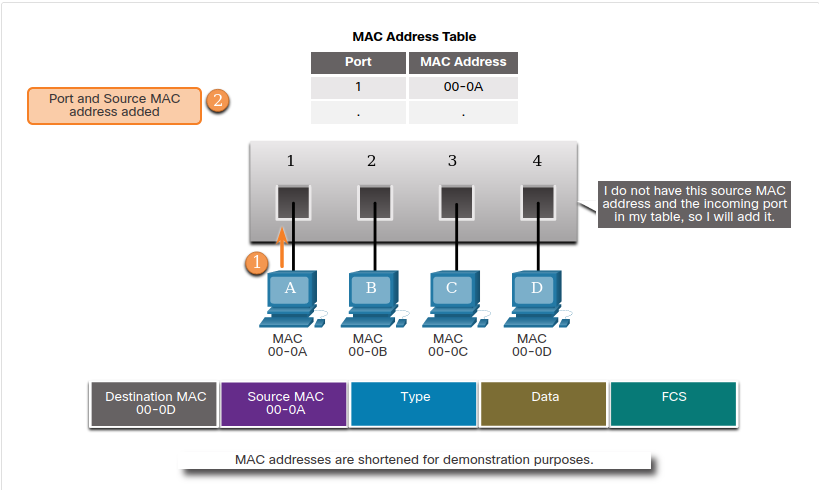
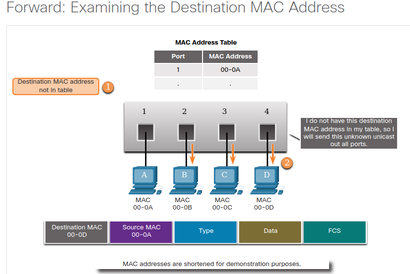
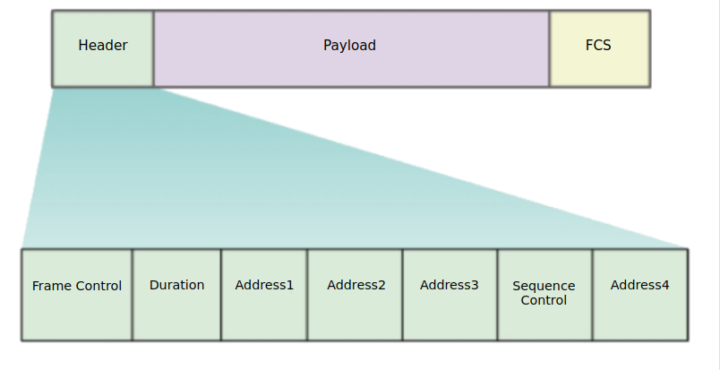

# Network Communication Devices

## Why Should I Take this Module?

The **network infrastructure defines the way in which devices are connected together to achieve end-to-end communications**. Just as there are many sizes of networks, there are also many ways to build an infrastructure. However, there are some standard designs that the network industry recommends achieving networks that are available and secure. This module covers the basic operation of network infrastructures, including wired and wireless networks.

## Network Devices

### End devices

The **network devices that people are most familiar with are end devices**. **To distinguish one end device from another**, **each end device on a network has an address**. When **an end device initiates communication**, it **uses the address of the destination end device to specify where to deliver the message**. **An end device is either the source or destination of a message transmitted over the network**.

### Routers

**Routers are devices that operate at the OSI network layer (L3)**. **Routers are used to interconnect remote sites**. **They use the process of routing to forward data packets between networks**. The **routing process uses network routing tables**, **protocols**, **and algorithms to determine the most efficient path for forwarding an IP packet**. Routers gather routing information and update other routers about changes in the network. Routers increase the scalability of networks by segmenting broadcast domains.

Routers have two primary functions: **path determination and packet forwarding**. **To perform path determination, each router builds and maintains a routing table which is a database of known networks and how to reach them**. **The routing table can be built manually and contain static routes or can be built using a dynamic routing protocol**.

**Packet forwarding is accomplished by using a switching function**. **Switching is the process used by a router to accept a packet on one interface and forward it out of another interface**. **A primary responsibility of the switching function is to encapsulate packets in the appropriate data link frame type for the outgoing data link**.

**After the router has determined the exit interface using the path determination function, the router must encapsulate the packet into the data link frame of the outgoing interface**.

What does a router do with a packet received from one network and destined for another network? **The router performs the following three major steps**:

1. It de-encapsulates the L2 (data link layer) frame header and trailer to expose the Layer 3 (network layer) packet.
2. It examines the destination IP address of the IP packet to find the best path in the routing table.
3. If the router finds a path to the destination, it encapsulates the Layer 3 (network layer) packet into a new Layer 2 (data link layer) frame and forwards that frame out the exit interface.

Devices have L3 (network layer) IPv4 addresses, while Ethernet interfaces have L2 (data link layer) data link addresses. For example, PC1 is configured with IPv4 address 192.168.1.10 and an example MAC address of 0A-10. 

As a packet travels from the source device to the final destination device, the L3 (network layer) IP addresses do not change. This is because the L3 (network layer) PDU does not change. However, the L2 (data link layer) data link addresses change at every router on the path to the destination, as the packet is de-encapsulated and re-encapsulated in a new Layer 2 frame.

### Packet Forwarding Decision Process

Now that the router has determined the best path for a packet based on the longest match, it must determine how to encapsulate the packet and forward it out the correct egress interface.

The figure explains how a router determines the best path to use to forward a packet.

The following steps describe the packet forwarding process:

1. the data link frame with an encapsulated IP packet arrives on the ingress interface
2. the router examines the destination IP address in the packet header and consults its IP routing table
3. the router finds the longest matching prefix in the routing table
4. the router encapsulates the packet in a data link frame and forwards it out the egress interface. The destination could be a device connected to the network or a net-hop router
5. However, if there is no matching route entry the packet is dropped

#### Forwards the packet to a device on a directly connected network

**If the route entry indicates that the egress interface is a directly connected network**, this means that **the destination IP address of the packet belongs to a device on the directly connected network**. Therefore, the **packet can be forwarded directly to the destination device**. The **destination device is typically an end device on an Ethernet LAN**, **which means the packet must be encapsulated in an Ethernet frame**.

To encapsulate the packet in the Ethernet frame, the **router needs to determine the destination MAC address associated with the destination IP address of the packet**. The **process varies based on whether the packet is an IPv4 or IPv6 packet**:

* **IPv4 packet**: The router checks its ARP table for the destination IPv4 address and an associated Ethernet MAC address. If there is no match, the router sends an ARP Request. The destination device will return an ARP Reply with its MAC address. The router can now forward the IPv4 packet in an Ethernet frame with the proper destination MAC address.
* **IPv6 packet**: The router checks its neighbor cache for the destination IPv6 address and an associated Ethernet MAC address. If there is no match, the router sends an ICMPv6 Neighbor Solicitation (NS) message. The destination device will return an ICMPv6 Neighbor Advertisement (NA) message with its MAC address. The router can now forward the IPv6 packet in an Ethernet frame with the proper destination MAC address.

#### Forwards the packet to a next-hop router

**If the route entry indicates that the destination IP address is on a remote network**, this means the **destination IP address of the packet belongs to a device on network that is not directly connected**. Therefore, the **packet must be forwarded to another router**, **specifically a next-hop router**. The **next-hop address is indicated in the route entry**.

If the forwarding router and the next-hop router are on an Ethernet network, a similar process (ARP and ICMPv6 Neighbor Discovery) will occur for determining the destination MAC address of the packet as described previously. The difference is that the router will search for the IP address of the next-hop router in its ARP table or neighbor cache, instead of the destination IP address of the packet.

Note: This process will vary for other types of Layer 2 networks.

#### drops the packet - no match in routing table

**If there is no match between the destination IP address and a prefix in the routing table, and if there is no default route, the packet will be dropped.**

### Routing Information

The routing table of a router stores the following information:

* **directly connected routes**: These routes come from the active router interfaces. Routers add a directly connected route when an interface is configured with an IP address and is activated.
* **remote routes**: These are remote networks connected to other routers. Routes to these networks can either be statically configured or dynamically learned through dynamic routing protocols.

Specifically, **a routing table is a data file in RAM that is used to store route information about directly connected and remote networks**. The **routing table contains network or next hop associations**. These associations tell a router that **a particular destination can be optimally reached by sending the packet to a specific router that represents the next hop on the way to the final destination**. The **next hop association can also be the outgoing or exit interface to the next destination**.

The destination network entries in the routing table can be added in several ways:

* **Local Route interfaces**: These are added when an interface is configured and active. This entry is only displayed in IOS 15 or newer for IPv4 routes, and all IOS releases for IPv6 routes.
* **Directly connected interfaces**: These are added to the routing table when an interface is configured and active.
* **Static routes**: These are added when a route is manually configured and the exit interface is active.
* **Dynamic routing protocol**: This is added when routing protocols that dynamically learn about the network, such as EIGRP or OSPF, are implemented and networks are identified.

**Dynamic routing protocols exchange network reachability information between routers and dynamically adapt to network changes**. Each routing protocol uses routing algorithms to determine the best paths between different segments in the network, and updates routing tables with these paths.

Dynamic routing protocols have been used in networks since the late 1980s. **One of the first routing protocols was RIP**. RIPv1 was released in 1988. As networks evolved and became more complex, new routing protocols emerged. The **RIP protocol was updated to RIPv2 to accommodate growth in the network environment**. However, **RIPv2 still does not scale to the larger network implementations of today**. To address the needs of larger networks, two advanced routing protocols were developed: **Open Shortest Path First (OSPF) and Intermediate System-to-Intermediate System (IS-IS)**. **Cisco developed the Interior Gateway Routing Protocol (IGRP) and Enhanced IGRP (EIGRP), which also scales well in larger network implementations**.

Additionally, there was the need to connect different internetworks and provide routing between them. The **Border Gateway Protocol (BGP) is now used between Internet Service Providers (ISPs).** **BGP is also used between ISPs and their larger private clients to exchange routing information**.

The table classifies the protocols. Routers configured with these protocols will periodically send messages to other routers. As a cybersecurity analyst, you will see these messages in various logs and packet captures.

|Protocol|Interior Gateway Protocols - Distance Vector|Interior Gateway Protocols - Link State| Exterior Gateway Protocols - Path Vector|
|--------|--------------------------------------------|---------------------------------------|-----------------------------------------|
|IPv4    | RIPv2 - EIGRP                              |OSPFv2 - IS-IS                         |BGP-4|
|IPv6    |RIPng - EIGRP for IPv6                      | OSPFv3 - IS-IS for IPv6|BGP-MP|

### End-to-End Packet Forwarding

The **primary responsibility of the packet forwarding function is to encapsulate packets in the appropriate data link (L2) frame type for the outgoing interface**. For example, the **data link frame format for a serial link could be Point-to-Point (PPP) protocol**, **High-Level Data Link Control** (HDLC) **protocol**, **or some other Layer 2 protocol**.

### Hubs, Bridges, LAN Switches

An **Ethernet hub acts as a multiport repeater that receives an incoming electrical signal (data) on a port**. It then **immediately forwards a regenerated signal out all other ports**. **Hubs use physical layer processing to forward data**. **They do not look at the source and destination MAC address of the Ethernet frame**. **Hubs connect the network into a star topology with the hub as the central connection point**. **When two or more end devices connected to a hub send data at the same time, an electrical collision takes place, corrupting the signals**. All devices connected to a hub belong to the same collision domain. Only one device can transmit traffic at any given time on a collision domain. **If a collision does occur, end devices use CSMA/CD logic to avoid transmission until the network is clear of traffic**. Due to the low cost and superiority of Ethernet switching, hubs are seldom used today.

**Bridges have two interfaces** and **are connected between hubs to divide the network into multiple collision domains**. Each collision domain can have only one sender at a time. **Collisions are isolated by the bridge to a single segment and do not impact devices on other segments**. **Just like a switch**, **a bridge makes forwarding decisions based on Ethernet MAC addresses**. Bridges are seldom used in modern networks.

**LAN switches are essentially multiport bridges that connect devices into a star topology**. Like bridges, **switches segment a LAN into separate collision domains, one for each switch port**. **A switch makes forwarding decisions based on Ethernet MAC addresses**.

### Switching Operation

**Switches use MAC addresses to direct network communications through the switch**, **to the appropriate port**, **and toward the destination**. **A switch is made up of integrated circuits and the accompanying software that controls the data paths through the switch**. For a switch to know which port to use to transmit a frame, **it must first learn which devices exist on each port**. As the switch learns the relationship of ports to devices, **it builds a table called a MAC address table**, **or content addressable memory (CAM) table**. **CAM is a special type of memory used in high-speed searching applications**.

**LAN switches determine how to handle incoming data frames by maintaining the MAC address table**. A **switch builds its MAC address table by recording the MAC address of each device that is connected to each of its ports**. The **switch uses the information in the MAC address table to send frames destined for a specific device out of the port to which the device is connected**.

The following two-step process is performed on every Ethernet frame that enters a switch.

1. Learn: Examining the source MAC Address: **Every frame that enters a switch is checked for new MAC address information that may need to be learned**. **It does this by examining the frame’s source MAC address and the port number where the frame entered the switch**. If **the source MAC address is not in the table**, **it is added to the MAC address table along with the incoming port number**. If the source MAC address does exist in the table, the switch updates the refresh timer for that entry. By default, most Ethernet switches keep an entry in the table for five minutes.

Note: **If the source MAC address does exist in the table but on a different port, the switch treats this as a new entry**. The entry is replaced using the same MAC address, but with the more current port number.

2. Forward: examining the destination MAC address: If **the destination MAC address is a unicast address**, the **switch will look for a match between the destination MAC address of the frame and an entry in its MAC address table**. **If the destination MAC address is in the table, it will forward the frame out the specified port**. **If the destination MAC address is not in the table, the switch will forward the frame out all ports except the incoming port**. This is called an unknown unicast.

Note: **If the destination MAC address is a broadcast or a multicast, the frame is also flooded out all ports except the incoming port**.

### VLANS

Within a switched internetwork, **VLANs provide segmentation and organizational flexibility**. **VLANs provide a way to group devices within a LAN**. **A group of devices within a VLAN communicate as if they were connected to the same network segment**. **VLANs are based on logical connections, instead of physical connections**.

VLANs allow an administrator **to segment networks based on factors such as function, project team, or application, without regard for the physical location of the user or device**. Devices within a VLAN act as if they are in their own independent network, **even if they share a common infrastructure with other VLANs**. Any switch port can belong to a VLAN. Unicast, broadcast, and multicast packets are forwarded and flooded only to end devices within the VLAN where the packets are sourced. **Each VLAN is considered a separate logical network**. Packets destined for devices that do not belong to the VLAN must be forwarded through a device that supports routing.

**A VLAN creates a logical broadcast domain that can span multiple physical LAN segments**. VLANs improve network performance by separating large broadcast domains into smaller ones. If a device in one VLAN sends a broadcast Ethernet frame, all devices in the VLAN receive the frame, but devices in other VLANs do not.

VLANs also prevent users on different VLANs **from snooping on each other’s traffic**. For example, even though HR and Sales are connected to the same switch, the switch will not forward traffic between the HR and Sales VLANs. This allows a router or another device to use access control lists to permit or deny the traffic. Access lists are discussed in more detail later in the chapter. For now, just remember that VLANs can help limit the amount of data visibility on your LANs.

### STP

**Network redundancy is a key to maintaining network reliability**. **Multiple physical links between devices provide redundant paths**. The **network can then continue to operate when a single link or port has failed**. **Redundant links can also share the traffic load and increase capacity**.

Multiple paths need to be managed so that Layer 2 (data link layer) loops are not created. The best paths are chosen, and an alternate path is immediately available should a primary path fail. The **Spanning Tree Protocol** (STP) is used to maintain one loop-free path in the L2 (data link layer) network, at any time.

**Redundancy increases the availability of the network topology by protecting the network from a single point of failure**, such as a failed network cable or switch. **When physical redundancy is introduced into a design, loops and duplicate frames occur**. **Loops and duplicate frames have severe consequences for a switched network. STP was developed to address these issues**.

**STP ensures that there is only one logical path between all destinations on the network by intentionally blocking redundant paths that could cause a loop**. A port is considered blocked when user data is prevented from entering or leaving that port. **This does not include bridge protocol data unit (BPDU) frames that are used by STP to prevent loops**. Blocking the redundant paths is critical to preventing loops on the network. The physical paths still exist to provide redundancy, **but these paths are disabled to prevent the loops from occurring**. If the path is ever needed to compensate for a network cable or switch failure, STP recalculates the paths and unblocks the necessary ports to allow the redundant path to become active.

### Multilayer Switching

**Multilayer switches (also known as L3 (network layer) switches) not only perform L2 (data link layer) switching, but also forward frames based on L3 (network layer) and L4 (transport layer) information**. All Cisco Catalyst multilayer switches support the following types of L3 (network layer) interfaces:

* **Routed port**: A pure L3 (network layer) interface similar to a physical interface on a Cisco IOS router. A routed port is a physical port that acts similarly to an interface on a router. Unlike an access port, a routed port is not associated with a particular VLAN. A routed port behaves like a regular router interface. Also, because L2 (data link layer) functionality has been removed, L2 (data link layer) protocols, such as STP, do not function on a routed interface. However, some protocols, such as LACP and EtherChannel, do function at Layer 3. Unlike Cisco IOS routers, routed ports on a Cisco IOS switch do not support subinterfaces.

* **Switch virtual interface (SVI)**: A virtual VLAN interface for inter-VLAN routing. In other words, SVIs are the virtual-routed VLAN interfaces. **An SVI is a virtual interface that is configured within a multilayer switch**. Unlike the basic Layer 2 switches discussed above, **a multilayer switch can have multiple SVIs**. **An SVI can be created for any VLAN that exists on the switch**. **An SVI is considered to be virtual because there is no physical port dedicated to the interface**. It can perform the same functions for the VLAN as a router interface would, and can be configured in much the same way as a router interface (i.e., IP address, inbound/outbound ACLs, etc.). The SVI for the VLAN provides Layer 3 processing for packets to or from all switch ports associated with that VLAN.

### Wireless communications

#### Wireless versus Wired LANs

WLANs use **Radio Frequencies (RF)** instead of cables at the physical layer (L1) and MAC sublayer of the data link layer (L2). **WLANs share a similar origin with Ethernet LANs.** The IEEE has adopted the **802 LAN/MAN portfolio of computer network architecture standards**. The **two dominant 802 working groups are 802.3 Ethernet**, **which defined Ethernet for wired LANs**, **and 802.11 which defined Ethernet for WLANs**. There are important differences between the two.

**WLANs also differ from wired LANs as follows:**

* WLANs connect clients to the network through a wireless access point (AP) or wireless router, instead of an Ethernet switch.
* WLANs connect mobile devices that are often battery powered, as opposed to plugged-in LAN devices. Wireless NICs tend to reduce the battery life of a mobile device.
* WLANs support hosts that contend for access on the RF media (frequency bands). **802.11 prescribes collision-avoidance (CSMA/CA) instead of collision-detection (CSMA/CD) for media access to proactively avoid collisions within the media**.
* WLANs use a **different frame format than wired Ethernet LANs**. **WLANs require additional information in the Layer 2 header of the frame**.
* WLANs raise more privacy issues because radio frequencies can reach outside the facility.

The table summarizes the differences between wireless and wired LANs.

|Characteristic|802.11 | 802.3|
|--------------|-------|------|
|Physical Layer| radio frequency (RF) | physical cables|
|Media Access| collision avoidance | collision detection|
|Availability| anyone with a wireless NIC in range of an access point| physical cable connection required|
|Signal Interference| yes | minimal|
|Regulation| different regulations by country| IEEE standard dictates|

#### 802.11 Frame Structure

Recall that all **Layer 2 (data link layer) frames consist of a header, payload, and Frame Check Sequence (FCS)** section. The **802.11 frame format is similar to the Ethernet frame format**, except that it **contains more fields**.

All 802.11 wireless frames contain the following fields:

* **Frame Control**: This identifies the **type of wireless frame** and contains subfields for protocol version, frame type, address type, power management, and security settings.
* **Duration**: This is typically used to indicate the remaining duration needed to receive the next frame transmission.
* **Address1**: This usually contains the MAC address of the receiving wireless device or AP.
* **Address2**: This usually contains the MAC address of the transmitting wireless device or AP.
* **Address3**: This sometimes contains the MAC address of the destination, such as the router interface (default gateway) to which the AP is attached.
* **Sequence Control**: This contains information to control sequencing and fragmented frames.
* **Address4**: This usually missing because it is used only in ad hoc mode.
* **Payload**: This contains the data for transmission.
* **FCS**: This is used for Layer 2 error control.

### CSMA/CA

**WLANs are half-duplex**, **shared media configurations**. **Half-duplex means that only one client can transmit or receive at any given moment**. **Shared media means that wireless clients can all transmit and receive on the same radio channel**. This creates a problem because **a wireless client cannot hear while it is sending**, **which makes it impossible to detect a collision**.

To resolve this problem, WLANs use **carrier sense multiple access with collision avoidance (CSMA/CA)** as the method to determine how and when to send data on the network. A wireless client does the following:

1. Listens to the channel to see if it is idle, which means that is senses no other traffic is currently on the channel. The channel is also called the carrier.
2. Sends a ready to send (RTS) message to the AP to request dedicated access to the network.
3. Receives a clear to send (CTS) message from the AP granting access to send.
4. If the wireless client does not receive a CTS message, it waits a random amount of time before restarting the process.
5. After it receives the CTS, it transmits the data.
6. All transmissions are acknowledged. If a wireless client does not receive an acknowledgment, it assumes a collision occurred and restarts the process.

### Wireless Client and AP Association

For wireless devices to communicate over a network, **they must first associate with an AP or wireless router**. **An important part of the 802.11 process is discovering a WLAN and subsequently connecting to it**. Wireless devices complete the following three stage process:

1. Discover a wireless AP
2. Authenticate with AP
3. Associate with AP

In order to have a successful association, **a wireless client and an AP must agree on specific parameters**. Parameters must then be configured on the AP and subsequently on the client to enable the negotiation of a successful association.

* **SSID**: The SSID name appears in the list of available wireless networks on a client. In larger organizations that use multiple VLANs to segment traffic, **each SSID is mapped to one VLAN**. Depending on the network configuration, several APs on a network can share a common SSID.
* **Password**: This is required from the wireless client to authenticate to the AP.
* **Network mode**: This **refers to the 802.11a/b/g/n/ac/ad WLAN standards**. APs and wireless routers can operate in a Mixed mode meaning that they can simultaneously support clients connecting via multiple standards.
* **Security mode**: This refers to the security parameter settings, such as WEP, WPA, or WPA2. Always enable the highest security level supported.
* **Channel settings**: This refers to the frequency bands used to transmit wireless data. Wireless routers and APs can scan the radio frequency channels and automatically select an appropriate channel setting. The channel can also be set manually if there is interference with another AP or wireless device.

### Passive and Active Discover Mode

Wireless devices must discover and connect to an AP or wireless router. Wireless clients connect to the AP using a scanning (probing) process. This process can be passive or active.

* **passive mode**: the **AP openly advertises its service by periodically sending broadcast beacon frames containing the SSID**, supported standards, and security settings. The primary purpose of the beacon is to allow wireless clients to learn which networks and APs are available in a given area. This allows the wireless clients to choose which network and AP to use.
* **active mode**: wireless clients must know the name of the SSID. The **wireless client initiates the process by broadcasting a probe request frame on multiple channels**. The probe request includes the SSID name and standards supported. APs configured with the SSID will send a probe response that includes the SSID, supported standards, and security settings. Active mode may be required if an AP or wireless router is configured to not broadcast beacon frames.

A wireless client could also send a probe request without a SSID name to discover nearby WLAN networks. APs configured to broadcast beacon frames would respond to the wireless client with a probe response and provide the SSID name. APs with the broadcast SSID feature disabled do not respond.

### Check Your Understanding – Steps in the Client and AP Process

1. What are two events that can occur in Step 1 (Discovery) of the client and AP association process? (Choose two.)
   listen for beacon frames to find WLAN SSIDs (passive mode)
   send a probe request to the AP with or without a known SSID (active mode)
2. What are two events that can occur in Step 2 (Authentication) of the client and AP association process? (Choose two.)
   agree with AP to share open authentication
   initiate shared key authentication process
3. What are three events that can occur in Step 3 (Association) of the client and AP association process? (Choose three.)
   receive AP's MAc address (BSSID)
   send client's MAC address to AP
   receive AP's association identifier (AID)

### Wireless Devices -AP, LWAP, and WLC

A common wireless data implementation is enabling devices to connect wirelessly via a LAN. In general, a wireless LAN requires wireless access points and clients that have wireless NICs. Home and small business wireless routers integrate the functions of a router, switch, and access point into one device. Note that in small networks, the wireless router may be the only AP because only a small area requires wireless coverage. In larger networks, there can be many APs.

All of the control and management functions of the APs on a network can be centralized into a Wireless LAN Controller (WLC). When using a WLC, the APs no longer act autonomously, but instead act as lightweight APs (LWAPs). LWAPs only forward data between the wireless LAN and the WLC. All management functions, such as defining SSIDs and authentication are conducted on the centralized WLC rather than on each individual AP. A major benefit of centralizing the AP management functions in the WLC is simplified configuration and monitoring of numerous access points, among many other benefits.

### Check Your Understanding - Identify the LAN Device

1. Which device must connect to another device to gain access to the network?
   end devices
2. Which device connects wireless clients to the network?
   wireless access point (WAP)
3. Which device uses MAC addresses to determine the exit port?
   switch

## Network Communication Devices Summary

### What Did I Learn in this Module?

**Network Devices**

You learned that end devices that are connected to a LAN connect to other LANs using an internetwork of intermediary devices such as routers and switches.

**Routers are network layer (i.e., Layer 3) devices** and use the process of routing to forward data packets between networks or subnetworks. Routers provide:

* **Path determination**: The router builds a routing table containing a list of all known directly connected and remote network routes and how to reach them. The information in the routing table is either configured manually using static routes or discovered dynamically using a dynamic routing protocol (e.g., RIP, OSPF, EIGRP, BGP.) The packet forwarding decision processing is based on the longest match and determines how to encapsulate the packet and forward it out the correct egress interface.
* **Packet forwarding services**: Incoming packets go through the path determination process to identify the outgoing interface. The router then provides a switching function by encapsulating the outgoing packet in the appropriate data link frame type and forwarding it out the outgoing interface.

**Switches segment a LAN into separate collision domains**, one for each switch port. A switch makes forwarding decisions based on Ethernet MAC addresses that are contained in the Ethernet frame. The switch uses the frame source address to learn about new MAC addresses, and the destination MAC address to identify the outgoing port to forward the frame. Switches support the creation of VLANs (i.e., logical broadcast domains) to improve network performance and security. For redundancy, switches are often interconnected to provide alternate paths which can cause Layer 2 loop problems. Switches are configured with the Spanning Tree Protocol (STP) to maintain a loop-free Layer 2 path by intentionally blocking redundant paths that could cause a loop.

Multilayer switches (also known as Layer 3 switches) not only perform Layer 2 switching, but also forward frames based on Layer 3 and 4 information. A Cisco Catalyst multilayer switch supports routed ports and switch virtual interfaces (SVIs).

**Wireless Communications**

Wireless networking devices connect to an Access Point (AP) or Wireless LAN Controller (WLC) suing **the 802.11 standard**. The **802.11 frame format is similar to the Ethernet frame format**, **except that it contains additional fields**. WLAN devices use carrier sense multiple access with collision avoidance (CSMA/CA) as the method to determine how and when to send data on the network. To connect to the WLAN, wireless devices complete a three-stage process to discover a wireless AP, to authenticate with the AP, and to associate with the AP.

APs can be configured autonomously (individually) or by using a WLC to simplify the configuration and monitoring of numerous access points.

### Module 11: Network Communication Devices Quiz

1. For which discovery mode will an AP generate the most traffic on a WLAN?
   Topic 11.2.0 - The two discovery modes are passive and active. When operating in passive mode, **an AP will generate more traffic** as it continually broadcasts beacon frames to potential clients. In active mode, the client initiates the discovery process instead of the AP. Mixed mode refers to network mode settings, and open mode refers to security parameter settings.
   **passive mode**

2. Which parameter is commonly used to identify a wireless network name when a home wireless AP is being configured?
   Topic 11.2.0 - The SSID is used to name a wireless network. This parameter is required in order for a wireless client to attach to a wireless AP.
   **SSID**

3. Which two protocols are considered **distance vector routing protocols**? (Choose two.)
   Topic 11.1.0 - **RIP and EIGRP are both considered distance vector routing protocols**. **OSPF and ISIS are link-state routing protocols**. **BGP is a path vector routing protocol**.
   **EIGRP
   RIP**

4. What information does an Ethernet switch examine and use to build its address table?
   Topic 11.1.0 - **An Ethernet switch examines the source MAC address of an incoming frame**. If the source MAC address is not in the MAC address table, the switch will add it to the table with the associated ingress Ethernet port.
   **source MAC address**

5. Which OSI layer header is rewritten with new addressing information by a router when **forwarding between LAN segments**?
   Topic 11.1.0 - When a router forwards traffic between LAN segments it encapsulates the Layer 2 frame to determine the Layer 3 path. Once the Layer 3 path is determined, the router encapsulates the Layer 3 packet **in a new Layer 2 frame with new Layer 2 addressing infomation for the destination LAN segment**.
   **L2**

6. At what layer of the OSI model do routers operate?
   Topic 11.1.0 - Routers operate at Layer 3 of the OSI model and forward packets between logical networks.
   **L3**

7. Which wireless parameter refers to the frequency bands used to transmit data to a wireless access point?
   Topic 11.2.0 - An access point can be manually set to a specific frequency band or channel in order to avoid interference with other wireless devices in the area.
   **channel settings**

8. What is a role of an intermediary device on a network?
   Topic 11.1.0 - Processes running on the intermediary network devices perform functions like regenerating and re-transmitting data signals, maintaining information about what pathways exist through the network and internetwork, directing data along alternate pathways when there is a link failure, and permitting or denying the flow of data, based on security settings.
   **determines the path and directs data along the way to its final destination**

9.  What information does an Ethernet switch examine and use to forward a frame?
    Topic 11.1.0 - A switch is a Layer 2 device that uses source MAC addresses to build a MAC address table (a CAM table) and destination MAC addresses to forward frames.
    **destination MAC address**

10. Which device can control and manage a large number of corporate APs?
    Topic 11.2.0 - A **wireless LAN controller (WLC)** can be configured to manage multiple lightweight access points (LWAPs). On the WLC, a network administrator can configure SSIDs, security, IP addressing, and other wireless network parameters in a centralized management environment.
    **WLC**

11. Which **two roles** are typically performed by a wireless router that is used in a home or small business? (Choose two.)
    Topic 11.2.0 - In addition to its roles as router, a typical SOHO wireless router acts as both a wireless access point and an Ethernet switch. RADIUS authentication is provided by an external server. A WLAN controller is used in enterprise deployments to manage groups of lightweight access points. A repeater is a device that enhances an incoming signal and retransmits it.
    **access point**
    **Ethernet switch**

12. What technology is used to prevent **Layer 2 loops**?
    Topic 11.1.0 - **The Spanning Tree Protocol (STP)**, is enabled on switches to prevent Layer 2 loops from forming when there are redundant physical paths.
    **STP**

13. Which sentence correctly describes the **SVI inter-VLAN routing method**?
    Topic 11.1.0 - In order to create SVI inter-VLAN routing on a Layer 3 switch, the VLAN must exist in the database and the SVI must be explicitly created. The only exception is VLAN1, which is created by default.
    **An SVI is needed for each VLAN**

14. How are IP addressing designs affected by VLAN implementations?
    Topic 11.1.0 - Each VLAN requires its own network number, broadcast address, and valid IP addresses because each VLAN is a separate network. IP addressing schemes are frequently designed with the VLAN numbers as part of the design.
    **Each VLAN must have a different network number.**