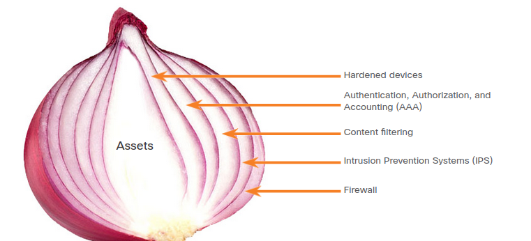
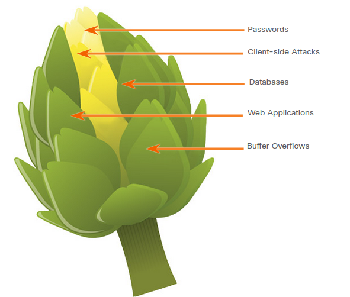

# Understanding defense

## Defense-in-depth: Assets, Vulnerabilities, Threats

Cybersecurity analysts must prepare for any type of attack. It is their job to secure the assets of the organization’s network. To do this, cybersecurity analysts must first identify:

* assets: anything of value to an organization that must be protected including servers, infrastructure devices, end devices, and the greatest asset, **data**.
* vulnerabilities: a weakness in a system or its design that could be exploited by a threat actor.
* threats: any potential danger to an asset.

### Identify assets

**The collection of all the devices and information owned or managed by the organization are assets**. **The assets constitute the attack surface that threat actors could target**.

**Asset management consists of inventorying all assets**, and then developing and implementing **policies and procedures to protect them**. This task can be daunting considering many organizations must protect internal users and resources, mobile workers, and cloud-based and virtual services. Further, organizations need to identify **where critical information assets are stored**, and how access is gained to that information.

**Information assets vary, as do the threats against them**. For example:

    * a retail business may store customer credit card information.
    * An engineering firm will store competition-sensitive designs and software. 
    * A bank will store customer data, account information, and other sensitive financial information. 
**Each of these assets can attract different threat actors who have different skill levels and motivations**.

### Identify Vulnerabilities

Threat identification provides an organization with a list of **likely threats** for a particular environment. When identifying threats, it is important to ask several questions:

    * What are the possible vulnerabilities of a system?
    * Who may want to exploit those vulnerabilities to access specific information assets?
    * What are the consequences if system vulnerabilities are exploited and assets are lost?

Some threat identification examples:

* **internal system compromise**: the attacker uses the exposed servers to break into an internal bank system.
* stolen customer data: an attacker steals the personal and financial data of bank customers from the customer database.
* phony transactions from an external server: an attacker alters the code of the application and makes transactions by impersonating a legitimate user.
* phony transactions using a stolen customer PIN or smart card: an attacker steals the identity of a customer and completes malicious transactions from the compromised account.
* insider attack on the system: a bank employee finds a flaw in the system from which to mount an attack.
* data input errors: a user inputs incorrect data or makes incorrect transaction requests
* data center destruction: a cataclysmic event severely damages or destroys the data center.

Identifying vulnerabilities on a network requires an understanding of the important applications that are used, as well as the different vulnerabilities of that application and hardware. This can require a significant amount of research on the part of the network administrator.

### Identify Threats

Organizations must use a defense-in-depth approach to identify threats and secure vulnerable assets. This approach uses multiple layers of security at the network edge, within the network, and on network endpoints.

A simple topology of a defense-in-depth:

1. edge router: the first line of defense is known as an edge router. The edge router has a set of rules specifying which traffic it allows or denies. It passes all connections that are intended for the internal LAN to the firewall.
2. firewall: the second line fo defense is the firewall. The firewall is a checkpoint device that performs additional filtering and tracks the state of the connections. It denies the initiation of connections from the outside (untrusted) networks to the inside (trusted) network while enabling internal users to establish two-way connections to the untrusted networks. It can also perform user authentication (authentication proxy) to grant external remote users access to internal network resources.
3. internal router: Another line of defense is the internal router.  It can apply final filtering rules on the traffic before it is forwarded to its destination.

**Routers and firewalls are not the only devices that are used in a defense-in-depth approach**. Other security devices include **Intrusion Prevention Systems (IPS)**, **Advanced Malware Protection (AMP)**, web and email content security systems, identity services, network access controls and more.

In the layered defense-in-depth security approach, **the different layers work together to create a security architecture in which the failure of one safeguard does not affect the effectiveness of the other safeguards**.

### The Security Onion and The Security Artichoke

#### security onion

A common analogy used to describe a defense-in-depth approach is called “the security onion.” A threat actor would have to peel away at a network’s defenses layer by layer in a manner similar to peeling an onion. Only after penetrating each layer would the threat actor reach the target data or system.

#### security artichoke

The changing landscape of networking, such as the evolution of borderless networks, has changed this analogy to the “security artichoke”, which benefits the threat actor. Threat actors no longer have to peel away each layer. They only need to remove certain “artichoke leaves.” The bonus is that each “leaf” of the network may reveal sensitive data that is not well secured.

For example, it’s easier for a threat actor to compromise a mobile device than it is to compromise an internal computer or server that is protected by layers of defense. Each mobile device is a leaf. And leaf after leaf, it all leads the hacker to more data. The heart of the artichoke is where the most confidential data is found. Each leaf provides a layer of protection while simultaneously providing a path to attack.

Not every leaf needs to be removed in order to get at the heart of the artichoke. The hacker chips away at the security armor along the perimeter to get to the “heart” of the enterprise.

While internet-facing systems are usually very well protected and boundary protections are typically solid, persistent hackers, aided by a mix of skill and luck, do eventually find a gap in that hard-core exterior through which they can enter and go where they please.

## Security Policies, Regulations, and Standards

### Business Policies

Business policies **are the guidelines that are developed by an organization to govern its actions**. The policies define standards of correct behavior for the business and its employees. In networking, policies define the activities that are allowed on the network. This sets a baseline of acceptable use. If behavior that violates business policy is detected on the network, it is possible that a security breach has occurred.

|Policy|Description|
|------|-----------|
|Company policies| **These policies establish** the rules of conduct and the responsibilities of both employees and employers. **Policies protect the rights** of workers as well as the business interests of employers. **Depending on the needs of** the organization, various policies and procedures establish rules regarding employee conduct, attendance, dress code, privacy and other areas related to the terms and conditions of employment|
|Employee policies| **These policies are created** and maintained by human resources staff to identify employee salary, pay schedule, employee benefits, work schedule, vacations, and more. **They are often provided** to new employees to review and sign|
|Security policies| **These policies identify a set** of security objectives for a company, define the rules of behavior for users and administrators, and specify system requirements.    **These objectives, rules, and requirements** collectively ensure the security of a network and the computer systems in an organization. **Much like a continuity plan**, a security policy is a constantly evolving document based on changes in the threat landscape, vulnerabilities, and business and employee requirements|

### Security Policy

A comprehensive security policy has a number of benefits, including the following:

* Demonstrates an organization’s commitment to security
* Sets the rules for expected behavior
* Ensures consistency in system operations, software and hardware acquisition and use, and maintenance
* Defines the legal consequences of violations
* Gives security staff the backing of management

Security policies are used to:

    * inform users, staff, and managers of an organization’s requirements for protecting technology and information assets. 
    * A security policy also specifies the mechanisms that are needed to meet security requirements and provides a baseline from which to acquire, configure, and audit computer systems and networks for compliance.

The table lists policies that may be included in a security policy.

|Policy|Description|
|------|-----------|
|Identification and authentication policy| Specifies authorized persons that can have access to network resources and identity verification procedures|
|Password policies|Ensures passwords meet minimum requirements and are changed regularly|
|Acceptable Use Policy (AUP)|Identifies network applications and uses that are acceptable to the organization. It may also identify ramifications if this policy is violated|
|Remote access policy|Identifies how remote users can access a network and what is accessible via remote connectivity|
|Network maintenance policy|Specifies network device operating systems and end user application update procedures|
|Incident handling procedures|Describes how security incidents are handled|

One of the most common security policy components is an AUP. This can also be referred to as an appropriate use policy. This component defines what users are allowed and not allowed to do on the various system components. **This includes the type of traffic that is allowed on the network**. The AUP should be as explicit as possible to avoid misunderstanding.

For example, **an AUP might list specific websites, newsgroups, or bandwidth intensive applications that are prohibited from being accessed by company computers or from the company network. Every employee should be required to sign an AUP, and the signed AUPs should be retained for the duration of employment**.

### BYOD Policies

Many organizations must now also support Bring Your Own Device (BYOD). This enables employees to use their own mobile devices to access company systems, software, networks, or information. BYOD provides several key benefits to enterprises, including increased productivity, reduced IT and operating costs, better mobility for employees, and greater appeal when it comes to hiring and retaining employees.

However, these benefits also bring an increased information security risk because BYOD can lead to data breaches and greater liability for the organization.

A BYOD security policy should be developed to accomplish the following:

* Specify the goals of the BYOD program.
* Identify which employees can bring their own devices.
* Identify which devices will be supported.
* Identify the level of access employees are granted when using personal devices.
* Describe the rights to access and activities permitted to security personnel on the device.
* Identify which regulations must be adhered to when using employee devices.
* Identify safeguards to put in place if a device is compromised.

The table lists BYOD security best practices to help mitigate BYOD vulnerabilities.

|Best Practice|Description|
|-------------|-----------|
|Password protected access|Use unique passwords for each device and account|
|Manually control wireless connectivity|Turn off Wi-Fi and Bluetooth connectivity when not in use. Connect only to trusted networks|
|Keep updated|Always keep the device OS and other software updated. Updated software often contains security patches to mitigate against the latest threats or exploits|
|Back up data|Enable backup of the device in case it is lost or stolen|
|Enable “Find my Device”|Subscribe to a device locator service with remote wipe feature|
|Provide antivirus software|Provide antivirus software for approved BYOD devices|
|Use Mobile Device Management (MDM) software|MDM software enables IT teams to implement security settings and software configurations on all devices that connect to company networks|

### Regulatory and Standards Compliance

There are also external regulations regarding network security. Network security professionals must be familiar with the laws and codes of ethics that are binding on Information Systems Security (INFOSEC) professionals.

Many organizations are mandated to develop and implement security policies. Compliance regulations define what organizations are responsible for providing and the liability if they fail to comply. The compliance regulations that an organization is obligated to follow depend on the type of organization and the data that the organization handles. Specific compliance regulations will be discussed later in the course.

## What Did I Learn in this Module?

**Defense-in-Depth**: In this chapter, you learned the importance of protecting our networks, devices, and data from threat actors. The starting point for network defense is the identification of assets, vulnerabilities, and threats. Assets are anything of value to an organization that must be protected including servers, infrastructure devices, end devices, and the greatest asset, data. Asset management consists of inventorying all assets, and then developing and implementing policies and procedures to protect them. Vulnerabilities are weaknesses in a system or its design that could be exploited by a threat actor. Threats are any potential danger to an asset. Organizations must use a defense-in-depth approach to identify threats and secure vulnerable assets. This approach uses multiple layers of security at the network edge, within the network, and on network endpoints.

**Security Policies, Regulations, and Standards**: Organizations must have a set of policies that define the activities that are allowed on the network. These include business policies, security policies, BYOD policies, and policies that ensure that the organization complies with governmental regulations. Business policies define standards of correct behavior for the business and its employees. Security policies are used to inform users, staff, and managers of an organization’s requirements for protecting technology and information assets. Some common security policies include acceptable use policy, remote access policy, network maintenance policy, and incident handling procedures. The purpose of a BYOD (Bring Your Own Device) policy is to enable employees to use their own mobile devices to access company systems, software, networks, or information. BYOD provides several key benefits to enterprises, including increased productivity, reduced IT and operating costs, better mobility for employees, and greater appeal when it comes to hiring and retaining employees.

**Regulatory and Standards Compliance**: Compliance regulations define what organizations are responsible for providing and the liability if they fail to comply. The compliance regulations that an organization is obligated to follow depend on the type of organization and the data that the organization handles.

## Module 18: Understanding Defense Quiz

1. How does BYOD change the way in which businesses implement networks?​ Topic 18.2.0 - A BYOD environment requires an organization to accommodate a variety of devices and access methods. Personal devices, which are not under company control, may be involved, so security is critical. Onsite hardware costs will be reduced, allowing a business to focus on delivering collaboration tools and other software to BYOD users.
**BYOD provides flexibility in where and how users can access network resources.**

2. Which device is usually the first line of defense in a layered defense-in-depth approach? Topic 18.1.0 - The edge router connects an organization to a service provider. The edge router has a set of rules that specify which traffic is allowed or denied.
**Edger router.**

3. With the evolution of borderless networks, which vegetable is now used to describe a defense-in-depth approach? Topic 18.1.0 - The artichoke is now used to provide a visual analogy to describe a defense-in-depth security approach. The onion used to be descriptive because the attacker would "peel away" each layer of the network defense mechanisms. Now the artichoke is used because a single petal or leaf can be moved or removed to reveal sensitive information.
**Artichoke.**

4. Which type of business policy establishes the rules of conduct and the responsibilities of employees and employers? Topic 18.2.0 - Business policies set a baseline of acceptable use. Company policies establish the rules and conduct and the responsibilities of both employees and the employer. Company policies protect the rights of the workers as well as the business interests of the company.
**Company**

5. An administrator is concerned with restricting which network applications and uses are acceptable to the organization. What security policy component does the administrator use to address these concerns? Topic 18.2.0 - The acceptable use policy (AUP) identifies which network applications and uses are acceptable to an organization.
**Acceptable use policy.**

6. What component of a security policy explicitly defines the type of traffic allowed on a network and what users are allowed and not allowed to do? Topic 18.2.0 - Security policies specify requirements and provide a baseline for organizations. Security policies may include the following:

    Identification and authentication policies that specify authorized individuals that have access to network resources and verification procedures
    Password policies that ensure minimum requirements are met and authentication methods are being enforced and updated
    Remote access policies that identify how remote users can access a network and to what they are allowed to connect
    Acceptable use policies that identify network applications and network usage that are allowed within the organization.
**Acceptable use policies.**

7. What device would be used as the third line of defense in a defense-in-depth approach? Topic 18.1.0 - In a defense-in-depth approach, the edge router would form the first line of defense. The firewall would be the second line of defense followed by the internal router making up the third line of defense.
**Internet router.**

8. The security policy of an organization allows employees to connect to the office intranet from their homes. Which type of security policy is this? Topic 18.2.0 - The remote access policy section of a corporate security policy identifies how remote users can access a network and what is accessible via remote connectivity.
**Remote access.**

9. What is a characteristic of a layered defense-in-depth security approach? Topic 18.1.0 - In the layered defense-in-depth security approach, the different layers work together to create a security architecture in which the failure of one safeguard does not affect the effectiveness of the other safeguards. 
**The failure of one safeguard does not affect the effectiveness of the other safeguards.**

10. Which is a BYOD security best practice? Topic 18.2.0 - One of the best practices for BYOD devices is subscribing to a device locator service with remote wipe feature in the event the device is lost or stolen.
**Subscribe to a device locator service with remote wipe feature.**

11. What do security compliance regulations define? Topic 18.2.0 - Compliance regulations define what organizations are responsible for providing and the liability failure to comply. The compliance regulations that an organization is obligated to follow will differ from one organization to the next because the regulations depend on the type of organization and the data that the organization handles.
**What organizations are responsible for providing and the liability for failure to comply.**

12. What device would be used as a second line of defense in a defense-in-depth approach? Topic 18.1.0 - In a defense-in-depth approach, the edge router would form the first line of defense. The firewall would be the second line of defense followed by the internal router making up the third line of defense.
**Firewall.**

13. Which two areas must an IT security person understand in order to identify vulnerabilities on a network? (Choose two.) Topic 18.1.0 - In order to identify security vulnerabilities, a cybersecurity expert must understand the applications being used and their associated vulnerabilities, as well as the hardware used.
**Hardware used by applications and important applications used.**

