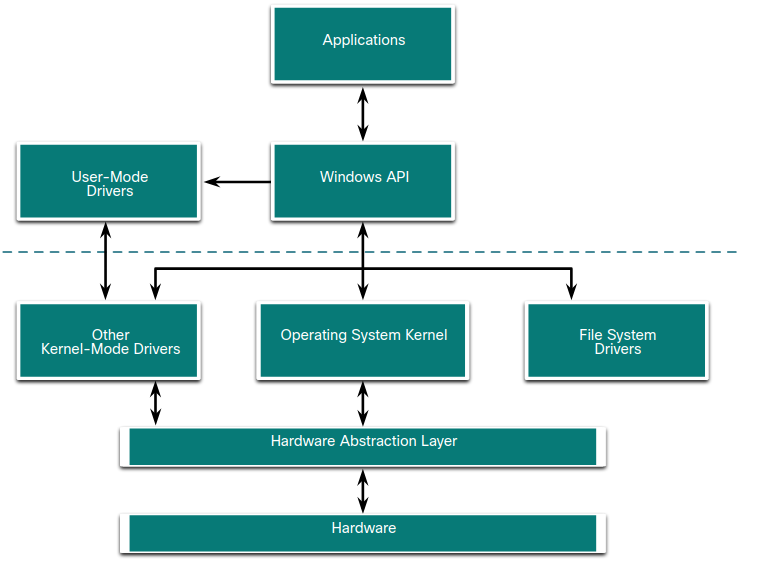
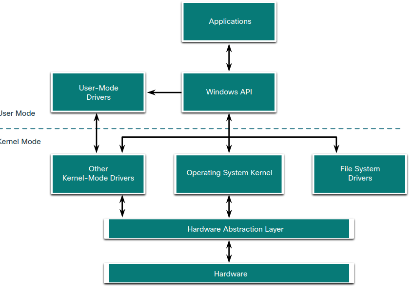
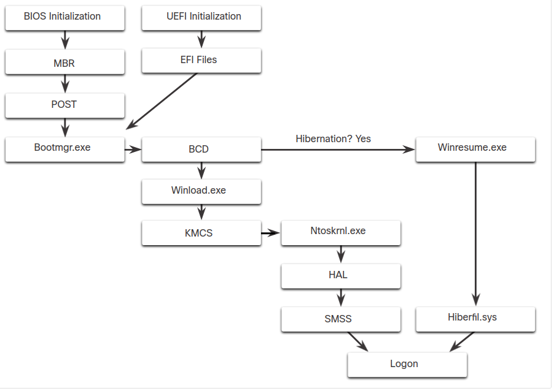

# 3 The Windows Operation System

## Introduction

### Windows History - Disk Operating System

The Disk Operating System **(DOS)** is an operating system that the computer uses to enable these data storage devices to read and write files. DOS provides a file system which organizes the files in a specific way on the disk. Microsoft bought DOS and developed MS-DOS. With MS-DOS, the computer **had a basic working knowledge of how to access the disk drive** and **load the operating system files directly from disk** as part of the boot process. When it was loaded, MS-DOS could **easily access the disk because it was built into the operating system**.
**Early versions of Windows** consisted of a Graphical User Interface **(GUI) that ran over MS-DOS**, **starting with Windows 1.0 in 1985**. **The disk operating system still controlled the computer and its hardware**. **A modern operating system** like **Windows 10 is not considered a disk operating system**. It is built on Windows NT, which stands for “New Technologies”. **The operating system itself is in direct control of the computer and its hardware**. NT is an OS with support for multiple user processes. This is much different than the single-process, single-user MS-DOS.

**Some basic command in cmd**

|MS-DOS Command            |Description                                                            |
|--------------------------|-----------------------------------------------------------------------|
|dir                       |Shows a listing of all the files in the current directory (folder)     |
|cd directory              |Changes the directory to the indicated directory                       |
|cd ..                     |Changes the directory to the directory above the current directory     |
|cd \                      |Changes the directory to the root directory (often C:)                 |
|copy source destination   |Copies files to another location                                       |
|del filename              |Deletes one or more files                                              |
|find                      |Searches for text in files                                             |
|mkdir directory           |Creates a new directory                                                |
|ren oldname newname       |Renames a file                                                         |
|help                      |Displays all the commands that can be used, with a brief description   |
|help command              |Displays extensive help for the indicated command                      |

#### Windows Versions

Since 1993, there have been more than 20 releases of Windows that are based on the NT (New Technologies that replace DOS) operating system. Most of these versions were for use by the general public and businesses. Businesses also adopted NT OS-based Windows operating systems because many editions were built specifically for workstation, professional, server, advanced server, and datacenter server, to name just a few of the many purpose-built versions.

**32, 64 bits**

Beginning with Windows XP, **a 64-bit edition was available**. The 64-bit operating system was **an entirely new architecture**. **It had a 64-bit address space instead of a 32-bit address space**. This is not simply twice the amount of space because these bits are binary numbers. While 32-bit Windows can address a little less than 4 GB of RAM, 64-bit Windows can **theoretically address 16.8 million terabytes**. When the OS and the hardware all support 64-bit operation, **extremely large data sets can be used**. These large data sets include very large databases, scientific computing, and manipulation of high definition digital video with special effects. In general, 64-bit computers and operating systems are backward-compatible with older, 32-bit programs, but 64-bit programs cannot be run on older, 32-bit hardware.

**Editions**

With each subsequent release of Windows, the operating system has become more refined by incorporating more features. Windows 7 was offered with six different editions, Windows 8 with as many as five, and Windows 10 with eight different editions! Each edition not only offers different capabilities, but also different price points. Microsoft has said that Windows 10 is the last version of Windows, and that Windows has become a service rather than just an OS. They say that rather than purchasing new operating systems, users will just update Windows 10 instead.

|OS                      |Versions                                                                                     |
|------------------------|---------------------------------------------------------------------------------------------|
|Windows 7               |Starter, Home Basic, Home Premium, Professional, Enterprise, Ultimate                        |
|Windows Server 2008 R2  |Foundation, Standard, Enterprise, Datacenter, Web Server, HPC Server, Itanium-Based Systems  |
|Windows Home Server 2011|None                                                                                         |
|Windows 8               |Windows 8, Windows 8 Pro, Windows 8 Enterprise, Windows RT                                   |
|Windows Server 2012     |Foundation, Essentials, Standard, Datacenter                                                 |
|Windows 8.1             |Windows 8.1, Windows 8.1 Pro, Windows 8.1 Enterprise, Windows RT 8.1                         |
|Windows Server 2012 R2  |Foundation, Essentials, Standard, Datacenter                                                 |
|Windows 10              |Home, Pro, Pro Education, Enterprise, Education, loT Core, Mobile, Mobile Enterprise         |
|Windows Server 2016     |Essentials, Standard, Datacenter, Multipoint Premium Server, Storage Server, Hyper-V Server  |

#### Windows Graphic User Interface (GUI)

Windows has a graphical user interface (GUI) for users to work with data files and software. The GUI has a main area that **is known as the Desktop**. The Desktop can be customized with various colors and background images. Windows supports multiple users, so each user can customize the Desktop to their liking. The Desktop can store files, folders, shortcuts to locations and programs, and applications. The Desktop also has a recycle bin icon, where files are stored when the user deletes them. Files can be restored from the recycle bin or the recycle bin can be emptied of files, which truly deletes them. At the bottom of the desktop is the Task Bar. The Task Bar has three areas that are used for different purposes. At the left is the Start menu. It is used to access all of the installed programs, configuration options, and the search feature. At the center of the Task Bar, users place quick launch icons that run specific programs or open specific folders when they are clicked. Finally, on the right of the Task Bar is the notification area. The notification area shows, at a glance, the functionality of many different programs and features. For example, a blinking envelope icon may indicate new email, or a network icon with a red “x” may indicate a problem with the network.

There are Context Menus for the icons in the notification area, for quick launch icons, system configuration icons, and for files and folders. The Context Menu provides many of the most commonly used functions by just clicking. For example, the Context Menu for a file will contain such items as copy, delete, share, and print. To open folders and manipulate files, Windows uses the Windows File Explorer.

### Operating System Vulnerabilities

Operating systems consist of millions of lines of code. Installed software can also contain millions of lines of code. **With all this code comes vulnerabilities**. **A vulnerability is some flaw or weakness that can be exploited by an attacker to reduce the viability of a computer’s information**. To take advantage of an operating system vulnerability, the attacker must use **a technique or a tool to exploit the vulnerability**. The attacker can then use the vulnerability to get the computer to act in a fashion outside of its intended design. In general, **the goal is to gain unauthorized control of the computer**, **change permissions**, or **to manipulate or steal data**.

#### **Bic Picture** of Windows OS Security recommendations.

1. Virus or malware protection
   * **By default**, **Windows uses Windows Defender for malware protection**. Windows Defender provides a suite of protection tools built into the system. If Windows Defender **is turned off**, the system becomes more vulnerable to attacks and malware.
1. Unknown or unmanaged services
   * **There are many services that run behind the scenes**. It is important to make sure that **each service is identifiable and safe**. **With an unknown service running in the background, the computer can be vulnerable to attack**.
1. Encryption
   * **When data is not encrypted**, it can easily be gathered and exploited. This is not only important for desktop computers, but especially mobile devices.
1. Security policy
   * **A good security policy must be configured and followed**. **Many settings in the Windows Security Policy control can prevent attacks**.
1. Firewall
   * **By default**, Windows uses **Windows Firewall** to limit communication with devices on the network. Over time, rules may no longer apply. For example, a port may be left open that should no longer be readily available. It is important to **review firewall settings periodically** to ensure that the rules are still applicable and remove any that no longer apply
1. File and share permissions
   * These **permissions must be set correctly**. **It is easy to just give the “Everyone” group Full Control, but this allows all people to do what they want to all files**. **It is best to provide each user or group with the minimum necessary permissions for all files and folders**.
1. Weak or no password
   * Many people choose weak passwords or do not use a password at all. It is especially important **to make sure that all accounts**, especially the **Administrator account, have a very strong password**.
1. Login as Administrator
   * When a user logs in as an administrator, any program that they run will have the privileges of that account. **It is best to log in as a Standard User and only use the administrator password to accomplish certain tasks**.

## Windows Architecture and Operations

### Hardware Abstraction Layer

Windows computers use many different types of hardware. When the operating system is installed, it must be isolated from differences in hardware. The basic Windows architecture is shown in the figure.

**A hardware abstraction layer (HAL)** is software that **handles all of the communication between the hardware and the kernel**. The **kernel** is the **core of the operating system** and has **control over the entire computer**. **It handles all of the input and output requests, memory, and all of the peripherals connected to the computer**.

In some instances, the kernel still communicates with the hardware directly, so it is not completely independent of the HAL. The HAL also needs the kernel to perform some functions.

### User mode and Kernel mode

There are **two different modes** in which a CPU operates when the computer has Windows installed: **the user mode and the kernel mode**.

Basically, **installed applications run in user mode**, and **operating system code runs in kernel mode**. Code that is executing in kernel mode has unrestricted access to the underlying hardware and is capable of executing any CPU instruction. **Kernel mode** code also can reference any memory address directly. Generally reserved for the most trusted functions of the OS, crashes in code running in kernel mode stop the operation of the entire computer. Conversely, **programs such as user applications**, run in **user mode and have no direct access to hardware or memory locations**. **User mode code must go through the operating system to access hardware resources**. Because of the isolation provided by user mode, crashes in user mode are restricted to the application only and are recoverable. **Most of the programs in Windows run in user mode. Device drivers, pieces of software that allow the operating system and a device to communicate, may run in either kernel or user mode, depending on the driver**.

All of the code that runs **in kernel mode** uses **the same address space**. **Kernel-mode drivers have no isolation from the operating system**. **If an error occurs with the driver running in kernel mode, and it writes to the wrong address space, the operating system or another kernel-mode driver could be adversely affected**. In this respect, the driver might crash, causing the entire operating system to crash.

When user mode code runs, it is granted its own restricted address space by the kernel, along with a process created specifically for the application. The reason for this functionality is **mainly to prevent applications from changing operating system code that is running at the same time**. By having its own process, that application has its own private address space, rendering other applications unable to modify the data in it. This also helps to prevent the operating system and other applications from crashing if that application crashes.

### Windows File System

A **file system** is **how information is organized on storage media**. Some file systems may be a better choice to use than others, depending on the type of media that will be used. Following the list of file systems supported by Windows OS.

1. exFAT
    * This is a simple file system supported by many different operating systems. 
    * FAT has limitations to the number of partitions, partition sizes, and file sizes that it can address, so it is not usually used for hard drives (HDs) or solid-state drives (SSDs) anymore. 
    * Both FAT16 and FAT32 are available to use, with FAT32 being the most common because it has many fewer restrictions than FAT16.
1. Hierarchical File System Plus (HFS+)
    * This file system is used on MAC OS X computers and allows much longer filenames, file sizes, and partition sizes than previous file systems. 
    * Although it is not supported by Windows without special software, Windows is able to read data from HFS+ partitions.
1. Extended File System (EXT)
    * This file system is used with Linux-based computers. 
    * Although it is not supported by Windows, Windows is able to read data from EXT partitions with special software.
1. New Technology File System (NTFS)
    * This is the most commonly used file system when installing Windows. All versions of Windows and Linux support NTFS. 
    * Mac-OS X computers can only read an NTFS partition. They are able to write to an NTFS partition after installing special drivers.
    * NTFS is the most widely used file system for Windows for many reasons:
      1. NTFS supports very large files and partitions and it is very compatible with other operating systems.
      2. NTFS is also very reliable and supports recovery features.
      3. It supports many security features.
         * Data access control is achieved through security descriptors. These security descriptors contain file ownership and permissions all the way down to the file level. 
         * NTFS also tracks many time stamps to track file activity. Sometimes referred to as MACE, the timestamps Modify, Access, Create, and Entry Modified are often used in forensic investigations to determine the history of a file or folder. NTFS also supports file system encryption to secure the entire storage media.

Before a storage device such as a disk can be used, **it must be formatted with a file system**. In turn, before a file system can be put into place on a storage device, **the device needs to be partitioned**. A hard drive is divided into areas called partitions. **Each partition is a logical storage unit** that can be formatted to store information, such as data files or applications. During the installation process, most operating systems automatically partition and format the available drive space with a file system such as NTFS.

**NTFS formatting creates important **structures on the disk for file storage**, and tables for recording the locations of files:**

1. **Partition Boot Sector**: **This is the first 16 sectors of the drive**. It contains the location of the Master File Table (MFT). The last 16 sectors contain a copy of the boot sector.
1. **Master File Table (MFT)**: This table contains the locations of all the files and directories on the partition, including file attributes such as security information and timestamps.
1. **System Files**: These are hidden files that store information about other volumes and file attributes.
1. **File Area**: The main area of the partition where files and directories are stored.

Note: **When formatting a partition**, **the previous data may still be recoverable because not all the data is completely removed**. **The free space can be examined**, and **files can be retrieved which can compromise security**. It is recommended to perform a secure wipe on a drive that is being reused. **The secure wipe will write data to the entire drive multiple times to ensure there is no remaining data**.

#### Alternate data streams

**NTFS stores files as a series of attributes, such as the name of the file, or a timestamp**. The data which the file contains is stored **in the attribute $DATA**, and is known as a data stream. By using NTFS, you can connect **Alternate Data Streams (ADSs) to the file**. This is sometimes used **by applications that are storing additional information about the file**. **The ADS is an important factor when discussing malware**. This is because **it is easy to hide data in an ADS**. **An attacker could store malicious code within an ADS that can then be called from a different file**.

In the NTFS file system, a file with an ADS is identified after the filename and a colon, for example, Testfile.txt:ADS. This filename indicates an ADS called ADS is associated with the file called Testfile.txt. An example of ADS is shown in the command output.

**Commands**
___
echo "Alternate Data Here" > Testfile.txt:ADS  
dir 
more < Testfile.txt:ADS 
dir /r 
___

In the output:
* The first command places the text “Alternate Data Here” into an ADS of the file Testfile.txt called “ADS”.
* After that, dir, shows that the file was created, but the ADS is not visible.
* The next command shows that there is data in the Testfile.txt:ADS data stream.
* The last command shows the ADS of the Testfile.txt file because the r switch was used with the dir command.

### Windows Boot Process

Many actions occur between the time that the computer power button is pressed and Windows is fully loaded, as shown in the figure. This is known as the Windows Boot process.

Two types of computer firmware exist:

1. Basic Input-Output System **(BIOS)**: BIOS firmware was created in the early 1980s and works in the same way it did when it was created. As computers evolved, it became difficult for BIOS firmware to support all the new features requested by users.
2. Unified Extensible Firmware Interface **(UEFI)**: UEFI was designed to replace BIOS and support the new features.

In BIOS firmware, the process begins with **the BIOS initialization phase**. This is **when hardware devices are initialized** and **a power on self-test (POST) is performed to make sure all of these devices are communicating**. When the system disk is discovered, the POST ends. The last instruction in the POST is to look for the master boot record (MBR). The **MBR contains a small program that is responsible for locating and loading the operating** system. The **BIOS executes this code and the operating system starts to load**.

In contrast to BIOS firmware, UEFI firmware has a lot of visibility into the boot process. UEFI boots by loading EFI program files, stored as .efi files in a special disk partition, known as the EFI System Partition (ESP). **Note: A computer that uses UEFI stores boot code in the firmware. This helps to increase the security of the computer at boot time because the computer goes directly into protected mode.** Whether the firmware is BIOS or UEFI, **after a valid Windows installation is located, the Bootmgr.exe file is run**. **Bootmgr.exe switches the system from real mode to protected mode so that all of the system memory can be used**.

**Bootmgr.exe** reads the **Boot Configuration Database (BCD)**. The **BCD** contains any **additional code needed to start the computer**, along with an indication of **whether the computer is coming out of hibernation, or if this is a cold start**. If the computer is coming out of hibernation, the boot process **continues with Winresume.exe**. This allows the computer to read the Hiberfil.sys file which contains the state of the computer when it was put into hibernation.

If the computer is being booted from **a cold start**, **then the Winload.exe file is loaded**. **The Winload.exe file creates a record of the hardware configuration in the registry**. The **registry is a record of all of the settings, options, hardware, and software the computer has**. The registry will be explored in depth later in this chapter. **Winload.exe also uses Kernel Mode Code Signing (KMCS)** to make sure that **all drivers are digitally signed**. This ensures that the drivers are safe to load as the computer starts.

**After the drivers have been examined**, Winload.exe runs **Ntoskrnl.exe** which starts the Windows kernel and sets up the HAL. Finally, the Session Manager Subsystem (SMSS) reads the registry to create the user environment, start the Winlogon service, and prepare each user’s desktop as they log on.

### Windows Startup

There are two important registry items that are used to automatically start applications and services:

1. HKEY_LOCAL_MACHINE: Several **aspects of Windows configuration** are stored in this key, including information about services that start with each boot.
1. HKEY_CURRENT_USER: Several **aspects related to the logged in user are stored in this key**, including information about services that start only when the user logs on to the computer.

Different entries in these registry locations **define which services and applications will start**, as indicated by their entry type. **These types include Run, RunOnce, RunServices, RunServicesOnce, and Userinit**. These entries can be manually entered into the registry, but it is much safer to use the **Msconfig.exe tool**. **This tool is used to view and change all of the start-up options for the computer**. Use the search box to find and open the Msconfig tool.

The Msconfig tool opens the System Configuration window. There are **five tabs** which contain the configuration options:

1. General: Three different startup types can be chosen here. Normal loads all drivers and services. Diagnostic loads only basic drivers and services. Selective allows the user to choose what to load on startup.
1. Boot: Any installed operating system can be chosen here to start. There are also options for Safe boot, which is used to troubleshoot startup.
1. Services: All the installed services are listed here so that they can be chosen to start at startup.
1. Startup: All the applications and services that are configured to automatically begin at startup can be enabled or disabled by opening the task manager from this tab.
1. Tools: Many common operating system tools can be launched directly from this tab.

* msconfig.exe

### Windows Shutdown

It is always best to perform a proper shutdown to turn off the computer. Files that are left open, services that are closed out of order, and applications that hang **can all be damaged if the power is turned off without first informing the operating system**. The computer needs time to close each application, shut down each service, and record any configuration changes before power is lost.

During shutdown, the computer will **close user mode applications first**, **followed by kernel mode processes**. If a user mode process does not respond within a certain amount of time, the OS will display notification and allow the user to wait for the application to respond, or forcibly end the process. If a kernel mode process does not respond, the shutdown will appear to hang, and it may be necessary to shut down the computer with the power button.

There are several ways to shut down a Windows computer: Start menu power options, the command line command shutdown, and using Ctrl+Alt+Delete and clicking the power icon. There are three different options from which to choose when shutting down the computer:

1. Shutdown: Turns the computer off (power off).
1. Restart: Re-boots the computer (power off and power on).
1. Hibernate: Records the current state of the computer and user environment and stores it in a file. Hibernation allows the user to pick up right where they left off very quickly with all their files and programs still open.

### Process, Threads, and services

**A Windows application is made up of processes**. The **application can have one or many processes dedicated to it**. **A process is any program that is currently executing**. **Each process that runs is made up of at least one thread**. **A thread is a part of the process that can be executed**. The processor performs calculations on the thread. To configure Windows processes, search for Task Manager. The Processes tab of the Task Manager is shown in the figure.

All of **the threads dedicated to a process are contained within the same address space**. This means that **these threads may not access the address space of any other process**. **This prevents corruption of other processes**. **Because Windows multitasks, multiple threads can be executed at the same time**. **The amount of threads that can be executed at the same time is dependent on the number of the computer’s processors**.

**Some of the processes that Windows runs are services**. These are programs that run in the **background to support the operating system and applications**. They can be set to start automatically when Windows boots or they can be started manually. They can also be stopped, restarted, or disabled.

Services provide long-running functionality, such as wireless or access to an FTP server. To configure Windows Services, search for services.

* taskmgr.exe

### Memory allocation and handles

A computer works by storing instructions **in RAM until the CPU processes them**. **The virtual address space for a process is the set of virtual addresses that the process can use**. **The virtual address is not the actual physical location in memory, but an entry in a page table that is used to translate the virtual address into the physical address**. Each process **in a 32-bit Windows** computer **supports a virtual address space** that enables addressing **up to 4 gigabytes**. Each process **in a 64-bit Windows** computer **supports a virtual address space of 8 terabytes**.

**Each user space process runs in a private address space**, **separate from other user space processes**. When the user space process needs to access kernel resources, **it must use a process handle**. **This is because the user space process is not allowed to directly access these kernel resources**. The process handle provides the access needed by the user space process without a direct connection to it.

**A powerful tool for viewing memory allocation is RAMMap**. RAMMap is part of the **Windows Sysinternals Suite of tools**. It can be downloaded from Microsoft. RAMMap provides a wealth of information regarding how Windows has allocated system memory to the kernel, processes, drivers, and applications.

**https://docs.microsoft.com/en-us/sysinternals/downloads/sysinternals-suite**

### The Windows Registry

**Windows stores all of the information about hardware, applications, users, and system settings in a large database known as the registry**. The ways that these objects interact are also recorded, such as what files an application opens and all of the property details of folders and applications. **The registry is a hierarchical database** where the **highest level is known as a hive**, below that **there are keys**, followed **by subkeys**. Values store data and are stored in the keys and subkeys. **A registry key can be up to 512 levels deep.**

The table lists the five hives of the Windows registry.

|Registry Hive              |Description|
|---------------------------|-----------|
|HKEY_CURRENT_USER (HKCU)   |Holds information concerning the currently logged in user.|
|HKEY_USERS (HKU)           |Holds information concerning all the user accounts on the host.|
|HKEY_CLASSES_ROOT (HKCR)   |Holds information about object linking and embedding (OLE) registrations. OLE allows users to embed objects from other applications (like a spreadsheet) into a single document (like a Word document.|
|HKEY_LOCAL_MACHINE (HKLM)  |Holds system-related information.|
|HKEY_CURRENT_CONFIG (HKCC) |Holds information about the current hardware profile.|

**New hives cannot be created**. The **registry keys** and **values in the hives can be created**, **modified**, or **deleted** by an account **with administrative privileges**. The tool **regedit.exe** is used to modify the registry. Be very careful when using this tool. Minor changes to the registry can have massive or even catastrophic effects.

Navigation in the registry is very similar to Windows file explorer. Use the left panel to navigate the hives and the structure below it and use the right panel to see the contents of the highlighted item in the left panel. With so many keys and subkeys, the key path can become very long. The path is displayed at the bottom of the window for reference. Because each key and subkey is essentially a container, the path is represented much like a folder in a file system. The backslash (\) is used to differentiate the hierarchy of the database.

Registry keys can contain either a subkey or a value. The different values that keys can contain are as follows:

1. REG_BINARY: Numbers or Boolean values
1. REG_DWORD: Numbers greater than 32 bits or raw data
1. REG_SZ: String values

**Because the registry holds almost all the operating system and user information, it is critical to make sure that it does not become compromised**. **Potentially malicious applications can add registry keys so that they start when the computer is started**. During a normal boot, the user will not see the program start because the entry is **in the registry and the application displays no windows or indication of starting when the computer boots**. **A keylogger, for example, would be devastating to the security of a computer if it were to start at boot without the user’s knowledge or consent**. When performing normal security audits, or remediating an infected system, review the application startup locations within the registry to ensure that each item is known and safe to run.

## Check your understanding: identify the windows registry hive

1. Which Windows registry hive stores information about object linking and embedding (OLE) registrations?
   HKEY_CLASSES_ROOT (HKCR)

2. Which Windows registry hive stores information about the current hardware profile?
   HKEY_CURRENT_CONFIG (HKCC)

3. Which Windows registry hive stores information concerning all the user accounts on the host
   HKEY_USERS (HKU) 
   
4. Which Windows registry hive stores information concerning the currently logged in user?
   HKEY_CURRENT_USER (HKCU)

5. Which Windows registry hive stores system-related information?
   HKEY_LOCAL_MACHINE (HKLM)