# Transport Layer

## Transport Layer Characteristics

### Role of the transport layer

**Application layer programs generate data that must be exchanged between source and destination hosts**. The **transport layer is responsible for logical communications** **between applications running on different hosts**. This may include services such as establishing a temporary session between two hosts and the reliable transmission of information for an application.

**The transport layer has no knowledge of the destination host type, the type of media over which the data must travel, the path taken by the data, the congestion on a link, or the size of the network**.

The transport layer includes two protocols:

* Transmission Control Protocol (TCP)
* User Datagram Protocol (UDP)
  
### Transport Layer Responsibilities

1. **Tracking Individual Conversations**: At the transport layer, **each set of data flowing between a source application and a destination application is known as a conversation** **and is tracked separately**. **It is the responsibility of the transport layer to maintain and track these multiple conversations**. A host may have multiple applications that are communicating across the network simultaneously. Most networks have a limitation on the amount of data that can be included in a single packet. Therefore, **data must be divided into manageable pieces**.
2. **Segmenting Data and Reassembling Segments**: It is the transport layer **responsibility to divide the application data into appropriately sized blocks**. Depending on the transport layer protocol used, the transport layer **blocks are called either segments or datagrams**. The transport layer divides the data into smaller blocks (i.e., segments or datagrams) that are easier to manage and transport.
3. **Add Header Information**: The **transport layer protocol also adds header information containing binary data organized into several fields to each block of data**. It is the values in these fields **that enable various transport layer protocols to perform different functions in managing data communication**. For instance, the header information is used by the receiving host to reassemble the blocks of data into a complete data stream for the receiving application layer program. **The transport layer ensures that even with multiple application running on a device, all applications receive the correct data**.
4. **Identifying the Applications**: The transport layer must be able **to separate and manage multiple communications with different transport requirement needs**. To pass data streams to the proper applications, the **transport layer identifies the target application using an identifier called a port number**. **Each software process that needs to access the network is assigned a port number unique to that host**.
5. **Conversation Multiplexing**: Sending some types of data (e.g., a streaming video) across a network, as one complete communication stream, can consume all the available bandwidth. This would prevent other communication conversations from occurring at the same time. It would also make error recovery and retransmission of damaged data difficult. **The transport layer uses segmentation and multiplexing to enable different communication conversations to be interleaved on the same network**. Error checking can be performed on the data in the segment, to determine if the segment was altered during transmission.

### Transport Layer Protocols

**IP is concerned only with the structure, addressing, and routing of packets**. **IP does not specify how the delivery or transportation of the packets takes place**. **Transport layer protocols specify how to transfer messages between hosts**, and are responsible for managing reliability requirements of a conversation. The transport layer includes the TCP and UDP protocols.

Different applications have different transport reliability requirements. Therefore, TCP/IP provides two transport layer protocols, as shown in the figure.

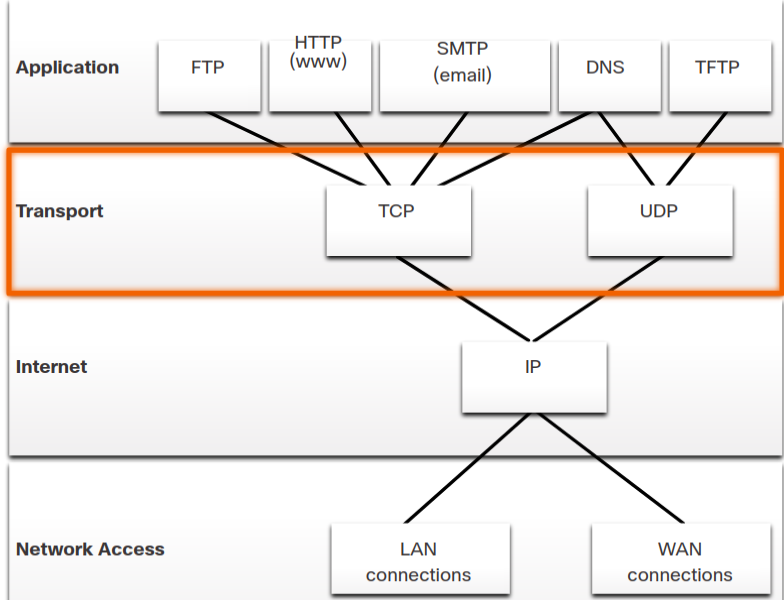

### Transmission Control Protocol (TCP)

TCP is considered a reliable, full-featured transport layer protocol, which ensures that all of the data arrives at the destination. TCP includes fields which ensure the delivery of the application data. These fields require additional processing by the sending and receiving hosts.

Note: TCP divides data into segments.

TCP **provides reliability and flow control using these basic operations**:

* Number and track data segments transmitted to a specific host from a specific application
* Acknowledge received data
* Retransmit any unacknowledged data after a certain amount of time
* Sequence data that might arrive in wrong order
* Send data at an efficient rate that is acceptable by the receiver

In order to maintain the state of a conversation and track the information, **TCP must first establish a connection between the sender and the receiver**. **This is why TCP is known as a connection-oriented protocol**.

### TCP Header

TCP is a stateful protocol which means **it keeps track of the state of the communication session**. **To track the state of a session, TCP records which information it has sent and which information has been acknowledged**. **The stateful session begins with the session establishment and ends with the session termination**.

A TCP segment adds 20 bytes (i.e., 160 bits) of overhead when encapsulating the application layer data. The figure shows the fields in a TCP header.

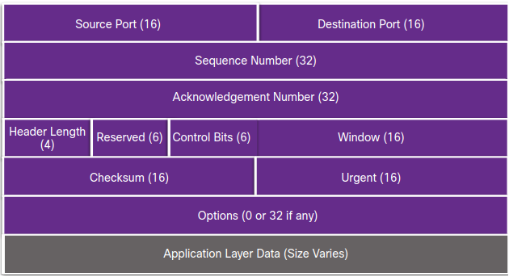

#### TCP Header Fields

|TCP Header Field | Description                                                          |
|-----------------|----------------------------------------------------------------------|
|Source Port      |A 16-bit field used to identify the **source application by port number**|
|Destination Port|A 16-bit field used to identify the **destination application by port number**|
|Sequence Number |A 32-bit field used for **data reassembly purposes**|
|Acknowledgment Number |A 32-bit field used to indicate that **data has been received and the next byte expected from the source**|
|Header Length |A 4-bit field known as ʺdata offsetʺ that **indicates the length of the TCP segment header**|
|Reserved|A 6-bit field that **is reserved for future use**.|
|Control bits |A 6-bit field that **includes bit codes**, or flags, which **indicate the purpose and function of the TCP segment**|
|Window size |A 16-bit field used to **indicate the number of bytes that can be accepted at one time**|
|Checksum |A 16-bit field **used for error checking of the segment header and data**|
|Urgent|A 16-bit field used to **indicate if the contained data is urgent**|

### User Datagram Protocol (UDP)

**UDP is a simpler transport layer protocol than TCP**. It **does not provide reliability and flow control**, which means **it requires fewer header fields**. Because the sender and the receiver UDP processes **do not have to manage reliability and flow control**, **this means UDP datagrams can be processed faster than TCP segments**. **UDP provides the basic functions for delivering datagrams between the appropriate applications**, with very little overhead and data checking.

Note: UDP divides data into datagrams that are also referred to as segments.

UDP **is a connectionless protocol**. Because **UDP does not provide reliability or flow control**, **it does not require an established connection**. Because **UDP does not track information sent or received between the client and server, UDP is also known as a stateless protocol**.

UDP is also known as a best-effort delivery protocol because there is no acknowledgment that the data is received at the destination. With UDP, there are no transport layer processes that inform the sender of a successful delivery.

UDP is like placing a regular, nonregistered, letter in the mail. The sender of the letter is not aware of the availability of the receiver to receive the letter. Nor is the post office responsible for tracking the letter or informing the sender if the letter does not arrive at the final destination.

#### UDP Header

UDP **is a stateless protocol**, **meaning neither the client, nor the server, tracks the state of the communication session**. **If reliability is required when using UDP as the transport protocol, it must be handled by the application**.

**One of the most important requirements for delivering live video and voice over the network is that the data continues to flow quickly**. Live video and voice applications can tolerate some data loss with minimal or no noticeable effect, and are perfectly suited to UDP.

The blocks of communication in UDP are called datagrams, or segments. These datagrams **are sent as best effort by the transport layer protocol**.

The UDP header is far simpler than the TCP header because it only has four fields and requires 8 bytes (i.e., 64 bits). The figure shows the fields in a UDP header.

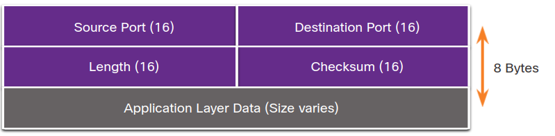

#### UDP Header Fields
|TCP Header Field | Description                                                          |
|-----------------|----------------------------------------------------------------------|
|Source Port      |A 16-bit field used to identify the **source application by port number**|
|Destination Port|A 16-bit field used to identify the **destination application by port number**|
|Lenght |A 16-bit field that indicates the length of the UDP datagram header|
|Checksum|A 16-bit field used for **error checking of the datagram header and data**|

### Socket Pairs

**The source and destination ports are placed within the segment**. **The segments are then encapsulated within an IP packet**. **The IP packet contains the IP address of the source and destination**. The **combination of the source IP address and source port number, or the destination IP address and destination port number is known as a socket**.

The socket is used to identify the server and service being requested by the client. **A client socket might look like this, with 1099 representing the source port number: 192.168.1.5:1099** **The socket on a web server might be 192.168.1.7:80**.

**Together, these two sockets combine to form a socket pair: 192.168.1.5:1099, 192.168.1.7:80**.

Sockets enable multiple processes, running on a client, to distinguish themselves from each other, and multiple connections to a server process to be distinguished from each other.

The source port number acts as a return address for the requesting application. The transport layer keeps track of this port and the application that initiated the request so that when a response is returned, it can be forwarded to the correct application.

### Check Your Understanding – Compare TCP and UDP Characteristics

* **UDP**
  * less overhead
  * fast transmission requirements
  * no acknowledgement of receipt
  * connectionless
  * no ordered delivery
* **TPC**
  * guaranteed delivery
  * ordered delivery
  * sequenced message segments
  * flow control
  * session establishment

## Transport Layer Session Establishment

### TCP Server Processes

**Each application process running on a server is configured to use a port number**. The **port number is either automatically assigned or configured manually by a system administrator**.
An individual server **cannot have two services assigned to the same port number within the same transport layer services**. For example, a host running a web server application and a file transfer application cannot have both configured to use the same port, such as TCP port 80.
An active server application assigned to a specific port is considered open, which means that the transport layer accepts, and processes segments addressed to that port. Any incoming client request addressed to the correct socket is accepted, and the data is passed to the server application. There can be many ports open simultaneously on a server, one for each active server application.

### TCP Connection Establishment

**In TCP connections, the host client establishes the connection with the server using the three-way handshake process**.

1. **Step 1**: SYN: The initiating client requests a client-to-server communication session with the server.
2. **Step 2**: The server acknowledges the client-to-server communication session and requests a server-to-client communication session.
3. **Step 3**: The initiating client acknowledges the server-to-client communication session.

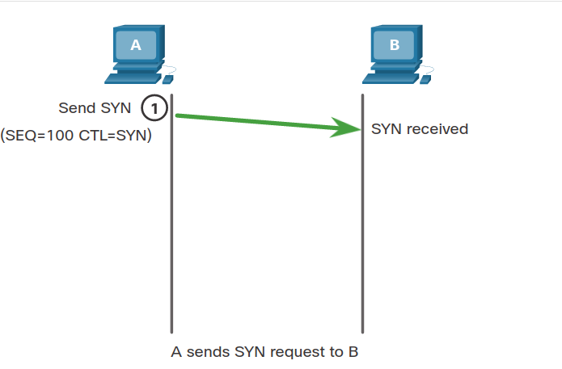

### 9.2.3 Session Termination

**To close a connection**, the **Finish (FIN) control flag must be set in the segment header**. To end each one-way TCP session, **a two-way handshake, consisting of a FIN segment and an Acknowledgment (ACK) segment**, is used. Therefore, to terminate a single conversation supported by TCP, **four exchanges are needed to end both sessions**. Either the client or the server can initiate the termination.

1. **Step 1**: FIN: When the client has no more data to send in the stream, it sends a segment with the FIN flag set.
2. **Step 2**: ACK: The server sends an ACK to acknowledge the receipt of the FIN to terminate the session from client to server.
3. **Step 3**: FIN: The server sends a FIN to the client to terminate the server-to-client session.
4. **Step 4**: ACK: The client responds with an ACK to acknowledge the FIN from the server.

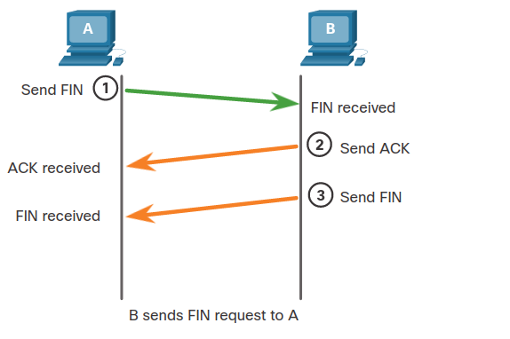
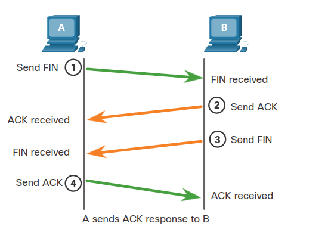

**When all segments have been acknowledged, the session is closed.**

### TCP Three-way Handshake Analysis

Hosts maintain state, track each data segment within a session, and exchange information about what data is received using the information in the TCP header. **TCP is a full-duplex protocol**, **where each connection represents two one-way communication sessions**. To establish the connection, **the hosts perform a three-way handshake**. **Control bits in the TCP header indicate the progress and status of the connection**.

**These are the functions of the three-way handshake**:

* It establishes that the destination device is present on the network.
* It verifies that the destination device has an active service and is accepting requests on the destination port number that the initiating client intends to use.
* It informs the destination device that the source client intends to establish a communication session on that port number.

After the communication is completed the sessions are closed, and the connection is terminated. The connection and session mechanisms enable TCP reliability function.

The six bits in the Control Bits field of the TCP segment header are also known as flags. A flag is a bit that is set to either on or off.

The six control bits flags are as follows:

* URG - Urgent pointer field significant
* ACK - Acknowledgment flag used in connection establishment and session termination
* PSH - Push function
* RST - Reset the connection when an error or timeout occurs
* SYN - Synchronize sequence numbers used in connection establishment
* FIN - No more data from sender and used in session termination

## Transport Layer Reliability

### TCP Reliability: Guaranteed and Ordered Delivery

TCP, unlike UDP, **resends dropped packets** and **numbers packets to indicate their proper order before delivery**. TCP can also help **maintain the flow of packets** so that devices do not become overloaded.

There may be times when TCP segments do not arrive at their destination. Other times, the TCP segments might arrive out of order. For the original message to be understood by the recipient, all the data must be received and the data in these segments must be reassembled into the original order. **Sequence numbers are assigned in the header of each packet to achieve this goal.** The sequence number represents the first data byte of the TCP segment.

**During session setup, an initial sequence number (ISN) is set.** **This ISN represents the starting value of the bytes that are transmitted to the receiving application**. As data is transmitted during the session, the sequence number is incremented by the number of bytes that have been transmitted. This data byte tracking enables each segment to be uniquely identified and acknowledged. Missing segments can then be identified. **The ISN does not begin at one but is effectively a random number**. **This is to prevent certain types of malicious attacks**. For simplicity, we will use an ISN of 1 for the examples.

Segment sequence numbers indicate how to reassemble and reorder received segments, as shown in the figure.

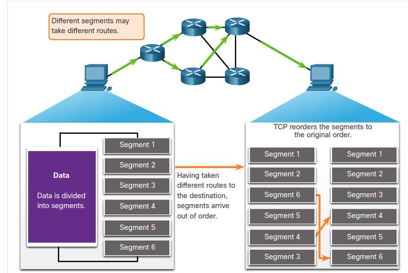

The receiving TCP process places the data from a segment into a receiving buffer. Segments are then placed in the proper sequence order and passed to the application layer when reassembled. Any segments that arrive with sequence numbers that are out of order are held for later processing. Then, when the segments with the missing bytes arrive, these segments are processed in order.

### TCP Reliability: data loss and retransmission

No matter how well designed a network is, **data loss occasionally occurs**. **TCP provides methods of managing these segment losses**. Among these is a mechanism to retransmit segments for unacknowledged data.

The **sequence (SEQ) number and acknowledgement (ACK) number** are used together to confirm receipt of the bytes of data contained in the transmitted segments. The **SEQ number identifies the first byte of data in the segment being transmitted**. **TCP uses the ACK number sent back to the source to indicate the next byte that the receiver expects to receive**. This is called expectational acknowledgement.

Prior to later enhancements, TCP could only acknowledge the next byte expected. For example, using segment numbers for simplicity, host A sends segments 1 through 10 to host B. If all the segments arrive except for segments 3 and 4, host B would reply with acknowledgment specifying that the next segment expected is segment 3. Host A has no idea if any other segments arrived or not. Host A would, therefore, resend segments 3 through 10. If all the resent segments arrived successfully, segments 5 through 10 would be duplicates. This can lead to delays, congestion, and inefficiencies.

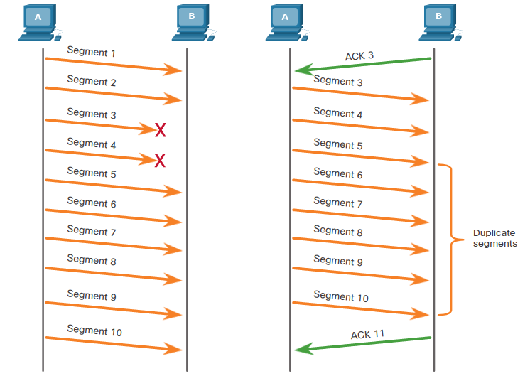

Host operating systems today typically employ an optional TCP feature **called selective acknowledgment (SACK), negotiated during the three-way handshake**. If both hosts support SACK, the receiver can explicitly acknowledge which segments (bytes) were received including any discontinuous segments. **The sending host would therefore only need to retransmit the missing data**. For example, again using segment numbers for simplicity, host A sends segments 1 through 10 to host B. If all the segments arrive except for segments 3 and 4, host B can acknowledge that it has received segments 1 and 2 (ACK 3), and selectively acknowledge segments 5 through 10 (SACK 5-10). Host A would only need to resend segments 3 and 4.

Note: TCP typically sends ACKs for every other packet, but other factors beyond the scope of this topic may alter this behavior. **TCP uses timers to know how long to wait before resending a segment**. 

### TCP Flow Control: Window Size and Acknowledgments

**TCP also provides mechanisms for flow control**. Flow control is the amount of data that the destination can receive and process reliably. **Flow control helps maintain the reliability of TCP transmission by adjusting the rate of data flow between source and destination for a given session**. To accomplish this, the TCP header includes **a 16-bit field called the window size**.

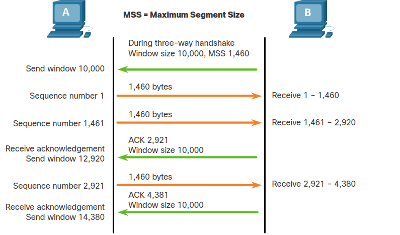

**The window size determines the number of bytes that can be sent before expecting an acknowledgment**. **The acknowledgment number is the number of the next expected byte**.

The window size is the number of bytes that the destination device of a TCP session can accept and process at one time. In this example, the PC B initial window size for the TCP session is 10,000 bytes. Starting with the first byte, byte number 1, the last byte PC A can send without receiving an acknowledgment is byte 10,000. **This is known as the send window** of PC A. The window size is included in every TCP segment so the destination can modify the window size at any time depending on buffer availability.

The initial window size is agreed upon when the TCP session is established during the three-way handshake. The source device must limit the number of bytes sent to the destination device based on the window size of the destination. **Only after the source device receives an acknowledgment that the bytes have been received, can it continue sending more data for the session**. Typically, **the destination will not wait for all the bytes for its window size to be received before replying with an acknowledgment. As the bytes are received and processed, the destination will send acknowledgments to inform the source that it can continue to send additional bytes**.

For example, it is typical that PC B would not wait until all 10,000 bytes have been received before sending an acknowledgment. This means PC A can adjust its send window as it receives acknowledgments from PC B. As shown in the figure, when PC A receives an acknowledgment with the acknowledgment number 2,921, which is the next expected byte. The PC A send window will increment 2,920 bytes. This changes the send window from 10,000 bytes to 12,920. PC A can now continue to send up to another 10,000 bytes to PC B as long as it does not send more than its new send window at 12,920.

A destination sending acknowledgments as it processes bytes received, and the continual adjustment of the source send window, is known as sliding windows. In the previous example, the send window of PC A increments or slides over another 2,921 bytes from 10,000 to 12,920.

If the availability of the destination’s buffer space decreases, it may reduce its window size to inform the source to reduce the number of bytes it should send without receiving an acknowledgment.

Note: Devices today use the sliding windows protocol. The receiver typically sends an acknowledgment after every two segments it receives. The number of segments received before being acknowledged may vary. The advantage of sliding windows is that it allows the sender to continuously transmit segments, as long as the receiver is acknowledging previous segments. The details of sliding windows are beyond the scope of this course.

### TCP Flow Control - Maximum Segment Size (MSS)

**The source is transmitting 1,460 bytes of data within each TCP segment**. **This is typically the Maximum Segment Size (MSS) that the destination device can receive**. The MSS is part of the options field in the TCP header that specifies the largest amount of data, in bytes, that a device can receive in a single TCP segment. The MSS size does not include the TCP header. The MSS is typically included during the three-way handshake.

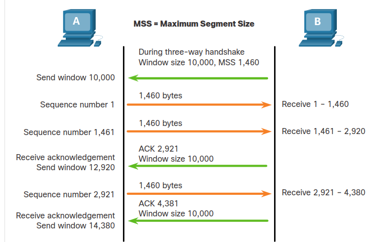

**A common MSS is 1,460 bytes when using IPv4**. A host determines the value of its MSS field by subtracting the IP and TCP headers from the Ethernet maximum transmission unit (MTU). On an Ethernet interface, the default MTU is 1500 bytes. Subtracting the IPv4 header of 20 bytes and the TCP header of 20 bytes, the default MSS size will be 1460 bytes, as shown in the figure.

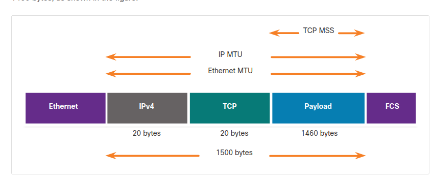

### TCP Flow Control - Congestion Avoidance

**When congestion occurs on a network, it results in packets being discarded by the overloaded router**. **When packets containing TCP segments do not reach their destination, they are left unacknowledged**. By determining the rate at which TCP segments are sent but not acknowledged, **the source can assume a certain level of network congestion**.

**Whenever there is congestion**, **retransmission of lost TCP segments from the source will occur**. If the retransmission is not properly controlled, the additional retransmission of the TCP segments **can make the congestion even worse**. Not only are new packets with TCP segments introduced into the network, but the feedback effect of the retransmitted TCP segments that were lost will also add to the congestion. **To avoid and control congestion, TCP employs several congestion handling mechanisms, timers, and algorithms**.

If the source determines that the TCP segments are either not being acknowledged or not acknowledged in a timely manner, then **it can reduce the number of bytes it sends before receiving an acknowledgment**. As illustrated in the figure, PC A senses there is congestion and therefore, reduces the number of bytes it sends before receiving an acknowledgment from PC B.

**Acknowledgment numbers are for the next expected byte and not for a segment.** The segment numbers used are simplified for illustration purposes.

Notice that it is the source that is reducing the number of unacknowledged bytes it sends and not the window size determined by the destination.

Note: Explanations of actual congestion handling mechanisms, timers, and algorithms are beyond the scope of this course.

### Check Your Understanding - Reliability and Flow Control

1. What field is used by the destination host to reassemble segments into the original order?
   **Sequence Number**
2. What field is used to provide flow control?
   **Windows Size**
3. What happens when a sending host senses there is congestion? 
   **The sending host reduces the number of bytes it sends before receiving an acknowledgment from the destination host.**

## The Transport Layer Summary

### What Did I Learn in this Module?

* **Transport Layer Characteristics**: The **transport layer is the link between the application layer and the lower layers of the OSI model that are responsible for network transmission**. The transport layer is responsible for logical communications between applications running on different hosts. **The transport layer includes TCP and UDP**. Transport layer protocols specify **how to transfer messages between hosts and is responsible for managing reliability requirements of a conversation**. The transport layer is responsible for **tracking conversations (sessions), segmenting data and reassembling segments, adding segment header information, identifying applications, and conversation multiplexing**. **TCP is stateful and reliable**. It **acknowledges data, resends lost data, and delivers data in sequenced order**. **TCP is used for email and the web**. **UDP is stateless and fast**. **It has low overhead, does not requires acknowledgments, does not resend lost data, and processes data in the order in which it arrives**. **UDP is used for VoIP and DNS**. The TCP and UDP transport layer protocols use port numbers to manage multiple simultaneous conversations. This is why the TCP and UDP header fields identify a source and destination application port number. The source and destination ports are placed within the segment. The segments are then encapsulated within an IP packet. The combination of the source IP address and source port number, or the destination IP address and destination port number are known as a sockets. The socket is used to identify the server and service being requested by the client and the host and application on the host that should handle the returning data. The range of port numbers is from 0 through 65535.

* **Transport Layer Session Establishment**: The **three-way handshake establishes that the destination device is present on the network**. It verifies that the destination device has an active service that is accepting requests on the destination port number that the initiating client intends to use. It also informs the destination device that the source client intends to establish a communication session on that port number. **The six control bits flags are: URG, ACK, PSH, RST, SYN, and FIN and are used to identify the function of TCP messages that are sent**. A client or server can terminate a single conversation supported by TCP by sending a sequence of TCP messages.

* **Transport Layer Reliability**: For the original message to be understood by the recipient, all the data must be received and the data in these segments must be reassembled into the original order. Sequence numbers are assigned in the header of each packet. No matter how well designed a network is, data loss occasionally occurs. TCP provides ways to manage segment losses. There is a mechanism to retransmit segments for unacknowledged data. Host operating systems today typically employ an optional TCP feature called selective acknowledgment (SACK), which is negotiated during the three-way handshake. If both hosts support SACK, the receiver can explicitly acknowledge which segments (bytes) were received including any discontinuous segments. The sending host would therefore only need to retransmit the missing data. Flow control helps maintain the reliability of TCP transmission by adjusting the rate of data flow between source and destination. To accomplish this, the TCP header includes a 16-bit field called the window size. The process of the destination sending acknowledgments as it processes bytes received and the continual adjustment of the source’s send window is known as sliding windows. A source might be transmitting 1,460 bytes of data within each TCP segment. This is the typical maximum segment size (MSS) that a destination device can receive. To avoid and control congestion, TCP employs several congestion handling mechanisms.

### Module 9: The Transport Layer Quiz

1. What are two roles of the transport layer in data communication on a network? (Choose two.)
   Topic 9.1.0 - The transport layer has several responsibilities. The primary responsibilities include the following:
    **Tracking the individual communication streams between applications on the source and destination hosts**
    Segmenting data at the source and reassembling the data at the destination
    Identifying the proper application for each communication stream through the use of port numbers 
    **Identifying the proper application for each communication stream**
    **Tracking the individual communication between applications on the source and destination hosts**

2. During a TCP session, a destination device sends an acknowledgment number to the source device. What does the acknowledgment number represent?
   Topic 9.1.0 - The window size determines the number of bytes that will be sent before expecting an acknowledgement. The acknowledgement number is the number of the next expected byte. For example, if a host has received 3140 bytes, the host would respond with an acknowledgement number of 3141.
   **The next byte that the destination expects to receive**

3. Which two services or protocols use the preferred UDP protocol for fast transmission and low overhead? (Choose two)
   Topic 9.1.0 - Both DNS and VoIP use UDP to provide low overhead services within a network implementation.​
   **VoIP**
   **DNS**

4. Which transport layer feature is used to guarantee session establishment?
   Topic 9.2.0 - TCP uses the 3-way handshake. UDP does not use this feature. The 3-way handshake ensures there is connectivity between the source and destination devices before transmission occurs.
   **TCP 3-way handshake**

5. Data is being sent from a source PC to a destination server. Which three statements correctly describe the function of TCP or UDP in this situation? (Choose three.)
   Topic 9.2.0 - Layer 4 port numbers identify the application or service which will handle the data. The source port number is added by the sending device and will be the destination port number when the requested information is returned. Layer 4 segments are encapsulated within IP packets. UDP, not TCP, is used when low overhead is needed. A source IP address, not a TCP source port number, identifies the sending host on the network. Destination port numbers are specific ports that a server application or service monitors for requests.
   **The UDP destination port number identifies the application or service on the server which will handle the data**
   **The source port field identifies the running application or service that will handle data returning to the PC**
   **UDP segments are encapsulated within IP packets for transport across the network**

6. What is the purpose of the TCP sliding window?
   Topic 9.3.0 - The TCP sliding window allows a destination device to inform a source to slow down the rate of transmission. To do this, the destination device reduces the value contained in the window field of the segment. It is acknowledgment numbers that are used to specify retransmission from a specific point forward. It is sequence numbers that are used to ensure segments arrive in order. Finally, it is a FIN control bit that is used to end a communication session.
   **To request that a source decrease the rate at which it transmits data**

7. What happens if part of an FTP message is not delivered to the destination?
   Topic 9.3.0 - Because FTP uses TCP as its transport layer protocol, sequence and acknowledgment numbers will identify the missing segments, which will be re-sent to complete the message.
   **The part of the FTP message that was lost is re-sent**

8. Which two flags in the TCP header are used in a TCP three-way handshake to establish connectivity between two network devices? (Choose two.)
   Topic 9.2.0 - TCP uses the SYN and ACK flags in order to establish connectivity between two network devices.
   **SYN**
   **ACK**

9.  Which tool is used to provide a list of open ports on network devices? 
    Topic 9.3.0 - The Nmap tool is a port scanner that is used to determine which ports are open on a particular network device. A port scanner is used before launching an attack.
    **NMAP**  

10. Which two fields are included in the TCP header but not in the UDP header? (Choose two.)
    Topic 9.1.0 - The sequence number and window fields are included in the TCP header but not in the UDP header.
    **Window
    Sequence Number    **

11. Topic 9.3.0 - A three-way handshake is recognizable by the SYN flag being set first, then the SYN, ACK response, followed by the final ACK flag being sent in a packet.
    
12. What is a characteristic of a TCP server process?
    Topic 9.1.0 - Each application process running on the server is configured to use a port number, either by default or manually, by a system administrator. An individual server cannot have two services assigned to the same port number within the same transport layer services. A host running a web server application and a file transfer application cannot have both configured to use the same server port. 
    There can be many ports open simultaneously on a server, one for each active server application.