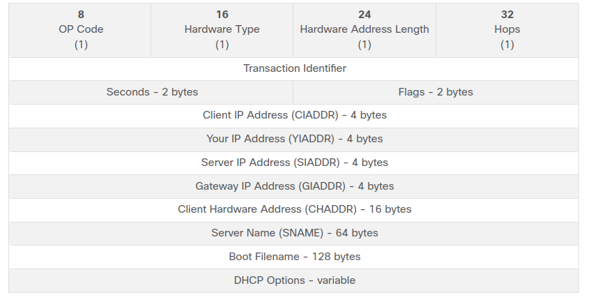
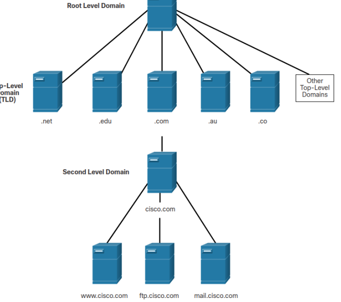
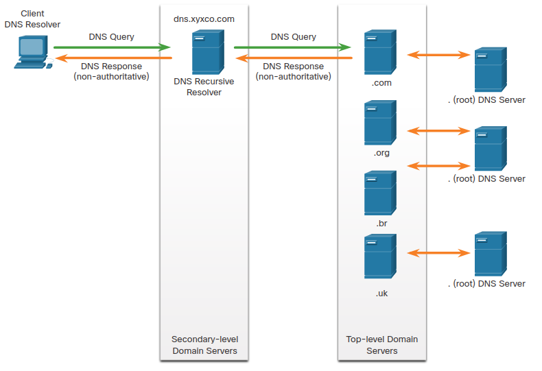
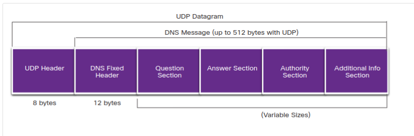
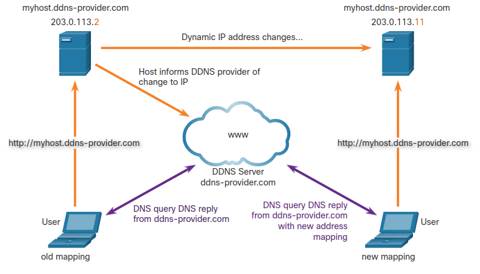
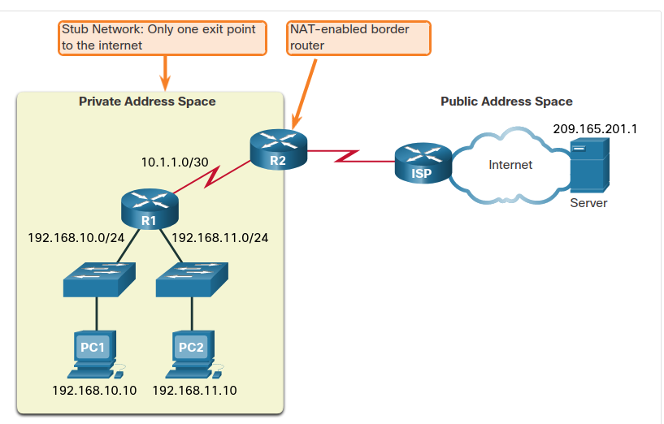
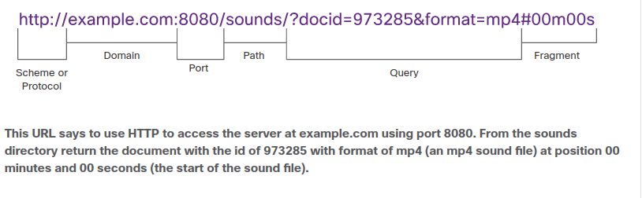
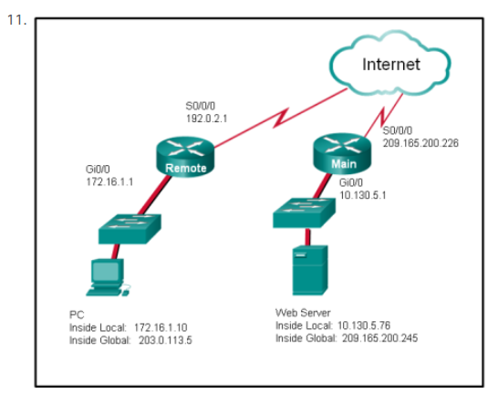

# Network Services

## Introduction

In this module you will learn about network services including **DHCP, NAT, PAT, FTP, TFTP, email protocols, and DNS**. **A recent analysis of network security threats discovered that over 90% of the malicious software that is used to attack networks uses the DNS system to carry out attack campaigns**! Now read more about the security of these protocols.

## DHCP : Dynamic Host Configuration Protocol

The Dynamic Host Configuration Protocol (DHCP) for IPv4 **service automates the assignment of IPv4 addresses, subnet masks, gateways, and other IPv4 networking parameters**. This is referred to as dynamic addressing. **The alternative to dynamic addressing is static addressing**. When using static addressing, the network administrator manually enters IP address information on hosts. When a host connects to the network, the DHCP server is contacted, and an address is requested. The DHCP server chooses an address from a configured range of addresses called a pool and assigns (leases) it to the host.

On larger networks, or where the user population changes frequently, DHCP is preferred for address assignment. New users may arrive and need connections; others may have new computers that must be connected. Rather than use static addressing for each connection, it is more efficient to have IPv4 addresses assigned automatically using DHCP. **DHCP can allocate IP addresses for a configurable period of time, called a lease period**. The lease period is an important DHCP setting, **When the lease period expires or the DHCP server gets a DHCPRELEASE message the address is returned to the DHCP pool for reuse**. Users can freely move from location to location and easily re-establish network connections through DHCP.

 The DHCP server in most medium-to-large networks is usually a local, dedicated PC-based server. With home networks, the DHCP server is usually located on the local router that connects the home network to the ISP. Many networks use both DHCP and static addressing. DHCP is used for general purpose hosts, such as end user devices. Static addressing is used for network devices, such as gateway routers, switches, servers, and printers. **DHCP for IPv6 (DHCPv6) provides similar services for IPv6 clients. One important difference is that DHCPv6 does not provide a default gateway address. This can only be obtained dynamically from the Router Advertisement message of the router.**

 ### 10.1.2 DHCP Operation

 when an IPv4, DHCP-configured device boots up or connects to the network, the client broadcasts a DHCP discover (DHCPDISCOVER) message to identify any available DHCP servers on the network. A DHCP server replies with a DHCP offer (DHCPOFFER) message, which offers a lease to the client. The offer message contains the IPv4 address and subnet mask to be assigned, the IPv4 address of the DNS server, and the IPv4 address of the default gateway. The lease offer also includes the duration of the lease.

 |DHCP CLIENT| DHCP SERVER|
 |-----------|------------|
 |DHCPDISCOVER->|         |
 |             |<- DHCPOFFER|
 |DHCPREQUEST->|            |
 |             | <- DHCPACK  |

 The client may receive multiple DHCPOFFER messages if there is more than one DHCP server on the local network. Therefore, it must choose between them, and sends a DHCP request (DHCPREQUEST) message that identifies the explicit server and lease offer that the client is accepting. A client may also choose to request an address that it had previously been allocated by the server.

 Assuming that the IPv4 address requested by the client, or offered by the server, is still available, the server returns a DHCP acknowledgment (DHCPACK) message that acknowledges to the client that the lease has been finalized. If the offer is no longer valid, then the selected server responds with a DHCP negative acknowledgment (DHCPNAK) message. If a DHCPNAK message is returned, then the selection process must begin again with a new DHCPDISCOVER message being transmitted. After the client has the lease, it must be renewed prior to the lease expiration through another DHCPREQUEST message.

 The DHCP server ensures that all IP addresses are unique (the same IP address cannot be assigned to two different network devices simultaneously). Most ISPs use DHCP to allocate addresses to their customers.

 DHCPv6 has a set of messages that is similar to those for DHCPv4. The DHCPv6 messages are SOLICIT, ADVERTISE, INFORMATION REQUEST, and REPLY.

 ### 10.1.3 DHCP Message Format

 The **DHCPv4 message format** is used for all DHCPv4 transactions. **DHCPv4 messages are encapsulated within the UDP transport protocol**. DHCPv4 messages that are sent from the client use **UDP source port 68** and **destination port 67**. DHCPv4 messages sent from the server to the client use **UDP source port 67** and **destination port 68**. The structure of the DHCPv4 message is shown below.

 

 The fields are explained here:
 * **operation (OP) code**: Specifies the general type of message. A value of 1 indicates a request message; a value of 2 is a reply message.
 * **hardware type**:  Identifies the type of hardware used in the network. For example, 1 is Ethernet, 15 is Frame Relay, and 20 is a serial line. These are the same codes used in ARP messages.
 * **hardware address length**: Specifies the length of the address.
 * **hops**: Controls the forwarding of messages. Set to 0 by a client before transmitting a request.
 * **transaction identifier**: Used by the client to match the request with replies received from DHCPv4 servers.
 * **seconds**: Identifies the number of seconds elapsed since a client began attempting to acquire or renew a lease. Used by DHCPv4 servers to prioritize replies when multiple client requests are outstanding.
 * **frags**: Used by a client that does not know its IPv4 address when it sends a request. Only one of the 16 bits is used, which is the broadcast flag. A value of 1 in this field tells the DHCPv4 server or relay agent receiving the request that the reply should be sent as a broadcast.
 * **Client IP Address**: Used by a client during lease renewal when the address of the client is valid and usable, not during the process of acquiring an address. The client puts its own IPv4 address in this field if and only if it has a valid IPv4 address while in the bound state; otherwise, it sets the field to 0.
 * **Your IP Address**: Used by the server to assign an IPv4 address to the client.
 * **Server IP Address**: Used by the server to identify the address of the server that the client should use for the next step in the bootstrap process, which may or may not be the server sending this reply. The sending server always includes its own IPv4 address in a special field called the Server Identifier DHCPv4 option.
 * Gateway IP Address: Routes DHCPv4 messages when DHCPv4 relay agents are involved. The gateway address facilitates communications of DHCPv4 requests and replies between the client and a server that are on different subnets or networks.
 * Client Hardware Address: Specifies the physical layer of the client.
 * Server Name: Used by the server sending a DHCPOFFER or DHCPACK message. The server may optionally put its name in this field. This can be a simple text nickname or a DNS domain name, such as dhcpserver.netacad.net.
 * Boot Filename: Optionally used by a client to request a particular type of boot file in a DHCPDISCOVER message. Used by a server in a DHCPOFFER to fully specify a boot file directory and filename.
 * DHCP Options: Holds DHCP options, including several parameters required for basic DHCP operation. This field is variable in length. Both client and server may use this field.

### 10.1.4 Check Your Understanding - DHCP

1. What information does DHCPv4 provide to network clients? (Choose three.)
   host address, subnet mask, default gateway address
2. True or false. DHCP can lease addresses to hosts for different periods of time.
   True
3. In large networks, static IPv4 addresses are usually assigned to which devices? (Choose two.)
   gateway routers, printers
4. Which DHCP message is sent from a client when the client starts up and requires an IP address?
   DHCPDISCOVER
5. When client sends a DHCPDISCOVER message, how is the message sent?
   It is broadcast on the local network

## DNS

The **Domain Name System (DNS) was developed to provide a reliable means of managing and providing domain names and their associated IP addresses**. The **DNS system consists of a global hierarchy of distributed servers that contain databases of name to IP address mappings**. The client computer in the figure will send a request to the DNS server to get the IP address for www⋅cisco⋅com so that it can address packets to that server.

**A recent analysis of network security threats discovered that over 90% of malicious software exploits use the DNS system to carry out network attack campaigns.** **A cybersecurity analyst should have a thorough understanding of the DNS system and the ways in which malicious DNS traffic can be detected through protocol analysis and the inspection of DNS monitoring information.** In addition, malware frequently contacts command-and-control servers by using DNS. This makes the server URLs indicators of compromise for specific exploits.

### The DNS Domain Hierarchy

The DNS consists **of a hierarchy of generic top-level domains (gTLD) which consist of .com, .net, .org, .gov, .edu, and numerous country-level domains, such as .br (Brazil), .es (Spain), .uk (United Kingdom), etc.** **At the next level** of the DNS hierarchy are second-level domains. These are represented by a domain name that is followed by a top-level domain. **Subdomains are found at the next level of the DNS hierarchy and represent some division of the second-level domain.** Finally, **a fourth level** can represent a host in a subdomain. **Each element of a domain specification is sometimes called a label**. The labels move from the top of the hierarchy downward from right to left. A dot (“.“) at the end of a domain name represents the root server at the top of the hierarchy. The figure illustrates this DNS domain hierarchy.

The different top-level domains represent either the type of organization or the country of origin. Examples of top-level domains are the following:

* .com: a business or industry
* .org: a non-profit organization
* .au: Australia
* .co: Colombia

### The DNS Lookup Process

To understand DNS, cybersecurity analysts should be familiar with the following terms:

* resolver: a DNS client that sends DNS messages to obtain information about the requested domain name space
* recursion: the action taken when a DNS server is asked to query on behalf of a DNS resolver
* authoritative server: a DNS server that responds to query messages with information stored in Resource Records (RRs) for a domain name space stored on the server
* FQDN: a Fully Qualified Domain Name is the absolute name of a device within the distributed DNS database
* RR: a Resource Record is a format used in DNS messages that is composed of the following fields: NAME, TYPE, CLASS, TTL, RDLENGTH, RDATA
* zone: a database that contains information about the domain name space stored on an authoritative server

When attempting to resolve a name to an IP address, a user host, known in the system as a resolver, **will first check its local DNS cache**. **If the mapping is not found there, a query will be issued to the DNS server or servers that are configured in the network addressing properties for the resolver**. **These servers may be present at an enterprise or ISP**. **If the mapping is not found there**, the **DNS server will query other higher-level DNS servers that are authoritative for the top-level domain in order to find the mapping**. These are known as recursive queries.

Because of the potential burden on authoritative top-level domain servers, **some DNS servers in the hierarchy maintain caches of all DNS records that they have resolved for a period of time**. These **caching DNS servers can resolve recursive queries without forwarding the queries to higher level servers**. If a server requires data for a zone, it will request a transfer of that data from an authoritative server for that zone. **The process of transferring blocks of DNS data between servers is known as a zone transfer**.

DNS Steps:

1. The user types an FQDN into a browser application Address field
2. A DNS query is sent to the designated DNS server for the client computer
3. The DNS server matches the FQDN with its IP address
4. The DNS query response is sent back to the client with the IP address for the FQDN
5. The client computer uses the IP address to make requests to the server

### DNS Message Format

DNS uses UDP port 53 for DNS queries and responses. DNS queries originate at a client and responses are issued from DNS servers. If a DNS response exceeds 512 bytes, such as when Dynamic DNS (DDNS) is used, TCP port 53 is used to handle the message. It includes the format for queries, responses, and data. The DNS protocol communications use a single format called a message.  This message format is used for all types of client queries and server responses, error messages, and the transfer of resource record information between servers.

The DNS server stores different types of RRs used to resolve names. These records contain the name, address, and type of record. Here is a list of some of these record types:

* A: an end device IPv4 address
* NS: an authoritative name server
* AAAA: an end device IPv6 address (pronounced quad-4)
* MX: a mail exchange record

When a client makes a query, the server’s DNS process first looks at its own records to resolve the name. If it is unable to resolve the name using its stored records, it contacts other servers to resolve the name. After a match is found and returned to the original requesting server, the server temporarily stores the numbered address in the event that the same name is requested again.

The DNS Client service on Windows PCs also stores previously resolved names in memory. The **ipconfig /displaydns** command displays all of the cached DNS entries.

DNS uses the same message for:
* all types of client queries and server responses
* error messages
* the transfer of resources records between servers

DNS uses the same message format between servers, consisting of a question, answer, authority, and additional information for all types of client queries and server responses, error messages, and transfer of resource record information. The table describes each section.

|DNS message section|Description|
|-------------------|-----------|
|Question|The question for the server. It contains the domain name to be resolved, the class of domain, and the query type.|
|Answer|The DNS resource record, or RR, for the query including the resolved IP address depending on the RR type.|
|Authority|Contains the RRs for the domain authority.|
|Additional|Relevant to query responses only. Consists of RRs that hold additional information that will make query resolution more efficient|

### Dynamic DNS

DNS requires registrars to accept and distribute DNS mappings from organizations that wish to register domain name and IP address mappings. After the initial mapping has been created, a process which can take 24 hours or more, changes to the IP address that is mapped to the domain name can be made by contacting the registrar or using an online form to the make the change. However, because of the time it takes for this process to occur and the new mapping to be distributed in domain name system, the change can take hours before the new mapping is available to resolvers. In situations in which an ISP is using DHCP to provide addresses to a domain, it is possible that the address that is mapped to the domain could expire and a new address be granted by the ISP. This would result in a disruption of connectivity to the domain through DNS. A new approach was necessary to allow organizations to make fast changes to the IP address that is mapped to a domain.

Dynamic DNS (DDNS) allows a user or organization to register an IP address with a domain name as in DNS. However, when the IP address of the mapping changes, the new mapping can be propagated through the DNS almost instantaneously. For this to occur, a user obtains a subdomain from a DDNS provider. That subdomain is mapped to the IP address of the user’s server, or home router connection to the internet. Client software runs on either the router or a host PC that detects a change in the internet IP address of the user. When a change is detected, the DDNS provider is immediately informed of the change and the mapping between the user’s subdomain and the internet IP address is immediately updated, as shown in the figure. DDNS does not use a true DNS entry for a user’s IP address. Instead, it acts as an intermediary. The DDNS provider’s domain is registered with the DNS, but the subdomain is mapped to a totally different IP address. The DDNS provider service supplies that IP address to the resolver’s second level DNS server. That DNS server, either at the organization or ISP, provides the DDNS IP address to the resolver.

Dynamic DNS can be abused by threat actors in various ways. Free DDNS services are especially useful to threat actors. DDNS can be used to facilitate the rapid change of IP address for malware command-and-control servers after the current IP address has become widely blocked. In this way, the malware can be coded with a URL rather than a static IP address. DDNS can also be used as a way to exfiltrate data from inside a network because DNS traffic is very common and is frequently considered to be benign. DDNS itself is not malignant, however monitoring DNS traffic that is going to known DDNS services, especially free ones, is very useful for the detection of exploits.

### The WHOIS Protocol

WHOIS is a TCP-based protocol that is used to identify the owners of internet domains through the DNS system. 
When an internet domain is registered and mapped to an IP address for the DNS system, the registrant must supply information regarding who is registering the domain. The WHOIS application uses a query, in the form of a FQDN. The query is issued through a WHOIS service or application. The official ownership registration record is returned to the user by the WHOIS service. This can be useful for identifying the destinations that have been accessed by hosts on a network. WHOIS has limitations, and hackers have ways of hiding their identities. However, WHOIS is a starting point for identifying potentially dangerous internet locations that may have been reached through the network. An internet-based WHOIS service is called ICANN Lookup can be used to obtain the registration record a URL. Other WHOIS services are maintained by regional internet registries such as RIPE and APNIC.

## NAT

### IPv4 Private Address Space

As you know, **there are not enough public IPv4 addresses to assign a unique address to each device connected to the internet**. Networks are commonly implemented using private IPv4 addresses, as defined in RFC 1918. The range of addresses included in RFC 1918 are included in the following table. It is very likely that the computer that you use to view this course is assigned a private address.

|Class|RFC 1918 internal Address Range|Prefix|
|-----|-------------------------------|------|
|A|10.0.0.0 - 10.255.255.255|10.0.0.0/8|
|B|172.16.0.0 - 172.31.255.255|172.16.0.0/12|
|C|192.168.0.0 - 192.168.255.255|192.168.0.0/16|

**These private addresses are used within an organization or site to allow devices to communicate locally**. However, **because these addresses do not identify any single company or organization**, **private IPv4 addresses cannot be routed over the internet**. To allow a device with a private IPv4 address to access devices and resources outside of the local network, the private address must first be translated to a public address.

**NAT provides the translation of private addresses to public addresses**. This allows a device with a private IPv4 address to access resources outside of their private network, such as those found on the internet. NAT, combined with private IPv4 addresses, has been the primary method of preserving public IPv4 addresses. A single, public IPv4 address can be shared by hundreds, even thousands of devices, each configured with a unique private IPv4 address.

Without NAT, the exhaustion of the IPv4 address space would have occurred well before the year 2000. However, NAT has limitations and disadvantages, which will be explored later in this module. The solution to the exhaustion of IPv4 address space and the limitations of NAT is the eventual transition to IPv6.

### What is NAT?

NAT has many uses, but **its primary use is to conserve public IPv4 addresses**. It does this by **allowing networks to use private IPv4 addresses internally and providing translation to a public address only when needed**. NAT has a perceived benefit of adding a degree of privacy and security to a network, because it hides internal IPv4 addresses from outside networks.

NAT-enabled routers can be configured with one or more valid public IPv4 addresses. These public addresses are known as the NAT pool. When an internal device sends traffic out of the network, the NAT-enabled router translates the internal IPv4 address of the device to a public address from the NAT pool. To outside devices, all traffic entering and exiting the network appears to have a public IPv4 address from the provided pool of addresses.

A NAT router typically operates at the border of a stub network. A stub network is one or more networks with a single connection to its neighboring network, one way in and one way out of the network. In the example in the figure, R2 is a border router. As seen from the ISP, R2 forms a stub network.

When a device inside the stub network wants to communicate with a device outside of its network, the packet is forwarded to the border router. The border router performs the NAT process, translating the internal private address of the device to a public, outside, routable address.

Note: The connection to the ISP may use a private address or a public address that is shared among customers. For the purposes of this module, a public address is shown.

### Port Address Translation

Port Address Translation (PAT), **also known as NAT overload**, **maps multiple private IPv4 addresses to a single public IPv4 address or a few addresses**. **This is what most home routers do.** **The ISP assigns one address to the router**, yet several members of the household can simultaneously access the internet. This is the most common form of NAT for both the home and the enterprise.

With PAT, **multiple addresses can be mapped to one or to a few addresses**, **because each private address is also tracked by a port number**. When a device initiates a TCP/IP session, it generates a TCP or UDP source port value, or a specially assigned query ID for ICMP, to uniquely identify the session. When the NAT router receives a packet from the client, it uses its source port number to uniquely identify the specific NAT translation.

PAT ensures that devices use a different TCP port number for each session with a server on the internet. When a response comes back from the server, the source port number, which becomes the destination port number on the return trip, determines to which device the router forwards the packets. The PAT process also validates that the incoming packets were requested, thus adding a degree of security to the session.

As R2 processes each packet, **it uses a port number **(1331 and 1555, in this example) **to identify the device from which the packet originated**. The **source address (SA) is the inside local address with the TCP/UDP assigned port number added**. The **destination address (DA) is the outside global address with the service port number added**. 

**For the source address**, **R2 translates the inside local address to an inside global address with the port number added**. The destination address is not changed but is now referred to as the outside global IPv4 address. When the web server replies, the path is reversed.

## File Transfer and Sharing Services

### FTP and TFTP

**FTP** is another commonly used application layer protocol. FTP was developed to allow for data transfers between a client and a server. An FTP client is an application that runs on a computer that is used to push and pull data from an FTP server.

To successfully transfer data, FTP requires two connections between the client and the server, one for commands and replies, the other for the actual file transfer:

1. The **client establishes the first connection to the server for control traffic using TCP port 21**, consisting of client commands and server replies.
2. The **client establishes the second connection to the server for the actual data transfer using TCP port 20**. This connection is created every time there is data to be transferred.

The data transfer can happen in either direction. The **client can download (pull) data from the server, or the client can upload (push) data to the server**.

**FTP was not designed to be a secure application layer protocol**. For this reason, **SSH File Transfer Protocol, which is a secure form of FTP that uses Secure Shell protocol to provide a secure channel, is the preferred file transfer implementation**.

**TFTP** is a simplified file transfer protocol that **uses well-known UDP port number 69**. It lacks many of the features of FTP, such as the file management operations of listing, deleting, or renaming files. Because of its simplicity, **TFTP has a very low network overhead and is popular for non-critical file transfer applications**. **It is fundamentally insecure however, because it has no login or access control features**. For this reason, TFTP needs to be implemented carefully, and only when absolutely necessary.

### SMB

The **Server Message Block (SMB)** **is a client/server file sharing protocol that describes the structure of shared network resources such as directories**, **files**, **printers**, **and serial ports**. **It is a request-response protocol**. **All SMB messages share a common format**. This format uses a fixed-sized header, followed by a variable-sized parameter and data component.

SMB is a client/server, request-response protocol. Servers can make their own resources available to clients on the network.

**SMB messages can start**, **authenticate**, **and terminate sessions**, **control file and printer access**, **and allow an application to send or receive messages to or from another device**.

SMB file sharing and print services have become the mainstay of Microsoft networking, as shown below.

A file may be copied from PC to PC with Windows Explorer using the SMB protocol.

## Email

### Email protocols

One of the primary services offered by an ISP is email hosting. To run on a computer or other end device, **email requires several applications and services**. **Email is a store-and-forward method of sending, storing, and retrieving electronic messages across a network**. **Email messages are stored in databases on mail servers**.

**Email clients communicate with mail servers to send and receive email**. **Mail servers communicate with other mail servers to transport messages from one domain to another**. An email client does not communicate directly with another email client when sending email. Instead, **both clients rely on the mail server to transport messages**.

Email supports three separate protocols for operation: **Simple Mail Transfer Protocol (SMTP)**, **Post Office Protocol (POP)**, **and IMAP**. The **application layer process that sends mail uses SMTP**. A **client retrieves email using one of the two application layer protocols: POP or IMAP**.

### SMTP

**SMTP message formats** require **a message header and a message body**. While the message body can contain any amount of text, the message header must have **a properly formatted recipient email address and a sender address**.

When a client sends email, the **client SMTP process connects with a server SMTP process on well-known port 25**. After the connection is made, the **client attempts to send the email to the server across the connection**. When **the server receives the message**, it either places the message in a local account, if the recipient is local, or forwards the message to another mail server for delivery, as shown in the figure.

The **destination email server** may not be online or may be busy when email messages are sent. Therefore, SMTP spools messages to be sent at a later time. **Periodically, the server checks the queue for messages and attempts to send them again**. If the message is still not delivered after a predetermined expiration time, it is returned to the sender as undeliverable.

### POP3

**POP3 is used by an application to retrieve mail from a mail server**. With POP3, mail is downloaded from the server to the client **and then deleted on the server**.

The **server starts the POP3 service by passively listening on TCP port 110 for client connection requests**. **When a client wants to make use of the service**, **it sends a request to establish a TCP connection with the server**. When the connection is established, the POP3 server sends a greeting. The client and POP3 server then exchange commands and responses until the connection is closed or aborted.

**With POP3**, **email messages are downloaded to the client and removed from the server**, so there is no centralized location where email messages are kept. Because POP3 does not store messages, **it is undesirable for a small business that needs a centralized backup solution**.

### IMAP

**IMAP is another protocol that describes a method to retrieve email messages**. **Unlike POP3**, **when the user connects to an IMAP-capable server**, **copies of the messages are downloaded to the client application**. The **original messages are kept on the server until manually deleted**. **Users view copies of the messages in their email client software**.

Users can create a file hierarchy on the server to organize and store mail. That file structure is duplicated on the email client as well. When a user decides to delete a message, the server synchronizes that action and deletes the message from the server.

## HTTP

### Hypertext Transfer Protocol and Hypertext Markup Language

There are application layer-specific protocols that are designed for common uses such as web browsing and email. The first topic gave you an overview of these protocols. This topic goes into more detail.

When a web address or Uniform Resource Locator (URL) is typed into a web browser, the **web browser establishes a connection to the web service**. The **web service is running on the server that is using the HTTP protocol**. **URLs and Uniform Resource Identifiers (URIs) are the names most people associate with web addresses**.

To better understand how the web browser and web server interact, examine how a web page is opened in a browser. For this example, use the http://www.cisco.com/index.html URL.

1. The browser interprets the three parts of the URL:
   1. http (protocol or scheme)
   2. www.cisco.com (server name)
   3. index.html (specific filename requested)
2. Browser then checks with a name server to convert www.cisco.com into a numeric IP address, which it uses to connect to the server. The client initiates an HTTP request to a server by sending a GET request to the server and asks for the index.html file.
3. In response to the request, the server sends the HTML code for this web page to the browser
4. Browser deciphers the HTML code and formats the page for the browser window.

### The HTTP URL

HTTP URLs can also specify **the port on the server that should handle the HTTP methods**. In addition, it can specify **a query string and fragment**. The **query string typically contains information that is not handled by the HTTP server process itself**, but **is instead handled by another process that is running on the server**. **Query strings are preceded by a “?”** **character and typically consist of a series of name and value pairs**. **A fragment is preceded by a “#” character**. **It refers to a subordinate part of the resource that is requested in the URL**. For example, **a fragment could refer to a named anchor in an HTML document**. The **URL will access the document and then move to the part of the document specified by the fragment if a matching named anchor link exists in the document**. An HTTP URL that includes these parts is shown in the figure.

### HTTP Operation

**HTTP is a request/response protocol that uses TCP port 80**, although other ports can be used. When a client, typically a web browser, sends a request to a web server, **it will use one of six methods that are specified by the HTTP protocol**.

* GET: a client request for data. A client (web browser) sends the GET message to the web server to request HTML pages.
* POST: submits data to be processed by a resource
* PUT: uploads resources or content to the web server such as an image
* DELETE: deletes the resources specified
* OPTIONS: returns the HTTP methods that the server supports
* CONNECT: requests that an HTTP proxy server forwards the HTTP TCP session to the desired destination

**Although HTTP is remarkably flexible**, **it is not a secure protocol**. The **request messages send information to the server in plaintext that can be intercepted and read**. The **server responses, typically HTML pages, are also unencrypted**.

### HTTP Status Codes

The HTTP server responses are identified with various status codes that inform the host application of the outcome of client requests to the server. The codes are organized into five groups. The codes are numeric, with the first number in the code indicating the type of message. The five status code groups are:

* 1xx: informational
* 2xx: success
* 3xx: redirection
* 4xx: client error
* 5xx: server error

An explanation of some common status codes is shown in the figure. An excellent resource for details about specific status codes can be found by searching for **“rest api tutorial**” and “**HTTP status codes**.” **HTTP status codes are shown in HTTP client/server traffic and are useful for cybersecurity investigations**.

|Code|Status|Meaning|
|----|------|-------|
|1xx - informational||
|100| Continue| The client should continue with the request. The Server has verified that the request can be fulfilled.|
|2xx - success||
|200|ok|The request completed successfully.|
|202| accepted|The request has been accepted for processing, but processing is not completed.|
|4xx -client error||
|403|Forbidden|The request is understood by the server, but the resource will not be fulfilled. This is possibly because the requester is not authorized to view the resource.|
|404|Not Found|The server could not find the requested resource. This can be caused by an out-of-date or incorrect URL.|

### HTTP/2

**HTTP/2 is a major revision to the HTTP protocol specification**. The **purpose of HTTP/2 is to improve HTTP performance by addressing latency issues that existed in the HTTP 1.1 version of the protocol**. HTTP/2 uses the same header format as HTTP 1.1 and uses the same status codes. However, **there are many important features to HTTP/2 that a cybersecurity analyst must be aware of**.

* **Multiplexing**: **HTTP servers and clients carry on conversations called streams for each transaction**. For example, a client will connect to an HTTP server, request resources from that server, and receive the resources it requested. **With HTTP 1.1, only one stream was supported at time**. **With HTTP/2 a client and server can have multiple streams running between them at the same time over the same TCP connection**. This provides greatly enhanced efficiency to the protocol.
* **Server PUSH**: **HTTP servers are able to push content that has not yet been requested to the client**. The **server anticipates the content that the client is likely to request**. The client caches this content for future use.
* **A binary protocol**: **In HTTP 1.1, commands, such as requests from client to server, are made in text format**. **HTTP/2 has shifted to using binary commands**. This overcomes some cumbersome issues with the former version, **lowers request and response overhead**, **and reduces latency and improves throughput**.
* **Header compression**: The **HTTP request and response headers are compressed to further reduce the amount of bandwidth required by HTTP/2 streams**.

### Securing HTTP – HTTPS

**For secure communication across the internet**, the **HTTP Secure (HTTPS) protocol is used**. **HTTPS uses TCP port 443**. **HTTPS uses authentication and encryption to secure data as it travels between the client and server**. **HTTPS uses the same client request-server response process as HTTP**, but **the data stream is encrypted with Secure Socket Layer (SSL)**, or **Transport Layer Security (TLS)**, before being transported across the network. Although SSL is the predecessor to TLS, both protocols are often referred to as SSL.

**HTTPS/2 is specified to use HTTPS over TLS with the Application-Layer Protocol Negotiation (ALPN) extension for TLS 1.2 or newer**. The **HTTP/2 standard does not specify encryption**, **however all major client software applications require it**. Therefore, it can be assumed **that HTTP/2 is in fact encrypted**.

**A great deal of confidential information, such as passwords, credit card information, and medical information are transmitted over the internet using HTTPS**.

## Network Service Summary

### What Did I Learn in this Module?

**DHCP**

**Dynamic Host Configuration Protocol (DHCP)** for IPv4 **automates the assignment of IPv4 addresses**. **This is referred to as dynamic addressing and is the alternative to static addressing**. **On larger networks**, or where the user population changes frequently, **dynamic addressing is often the preferred method for address assignments**. Many networks use both methods. **DHCP is used for general purpose hosts**, **such as user end devices**. **Static addressing is used for network devices**, **such as gateway routers, switches, servers, and printers**.

When an IPv4 DHCP configured device boots up or connects to the network, the **client broadcasts a DHCP discover (DHCPDISCOVER)** message to identify any DCHP servers that are available on the network. A **DHCP server replies with a DCHP offer (DHCPOFFER) message**, which offers a lease to the client. The **offer message contains the IPv4 address and subnet mask to be assigned, the IPv4 address of the DNS server, and the IPv4 address of the default gateway**. The **client may receive multiple DHCPOFFER messages if there is more than one DCHP server on the local network**. It **must choose between them and sends a DCHPREQUEST message that identifies the explicit server and lease offer that the client is accepting**. If the IPv4 address is still available, **the server returns a DHCPACK message**. If the offer is no longer valid it will return a **DCHPNACK message**. The **DHCPv4 message format is used for all DHCPv4 transactions**. **DHCPv4 messages are encapsulated within the UDP transport protocol**.

**DNS Overview**

The **Domain Name System (DNS)** was developed to provide a **reliable means of managing and providing domain names and their associated IP addresses**. The **DNS system consists of a global hierarchy of distributed servers that contain databases of name to IP address mappings**. **Cybersecurity analysts should have a thorough understanding of DNS because a recent analysis of network security threats discovered that over 90% of the malicious software that is used to attack networks uses the DNS system to carry out attack campaigns**.

The following are the steps involved in DNS resolution:

* The user types an FQDN into a browser address field.
* A DNS query is sent to the designated DNS server.
* The DNS server matches the FQDN with its IP address.
* The DNS query response is sent back to the client with the IP address for the FDQN.
* The client computer uses the IP address to send requests to the server.

**DNS uses UDP port 53 for DNS queries and responses**. The **DNS server stores different types of RRs used to resolve names**. These **records contain the name, address, and type of record**. **DNS uses the same message format between servers, consisting of a question, answer, authority, and additional information for all types of client queries and server responses, error messages, and transfer of resource record information**. **Dynamic DNS (DDNS)** allows a user or organization **to register an IP address with a domain name as in DNS**. **However, when the IP address of the mapping changes, the new mapping can be propagated throughout the DNS almost instantaneously**. **DDNS can be abused by threat actors in various ways and URLs that use DDNS should be suspect**. WHOIS is a TCP-based protocol that is used to identify owners of internet domains through the DNS system. WHOIS has limitations, and hackers have ways of hiding their identities.

**NAT**

**NAT provides the translation of private addresses to public addresses**. This **allows devices with private IPv4 addresses to access resources outside of their private network**, such as those found on the internet. NAT helps conserve public IPv4 addresses. NAT-enabled routers can be configured with one or more valid public IPv4 addresses. These addresses are known as the NAT pool. A **NAT router typically operates at the border of a stub network**. **When a device inside the stub network wants to communicate with a device outside of its network**, the **packet is forwarded to the border router**. The **border router performs the NAT process**, by **translating the internal private address of the device to the public, outside, routable address**. **Port Address Translation (PAT)**, **also known as NAT overload, maps multiple private IPv4 addresses to a single public IPv4 address or a few addresses**.

**File Transfer and Sharing Services**

**File Transfer Protocol (FTP)** is another commonly used application layer protocol. It was developed **to allow for file transfers between a client and a server**. **To successfully transfer files, FTP requires two connections between the client and the server: one for commands and replies, and one for the actual file transfer**. **SSH File Transfer Protocol is a secure form of FTP that uses Secure Shell to provide a secure channel**. **Trivial File Transfer Protocol (TFTP) is a simplified file transfer protocol that uses UDP port number 69**. **TFTP is fundamentally insecure**. **Server Message Block (SMB) is a client/server file sharing protocol that describes the structure of shared network resources such as directories, files, printers, and serial ports**. SMB file sharing and print services have become the mainstay of Microsoft networking.

**Email**

**Email clients communicate with mail servers to send and receive email**. **Mail servers communicate with other mail servers to transport messages from one domain to a another**. Email supports three separate protocols for operation: **SMTP, POP, and IMAP**. The **application layer process that sends mail from a client to an email server uses SMTP**. A **client retrieves email from a mail server by using either POP3 or IMAP**.

**HTTP**

Web browsers and web servers interact using the following steps:

* The browser interprets the three parts of the URL.
* The browser checks with a name server to convert an address into a numeric IP address. The client initiates an HTTP request to a server by sending a GET request to the server.
* In response to the request, the server sends the html for this web page to the browser.
* The browser deciphers the HTML and renders the page for the browser window.

**HTTP URLS can also specify the port on the server that should handle the HTTP methods**. In addition, **it can specify a query string and fragment**. **HTTP is a request/response protocol that uses TCP port 80**, **although other ports can be used**. When a client sends a request to a web server, it will use one of **six methods that are specified by the HTTP protocol**: **GET, POST, PUT, DELETE, OPTIONS, and CONNECT**. **HTTP is flexible but not secure**. HTTP server responses are identified with status codes which are organized in five code groups: **1xx, 2xx, 3xx, 4xx, and 5xx**. **HTTP/2 is a major revision to the HTTP protocol specification that is designed to improve HTTP performance by addressing latency issues**. For secure communication across the internet, HTTP Secure (HTTPS) is used. HTTPS uses authentication and encryption to secure data as it travels between the client and the server.

### Module 10: Network Services Quiz

1. Which message does an IPv4 host use to reply when it receives a DHCPOFFER message from a DHCP server?
   Topic 10.1.0 - When the client receives the DHCPOFFER from the server, it sends back a DHCPREQUEST broadcast message. On receiving the DHCPREQUEST message, the server replies with a unicast DHCPACK message.
   **DHCPREQUEST**

2. On a home network, which device is most likely to provide dynamic IP addressing to clients on the home network?
   Topic 10.1.0 - On a home network, a home router usually serves as the DHCP server. The home router is responsible for dynamically assigning IP addresses to clients on the home network. ISPs also use DHCP, but it usually assigns an IP address to the Internet interface of the home router, not the clients on the home network. In businesses, it is common to have a file or other dedicated server provide DHCP services to the network. Finally, a DNS server is responsible for finding the IP address for a URL, not for providing dynamic addressing to network clients.
   **a home router**

3. Which protocol automates assignment of IP addresses on a network, and which port number does it use? (Choose two.)
   Topic 10.1.0 - DNS uses port 53 and translates URLs to IP addresses. SMB provides shared access to files and printers and uses port 445. Port 80 is used by HTTP. HTTP is a protocol used to communicate between a web browser and a server.
   **DHCP, port 67**

4. A particular website does not appear to be responding on a Windows 7 computer. What command could the technician use to show any cached DNS entries for this web page?
   Topic 10.2.0 - 
   **ipconfig /displaydns**

5. What type of server would use IMAP?
   Topic 10.5.0 - SMTP, IMAP, and POP are three application layer protocols for email applications.
   **email**

6. What is a benefit of using DDNS?
   Topic 10.2.0 - Dynamic DNS (DDNS) allows a user or organization to register an IP address with a domain name as in DNS. However, when the IP address of the mapping changes, the new mapping can be propagated through the DNS almost instantaneously.
   **the DDNS provider detects a change to the client IP address and immediately updates the mapping change**

7. What application layer protocol describes the services that are used for file sharing in Microsoft networks?
   Topic 10.4.0 - SMB file sharing and print services are used for file sharing in Microsoft networking.
   **SMB**

8. Which application layer protocol uses message types such as GET, PUT, and POST?
   Topic 10.6.0 - The GET command is a client request for data from a web server. A PUT command uploads resources and content, such as images, to a web server. A POST command uploads data files to a web server.
   **HTTP**

9.  Which protocol enables mail to be downloaded from an email server to a client and then deletes the email from the server?
    Topic 10.5.0 -

    With POP, mail is downloaded from the server to the client and then deleted on the server.
    SMTP is used for sending or forwarding email.
    Unlike POP, when a user connects via IMAP, copies of the messages are downloaded to the client application and the original messages are kept on the server until manually deleted.
    HTTP is used for web traffic data and is considered insecure. 
    **POP3**

10. Which website is considered secure because it encrypts the communication between the website and visitors?
    Topic 10.6.0 - Curriculum reference: Module 1.1 A typical URL is of the format protocol://hostname_or_address[:port]/. The protocol **HTTPS stands for Hypertext Transfer Protocol over SSL (Secure Socket Layer).** **Using this protocol, the data transferred between the website and the user is encrypted.** The format ht&#8203;tps://website is used by web servers to transfer and display content securely. HTTP and FTP do not provide encryption during data transfers.
    https://www.ourblogs.info/    

11. Which statement best describes the operation of the File Transfer Protocol?
    Topic 10.4.0 - When using the File Transfer Protocol, an FTP client uses a randomly generated source port number, but targets a destination port number of 20 or 21 on the FTP server. The destination port numbers depend on whether it is the first connection for control traffic on port 21 or the second connection for data traffic on port 20.
    **An FTP server uses a source port number of 21 and a randomly generated destination port number during the establishment of control traffic with an FTP client**

12. In NAT translation for internal hosts, what address would be used by external users to reach internal hosts?
    Topic 10.3.0 - From the perspective of a NAT device, inside global addresses are used by external users to reach internal hosts. Inside local addresses are the addresses assigned to internal hosts. Outside global addresses are the addresses of destinations on the external network. Outside local addresses are the actual private addresses of destination hosts behind other NAT devices. 
    **inside global**

13. What is an example of a top-level domain?
    Topic 10.2.0 - Top-level domains represent a country or type of organization, such as .com or .edu. 
    **.com**
    
14. 
     Refer to the exhibit. NAT is configured on Remote and Main. The PC is sending a request to the web server. What IPv4 address is the source IP address in the packet between Main and the web server?
     Topic 10.3.0 - Because the packet is between Main and the web server, the source IP address is the inside global address of PC, 203.0.113.5.
     203.0.113.5

