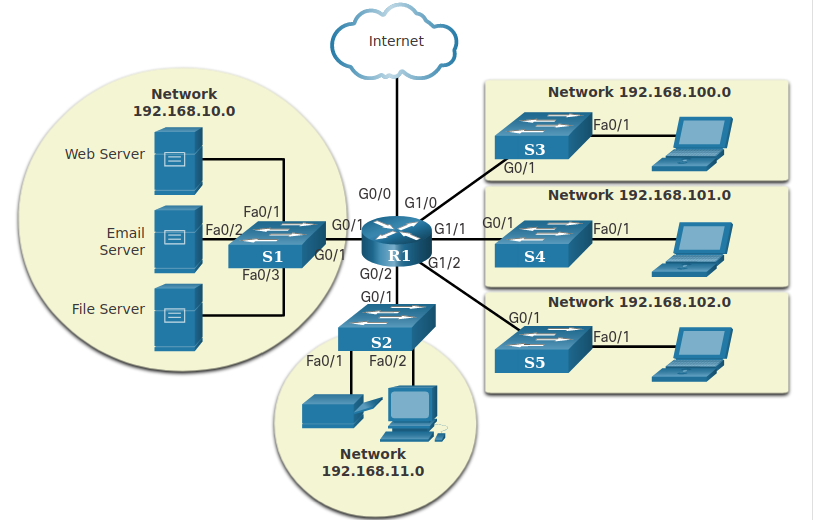
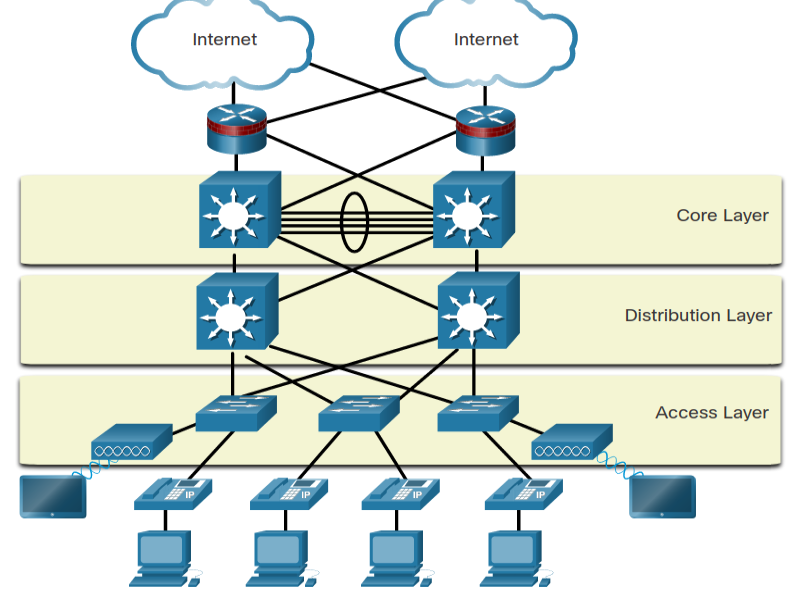
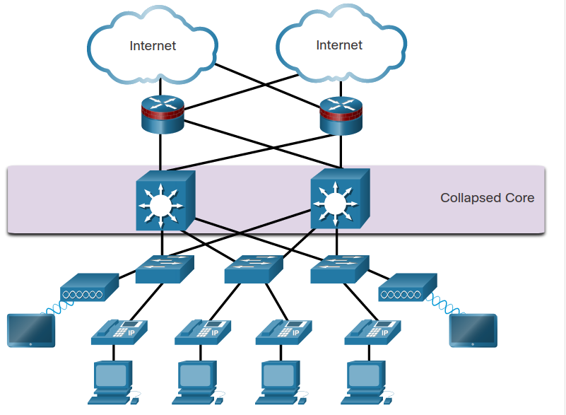
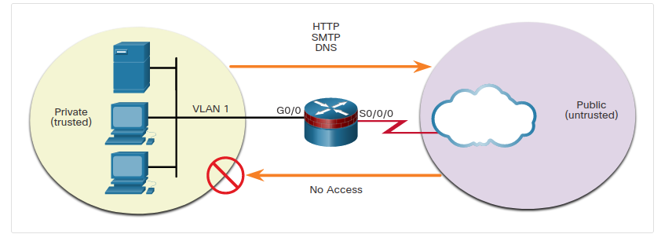
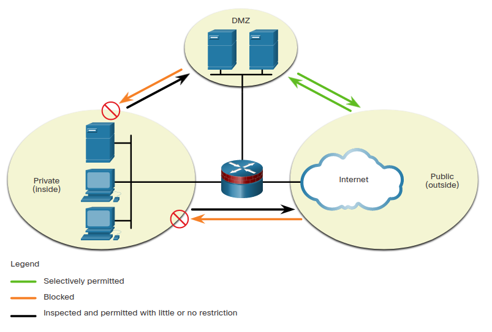
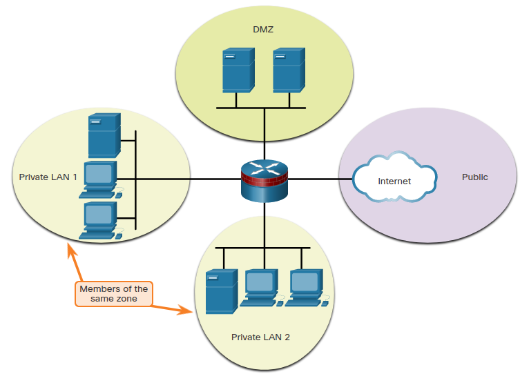
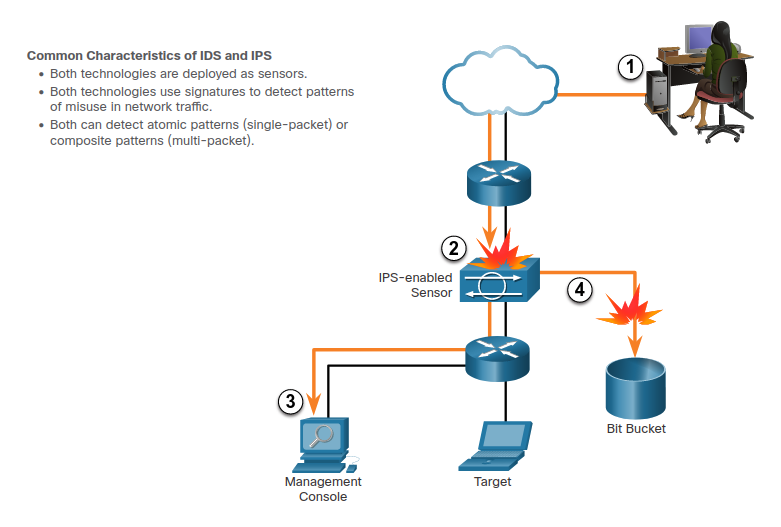
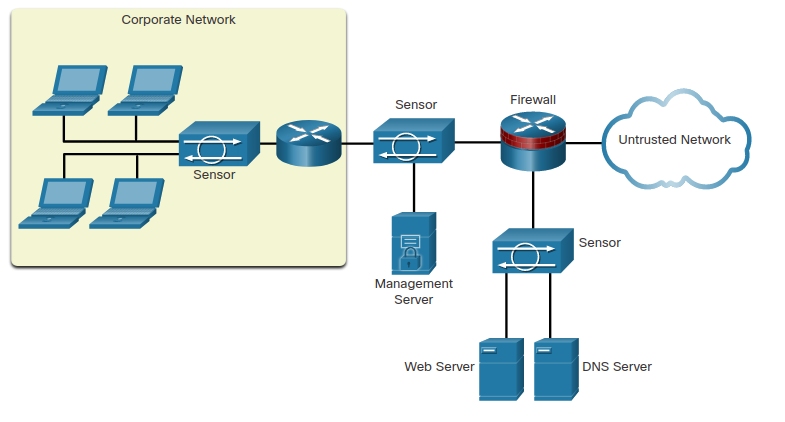

# Network Security Infrastructure

**How can networks be designed to protect data resources and ensure that network services are provided as required?** Just as there are many sizes of networks, **there are also many ways to build a secure network infrastructure**. 

This chapter covers the basic operation of network infrastructures, the various network security devices, and the security services that are used to monitor and maintain the safe and efficient transmission of data.

## Network topologies

### Network representations

A diagram provides an easy way to understand how devices connect in a large network. This type of “picture” of a network is known as a **topology diagram**. The ability to recognize the logical representations of the physical networking components is critical to being able to visualize the organization and operation of a network.

In addition to these representations, specialized terminology is used to describe how each of these devices and media connect to each other:

* **Network Interface Card (NIC)**: A NIC physically connects the end device to the network.
* **Physical Port**: A connector or outlet on a networking device where the media connects to an end device or another networking device.
* **Interface**: Specialized ports on a networking device that connect to individual networks. Because routers connect networks, the ports on a router are referred to as network interfaces.

Note: The terms port and interface are often used interchangeably.

### Topology Diagrams

**Topology diagrams are mandatory documentation for anyone working with a network**. They provide **a visual map of how the network is connected**. There are two types of topology diagrams: **physical and logical**.

* **Physical Topology Diagrams**: Physical topology diagrams illustrate the physical location of intermediary devices and cable installation. You can see that the rooms in which these devices are located are labeled in this physical topology.

**Logical Topology Diagrams**: Logical topology diagrams illustrate devices, ports, and the addressing scheme of the network. You can see which end devices are connected to which intermediary devices and what media is being used.

### Networks of Many Sizes

Networks come in all sizes. They range from simple networks consisting of two computers, to networks connecting millions of devices. Simple home networks let you share resources, such as printers, documents, pictures, and music, among a few local end devices.

Small office and home office (SOHO) networks allow people to work from home, or a remote office. Many self-employed workers use these types of networks to advertise and sell products, order supplies, and communicate with customers.

Businesses and large organizations use networks to provide consolidation, storage, and access to information on network servers. Networks provide email, instant messaging, and collaboration among employees. Many organizations use their network’s connection to the internet to provide products and services to customers.

**The internet is the largest network in existence**. In fact, the term internet means a “network of networks”. It is a collection of interconnected private and public networks.

In small businesses and homes, many computers function as both the servers and clients on the network. This type of network is called a peer-to-peer network.

### LANs and WANs

Network infrastructures vary greatly in terms of:

* Size of the area covered
* Number of users connected
* Number and types of services available
* Area of responsibility

The two most common types of network infrastructures **are Local Area Networks (LANs), and Wide Area Networks (WANs)**. A **LAN is a network infrastructure that provides access to users and end devices in a small geographical area**. A **LAN is typically used in a department within an enterprise, a home, or a small business network**. A **WAN is a network infrastructure that provides access to other networks over a wide geographical area**, which is typically owned and managed by a larger corporation or a telecommunications service provider. The figure shows LANs connected to a WAN.

* **LANs**:  it is a network infrastructure that spans a small geographical area. LANs have specific characteristics:

* LANs interconnect end devices in a limited area such as a home, school, office building, or campus.
* A LAN is usually administered by a single organization or individual. Administrative control is enforced at the network level and governs the security and access control policies.
* LANs provide high-speed bandwidth to internal end devices and intermediary devices.

The diagram is an illustration of a LAN. At the center of the diagram is a switch. There are four Ethernet connections on the switch. At the top left is a connection to a PC. Below that is a connection to the computer at the desk of a worker. Below that is another connection to the computer at the desk of a worker. At the bottom left is a connection to an IP phone. To the right of the switch is a connection to a server. Text under the figure reads: a network serving a home, small building, or a small campus is considered a LAN.

* **WANs**: it is a network infrastructure that spans a wide geographical area. WANs are typically managed by service providers (SPs) or Internet Service Providers (ISPs).

WANs have specific characteristics:

* WANs interconnect LANs over wide geographical areas such as between cities, states, provinces, countries, or continents.
* WANs are usually administered by multiple service providers.
* WANs typically provide slower speed links between LANs.

The figure shows two branch LANs connected via a WAN link. Both LANs are highlighted in a light yellow box and consist of a central switch connected to three PCs, an IP phone, a server, and a router. The two routers are connected via a red WAN link. On the left is the branch 1 LAN and on the right is the branch 2 LAN.
Branch 1 LANBranch 2 LAN

### The Three-Layer Network Design Model

The campus wired LAN uses a hierarchical design model to separate the network topology into modular groups or layers. **Separating the design into layers allows each layer to implement specific functions**, **which simplifies the network design**. This also simplifies the deployment and management of the network.

The campus wired LAN enables communications between devices in a building or group of buildings, as well as interconnection to the WAN and Internet edge at the network core.

A hierarchical LAN design includes the access, distribution, and core layers as shown in the figure.

**Hierarchical Design Model**

**Each layer is designed to meet specific functions.**

The **access layer provides endpoints and users direct access to the network**. The **distribution layer aggregates access layers and provides connectivity to services**. Finally, the **core layer provides connectivity between distribution layers for large LAN environments**. **User traffic is initiated at the access layer and passes through the other layers if the functionality of those layers is required**.

Even though the hierarchical model has three layers, some smaller enterprise networks may implement a two-tier hierarchical design. In a two-tier hierarchical design, the core and distribution layers are collapsed into one layer, reducing cost and complexity.

**Collapsed Core**

**In flat or meshed network architectures**, changes tend to affect a large number of systems. Hierarchical design helps constrain operational changes to a subset of the network, which makes it easy to manage as well as **improve resiliency**. Modular structuring of the network into small, easy-to-understand elements also facilitates resiliency through improved fault isolation.

### Common Security Architectures

**Firewall design is primarily about device interfaces permitting or denying traffic based on the source**, **the destination**, **and the type of traffic**. Some designs are as simple as designating an outside network and inside network, which are determined by two interfaces on a firewall.

Here are three common firewall designs.

* Private and Public
  The public network (or outside network) is untrusted, and the private network (or inside network) is trusted.
  Typically, a firewall with two interfaces is configured as follows:
    * **Traffic originating from the private network is permitted and inspected as it travels toward the public network**. Inspected traffic returning from the public network and associated with traffic that originated from the private network is permitted.
    * **Traffic originating from the public network and traveling to the private network is generally blocked**.
   

* Demilitarizes Zone
  A **demilitarized zone (DMZ) is a firewall design where there is typically one inside interface connected to the private network**, one outside interface connected to the public network, and one DMZ interface.
    * Traffic originating **from the private network is inspected as it travels toward the public or DMZ network**. This traffic **is permitted with little or no restriction**. Inspected traffic returning from the DMZ or public network to the private network is permitted.
    * Traffic **originating from the DMZ network and traveling to the private network is usually blocked**.
    * Traffic originating **from the DMZ network and traveling to the public network is selectively permitted based on service requirements**.
    * Traffic originating **from the public network and traveling toward the DMZ is selectively permitted and inspected**. This type of traffic is typically email, DNS, HTTP, or HTTPS traffic. Return traffic from the DMZ to the public network is dynamically permitted.
    * Traffic originating from the public network and traveling to the private network is blocked.

    

* Zone-based policy firewall
    **Zone-based policy firewalls (ZPFs) use the concept of zones to provide additional flexibility**. A zone is a group of one or more **interfaces that have similar functions or features**. Zones help you specify where a Cisco IOS firewall rule or policy should be applied. In the figure, security policies for LAN 1 and LAN 2 are similar and can be grouped into a zone for firewall configurations. By default, the traffic between interfaces in the same zone is not subject to any policy and passes freely. However, all zone-to-zone traffic is blocked. In order to permit traffic between zones, a policy allowing or inspecting traffic must be configured.

    The only exception to this default deny any policy is the router self zone. The self zone is the router itself and includes all the router interface IP addresses. Policy configurations that include the self zone would apply to traffic destined to and sourced from the router. By default, there is no policy for this type of traffic. Traffic that should be considered when designing a policy for the self zone includes management plane and control plane traffic, such as SSH, SNMP, and routing protocols.

    

### Check your Understanding - Identify the Network Topology

1. Which network design layer provides endpoints and users with a connection to the network?
   **Access layer**
2. Which network design layer provides connectivity between distribution layers for large LAN environments?
   **core layer**
3. Which network design groups interfaces into zones with similar functions or features?
   ZPF
4. Which layer aggregates traffic and provides connectivity to services?
   **distribution layer**

## Security Devices

### Firewalls

A firewall is a system, or group of systems, that enforces an access control policy between networks.

**All firewalls share some common properties**:

* Firewalls are resistant to network attacks.
* Firewalls are the only transit point between internal corporate networks and external networks because all traffic flows through the firewall.
* Firewalls enforce the access control policy.

**There are several benefits of using a firewall in a network**:

* They prevent the exposure of sensitive hosts, resources, and applications to untrusted users.
* **They sanitize protocol flow**, which prevents the exploitation of protocol flaws.
* They block malicious data from servers and clients.
* They reduce security management complexity by off-loading most of the network access control to a few firewalls in the network.

Firewalls also have some limitations:

* A misconfigured firewall can have serious consequences for the network, such as becoming a single point of failure.
* The data from many applications cannot be passed over firewalls securely.
* Users might proactively search for ways around the firewall to receive blocked material, which exposes the network to potential attack.
* Network performance can slow down.
* Unauthorized traffic can be tunneled or hidden as legitimate traffic through the firewall.

### Firewall Type Descriptions

It is important to understand the different types of firewalls and their specific capabilities so that the right firewall is used for each situation.

* **Packet Filtering (Stateless) firewall**: they **are usually part of a router firewall**, **which permits or denies traffic based on L3 (network layer) and L4 (transport layer) information**. They are stateless firewalls that use **a simple policy table look-up that filters traffic based on specific criteria**.

  For example, SMTP servers listen to port 25 by default. An administrator can configure the packet filtering firewall to block port 25 from a specific workstation to prevent it from broadcasting an email virus

  L4: Transport
  L3: Network
  * source IP address
  * destination IP address
  * Protocol
  * Source port number
  * destination port number
  * synchronize/start (SYN) packet receipt

* **Stateful Firewall**: they **are the most versatile and the most common firewall technologies in use**. **Stateful firewalls provide stateful packet filtering by using connection information maintained in a state table**. Stateful filtering is a firewall architecture that is classified **at the network layer (L3)**. It also **analyzes traffic at OSI L4 (Transport) and L5 (Session)**.

* **Application Gateway Firewall**: An application gateway firewall (proxy firewall) filters information **at L3 (Network), 4 (Transport), 5 (Session), and 7 (Application)**. Most of the firewall control and filtering is done in software. When a client needs to access a remote server, it connects to a proxy server. **The proxy server connects to the remote server on behalf of the client**. Therefore, the server only sees a connection from the proxy server.

* **Next Generation Firewall**: Next-generation firewalls (NGFW) **go beyond stateful firewalls by providing**:

* Integrated intrusion prevention (IPS)
* Application awareness and control to see and block risky apps
* Upgrade paths to include future information feeds
* Techniques to address evolving security threats

Other methods of implementing firewalls include:

* **Host-based (server and personal) firewall**: A PC or server with firewall software running on it.
* **Transparent firewall**: Filters IP traffic between a pair of bridged interfaces.
* **Hybrid firewall**: A combination of the various firewall types. For example, an application inspection firewall combines a stateful firewall with an application gateway firewall.

### Check Your Understanding - Identify the Type of Firewall

1. Which type of firewall filters information at L3, 4, 5, and 7?
   **application gateway**
2. Which type of firewall is a combination of various firewall types?
   **hybrid**
3. Which type of firewall is part of a router firewall, permitting or denying traffic based on L3 and L4 information?
   **packet filtering**
4. Which type of firewall is a PC or server with firewall software running on it?
   **host-based**
5. Which type of firewall filters IP traffic between a pair of bridged interfaces?
   **transparent**

### Intrusion Prevention and Detection Devices (IPS, IDS)

A networking architecture paradigm shift is required to defend against fast-moving and evolving attacks. This must include cost-effective detection and prevention systems, such as intrusion detection systems (IDS) or the more scalable intrusion prevention systems (IPS). The network architecture integrates these solutions into the entry and exit points of the network.

When implementing IDS or IPS, **it is important to be familiar with the types of systems available**, **host-based and network-based approaches**, **the placement of these systems**, **the role of signature categories**, and possible actions that a Cisco IOS router can take when an attack is detected.

1. malicious traffic is sent to the target host that is inside the network
2. the traffic is routed into the network and received by an IPS-enabled sensor where it is blocked
3. the IPS-enabled sensor sends logging information regarding the traffic to the network security management console
4. the IPS-enabled sensor kills the traffic. It is sent to the bit bucket.

IDS and IPS technologies are both deployed as sensors. An IDS or IPS sensor can be in the form of several different devices:

* a router configured with Cisco IOS IPS software
* a device specifically designed to provide dedicated IDS or IPS services
* a network module installed in an adaptive security appliance (ASA), switch or router

**IDS and IPS technologies use signatures to detect patterns in network traffic**. A **signature is a set of rules that an IDS or IPS uses to detect malicious activity**. **Signatures can be used to detect severe breaches of security, to detect common network attacks, and to gather information**. IDS and IPS technologies can detect atomic signature patterns (single-packet) or composite signature patterns (multi-packet).

#### Advantages and Disadvantages of IDS and IPS

IDS Advantages and Disadvantages 

|Solution|Advantages|Disadvantages|
|--------|----------|-------------|
|IDS| no impact on network (latency, jitter); no network impact if there is a sensor failure; no network impact if there is sensor overload| response action cannot stop trigger packets; correct tuning required for response actions; more vulnerable to network security evasion techniques|
|IPS| stops trigger packets; can use stream normalization techniques| sensor issues might affect network traffic; sensor overloading impacts the network; some impact on network (latency, jitter)|

* IDS Advantages and Disadvantages
  * Advantages
    * An IDS is deployed in offline mode and therefore:
      * the IDS does not impact network performance. Specifically, it does not introduces latency, jitter, or other traffic flow issues
      * the IDS does not affect network functionality if the sensor fails. It only affects the ability of the IDS to analyze the data
  * Disadvantages
    * An **IDS sensor cannot stop the packets that have triggered an alert and are less helpful in detecting email viruses and automated attacks, such as worms**.
    * Tuning IDS sensors to achieve expected levels of intrusion detection can be very time-consuming. Users deploying IDS sensor response actions must have a well-designed security policy and a good operational understanding of their IDS deployments.
    * An IDS implementation is more vulnerable to network security evasion techniques because it is not inline.

### Types of IPS

There are two primary kinds of IPS available: host-based IPS and network-based IPS.

**Host-based IPS**

Host-based IPS (HIPS) **is software installed on a host to monitor and analyze suspicious activity**. A **significant advantage of HIPS is that it can monitor and protect operating system and critical system processes that are specific to that host**. With detailed knowledge of the operating system, **HIPS can monitor abnormal activity and prevent the host from executing commands that do not match typical behavior**. This suspicious or malicious behavior might include unauthorized registry updates, changes to the system directory, executing installation programs, and activities that cause buffer overflows. **Network traffic can also be monitored to prevent the host from participating in a denial-of-service (DoS) attack or being part of an illicit FTP session**.

HIPS can be thought of as a combination of antivirus software, antimalware software, and a firewall. Combined with a network-based IPS, HIPS is an effective tool in providing additional protection for the host.

A disadvantage of HIPS is that it operates only at a local level. It does not have a complete view of the network, or coordinated events that might be happening across the network. To be effective in a network, HIPS must be installed on every host and have support for every operating system. The table lists the advantages and disadvantages of HIPS.

|Advantages|Disadvantages|
|----------|-------------|
|provides protection specific to a host operating system| operating system dependent|
|provides operating system and application level protection|must be installed on all host|
|protects the host after the message is decrypted||

**Network-based IPS**

A network-based IPS can be implemented **using a dedicated or non-dedicated IPS device**. **Network-based IPS implementations are a critical component of intrusion prevention**. There are host-based IDS/IPS solutions, but these must be integrated with a network-based IPS implementation to ensure a robust security architecture.

Sensors detect malicious and unauthorized activity in real time and can take action when required. Sensors are deployed at designated network points. This enables security managers to monitor network activity while it is occurring, regardless of the location of the attack target.

### Specialized Security Appliances

There are a variety of specialized security appliances available. Here are a few examples.

* **AMP**: Cisco **Advanced Malware Protection** is an enterprise-class advanced malware analysis and protection solution. It provides comprehensive malware protection for organizations before, during, and after an attack:

  * Before an attack, AMP strengthens defenses and protects against known and emerging threats.
  * During an attack, AMP identifies and blocks policy-violating file types, exploit attempts, and malicious files from infiltrating the network.
  * After an attack, or after a file is initially inspected, AMP goes beyond point-in-time detection capabilities and continuously monitors and analyzes all file activity and traffic, regardless of disposition, searching for any indications of malicious behavior. If a file with an unknown or previously deemed “good” disposition starts behaving badly, AMP will detect it and instantly alert security teams with an indication of compromise. It then provides visibility into where the malware originated, what systems were affected, and what the malware is doing.

  AMP accesses the collective security intelligence of the Cisco Talos Security Intelligence and Research Group. Talos detects and correlates threats in real time using the largest threat-detection network in the world.

* **WSA**: A Cisco **Web Security Appliance** is a secure web gateway that combines leading protections to help organizations address the growing challenges of securing and controlling web traffic. WSA protects the network by automatically blocking risky sites and testing unknown sites before allowing users to access them. WSA provides malware protection, application visibility and control, acceptable use policy controls, insightful reporting and secure mobility. While WSA protects the network from malware intrusion, it does not provide protection for users who want to connect to the internet directly outside of the protected network, such as at a public Wi-Fi service. In this instance, the user’s PC can be infected with malware which can then spread to other networks and devices. To help protect user PCs from these types of malware infections there is **Cisco Cloud Web Security (CWS)**. CWS together with WSA provides comprehensive protection against malware and the associated impacts. The Cisco CWS solution enforces secure communication to and from the internet and provides remote workers the same level of security as onsite employees when using a laptop issued by the employer. Cisco CWS incorporates two main functions, web filtering and web security, and both are accompanied by extensive, centralized reporting.

* **ESA**: A Cisco **Email Security Appliance (ESA)**/ Cisco **Cloud Email Security** helps to mitigate email-based threats. The Cisco ESA defends mission-critical email systems. The Cisco ESA is constantly updated by real-time feeds from the Cisco Talos, which detects and correlates threats using a worldwide database monitoring system. These are some of the main features of ESA:

  * **Global threat intelligence**: Cisco Talos provides a 24-hour view into global traffic activity. It analyzes anomalies, uncovers new threats, and monitors traffic trends.
  * **Spam blocking**: A multilayered defense combines an outer layer of filtering based on the reputation of the sender and an inner layer of filtering that performs a deep analysis of the message.
  * **Advanced malware protection**: Includes AMP that takes advantage of the vast cloud security intelligence network of Sourcefire. It delivers protection across the attack continuum before, during, and after an attack.
  * **Outbound message control**: Controls outbound messages to help ensure that important messages comply with industry standards and are protected in transit.

### Check Your Understanding - Compare IDS and IPS Characteristics

1. More vulnerable to network security evasion techniques enabled by various network attack methods? **IDS**
2. Can affect network performance by introducing latency and jitter? **IPS**
3. Must be implemented so that time-sensitive applications are not adversely affected? **IPS**
4. Cannot stop the trigger packet and is not guaranteed to stop a connection? **IDS**
5. Deployed in offline mode? **IDS**
6. Can use stream normalization techniques to reduce or eliminate many of the network security evasion capabilities that exist? **IPS**
7. Can be configured to perform a packet drop to stop the trigger packet? **IPS**
8. Primarily focused on identifying possible incidents, logging information about the incidents, and reporting the incidents? **IDS**
9. Must be deployed inline, and traffic must be able to pass through it? **IPS**
10. Less helpful in stopping email viruses and automated attacks, such as worms? **IDS**

## Security Services

### 12.3.2 Traffic Control with ACLs

An **Access Control List (ACL) is a series of commands that control whether a device forwards or drops packets based on information found in the packet header**. When configured, ACLs perform the following tasks:

* They **limit network traffic to increase network performance**. For example, if corporate policy does not allow video traffic on the network, ACLs that block video traffic could be configured and applied. This would greatly reduce the network load and increase network performance.
* **They provide traffic flow control**. ACLs **can restrict the delivery of routing updates to ensure that the updates are from a known source**.
* **They provide a basic level of security for network access**. ACLs **can allow one host to access a part of the network and prevent another host from accessing the same area**. For example, access to the Human Resources network can be restricted to authorized users.
* **They filter traffic based on traffic type**. For example, **an ACL can permit email traffic, but block all Telnet traffic**.
* They **screen hosts to permit or deny access to network services.** ACLs can permit or deny a user to access file types, such as FTP or HTTP.

In addition to either permitting or denying traffic, **ACLs can be used for selecting types of traffic to be analyzed, forwarded, or processed in other ways**. For example, ACLs can be used to classify traffic to enable priority processing. This capability is similar to having a VIP pass at a concert or sporting event. The VIP pass gives selected guests privileges not offered to general admission ticket holders, such as priority entry or being able to enter a restricted area.

### ACLs: Important Features

Two types of Cisco IPv4 ACLs are standard and extended. **Standard ACLs can be used to permit or deny traffic only from source IPv4 addresses**. The **destination of the packet and the ports involved are not evaluated**.

Extended ACLs filter IPv4 packets based on several attributes that include:

* Protocol type
* Source IPv4 address
* Destination IPv4 address
* Source TCP or UDP ports
* Destination TCP or UDP ports
* Optional protocol type information for finer control

Standard and extended ACLs can be created using either a number or a name to identify the ACL and its list of statements.

By configuring ACL logging, an ACL message can be generated and logged when traffic meets the permit or deny criteria defined in the ACL. Cisco ACLs can also be configured to only allow TCP traffic that has an ACK or RST bit set, so that only traffic from an established TCP session is permitted. This can be used to deny any TCP traffic from outside the network that is trying to establish a new TCP session.

### SNMP

**Simple Network Management Protocol (SNMP) allows administrators to manage end devices such as servers, workstations, routers, switches, and security appliances, on an IP network**. It enables network administrators **to monitor and manage network performance**, **find and solve network problems**, **and plan for network growth**. **SNMP is an application layer protocol that provides a message format for communication between managers and agents**. The SNMP system consists of two elements:

* SNMP manager that runs SNMP management software
* SNMP agents which are the nodes being monitored and managed

The Management Information Base (MIB) is a database on the agents that stores data and operational statistics about the device. To configure SNMP on a networking device, it is first necessary to define the relationship between the manager and the agent. The SNMP manager is part of a network management system (NMS). The SNMP manager runs SNMP management software. The SNMP manager can collect information from an SNMP agent by using the “get” action and can change configurations on an agent by using the “set” action. In addition, SNMP agents can forward information directly to a network manager by using “traps”.

### NetFlow

**NetFlow is a Cisco IOS technology that provides statistics on packets flowing through a Cisco router or multilayer switch**. **While SNMP attempts to provide a very wide range of network management features and options**, **NetFlow is focused on providing statistics on IP packets flowing through network devices**. **NetFlow provides data to enable network and security monitoring**, **network planning**, **traffic analysis to include identification of network bottlenecks**, and **IP accounting for billing purposes**.

NetFlow can monitor that application connection, tracking byte and packet counts for that individual application flow. It then pushes the statistics over to an external server called a NetFlow collector. NetFlow technology has seen several generations that provide more sophistication in defining traffic flows, but “original NetFlow” distinguished flows using a combination of seven fields. Should one of these fields vary in value from another packet, the packets could be safely determined to be from different flows:

* Source IP address
* Destination IP address
* Source port number
* Destination port number
* Layer 3 protocol type
* Type of Service (ToS) marking
* Input logical interface

The first four of the fields NetFlow uses to identify a flow should be familiar. The source and destination IP addresses, plus the source and destination ports, identify the connection between source and destination application. **The Layer 3 protocol type identifies the type of header that follows the IP header** (usually TCP or UDP, but other options include ICMP). The ToS byte in the IPv4 header holds information about how devices should apply quality of service (QoS) rules to the packets in that flow.

### Port Mirroring

A **packet analyzer** (also known as a packet sniffer or traffic sniffer) is typically software that captures packets entering and exiting the network interface card (NIC). It is not always possible or desirable to have the packet analyzer on the device that is being monitored. Sometimes it is better on a separate station designated to capture the packets. Because network switches can isolate traffic, traffic sniffers or other network monitors, such as IDS, cannot access all the traffic on a network segment. **Port mirroring is a feature that allows a switch to make duplicate copies of traffic passing through a switch**, **and then send it out a port with a network monitor attached**. The original traffic is forwarded in the usual manner. An example of port mirroring is illustrated in the figure.

### Syslog Servers

**When certain events occur on a network, networking devices have trusted mechanisms to notify the administrator with detailed system messages**. These messages can be either non-critical or significant. Network administrators have a variety of options for storing, interpreting, and displaying these messages, and for being alerted to those messages that could have the greatest impact on the network infrastructure. The most common method of accessing system messages is to use **a protocol called syslog**. Many networking devices support syslog, including routers, switches, application servers, firewalls, and other network appliances. The syslog protocol allows networking devices to send their system messages across the network to syslog servers.

The syslog logging service provides three primary functions:

* the ability **to gather logging information for monitoring and troubleshooting**
* the ability **to select the type of logging information that is captured**
* the ability **to specify the destination of captured syslog messages**

### NTP

**It is important to synchronize the time across all devices on the network because all aspects of managing, securing, troubleshooting, and planning networks require accurate and consistent timestamping**. When the time is not synchronized between devices, it will be impossible to determine the order of the events that have occurred in different parts of the network. Typically, the date and time settings on a network device can be set using one of two methods:

* manual configuration of the data and time
* configuring the Network Time Protocol (NTP)

As a network grows, it becomes difficult to ensure that all infrastructure devices are operating with synchronized time. Even in a smaller network environment, the manual method is not ideal. If a device reboots, how will it get an accurate date and timestamp?

**A better solution is to configure the NTP on the network**. **This protocol allows routers on the network to synchronize their time settings with an NTP server**. A group of NTP clients that obtain time and date information from a single source have more consistent time settings. When NTP is implemented in the network, it can be set up to synchronize to a private primary clock or it can synchronize to a publicly available NTP server on the Internet.

**NTP networks use a hierarchical system of time sources. Each level in this hierarchical system is called a stratum. The stratum level is defined as the number of hop counts from the authoritative source. The synchronized time is distributed across the network using NTP**.

NTP servers are arranged in three levels known as strata:

* **stratum 0**: **An NTP network gets the time from authoritative time sources**. These authoritative time sources, also referred to as stratum 0 devices, **are high-precision timekeeping devices assumed to be accurate and with little or no delay associated with them**.
* **stratum 1**: The stratum 1 devices are directly connected to the authoritative time sources. They act as the primary network time standard.
* **stratum 2 and lower strata**: The stratum 2 servers are connected to stratum 1 devices through network connections. Stratum 2 devices, such as NTP clients, synchronize their time using the NTP packets from stratum 1 servers. They could also act as servers for stratum 3 devices.

Smaller stratum numbers indicate that the server is closer to the authorized time source than larger stratum numbers. The larger the stratum number, the lower the stratum level. **The max hop count is 15**. **Stratum 16, the lowest stratum level, indicates that a device is unsynchronized**. Time servers on the same stratum level can be configured to act as a peer with other time servers on the same stratum level for backup or verification of time.

### AAA Servers

|AAA Provides| Description|
|------------|------------|
|Authentication| Users and administrator must prove that they are who they say they are; Authentication can be established using username and password combinations, challenge and response questions, token cards, and other methods; AAA authentication provides a centralized way to control access to the network|
|Authorization| after the user is authenticated, authorization services determine which resources the user can access and which operations the user is allowed to perform; an example is "User 'student' can access host serverXYZ using SSH only."|
|Accounting| accounting records what the user does, including what is accessed, the amount of time the resource is accessed, and any changes that were made; * accounting keeps track of how network resources are used; an example is "User 'student' accessed host serverXYZ using SSH for 15 minutes."|

**Terminal Access Controller Access-Control System Plus (TACACS+)** and **Remote Authentication Dial-In User Service (RADIUS)** **are both authentication protocols that are used to communicate with AAA servers**. Whether TACACS+ or RADIUS is selected depends on the needs of the organization. While both protocols can be used to communicate between a router and AAA servers, **TACACS+ is considered the more secure protocol**. This is because all TACACS+ protocol exchanges are encrypted, while RADIUS only encrypts the user’s password. RADIUS does not encrypt usernames, accounting information, or any other information carried in the RADIUS message.

The table lists the differences between the two protocols.

|     |TACACS+|RADIUS|
|-----|-------|------|
|Functionality| Separates AAA according to the AAA architecture, allowing modularity of the security server implementation| Combines authentication and authorization but separates accounting, allowing less flexibility in implementation than TACACS+|
|Standard|Mostly Cisco supported|Open/RFC standard|
|Transport|TCP|UDP|
|Protocol CHAP|Bidirectional challenge and response as used in Challenge Handshake Authentication Protocol (CHAP)|Unidirectional challenge and response from the RADIUS security server to the RADIUS client|
|Confidentiality|Entire packet encrypted|Password encrypted|
|Customization|Provides authorization of router commands on a per-user or per-group basis |Has no option to authorize router commands on a per-user or per-group basis|
|Accounting|Limited|Extensive|

### VPN

**A VPN is a private network that is created over a public network**, usually the internet.

Instead of using a dedicated physical connection, **a VPN uses virtual connections that are routed through the internet from the organization to the remote site**. The **first VPNs were strictly IP tunnels that did not include authentication or encryption of the data**. For example, Generic Routing Encapsulation (GRE) is a tunneling protocol developed by Cisco that can encapsulate a wide variety of network layer protocol packet types inside IP tunnels. This creates a virtual point-to-point link to Cisco routers at remote points over an IP internetwork. **A VPN is virtual in that it carries information within a private network, but that information is actually transported over a public network**. A VPN is private in that the traffic is encrypted to keep the data confidential while it is transported across the public network.

A VPN is a communications environment in which access is strictly controlled to permit peer connections within a defined community of interest. Confidentiality is achieved by encrypting the traffic within the VPN. Today, a secure implementation of VPN with encryption is what is generally equated with the concept of virtual private networking.

In the simplest sense, **a VPN connects two endpoints**, such as a remote office to a central office, over a public network, to form a logical connection. **The logical connections can be made at either L2(data link layer) or L3 (network layer)**. Common examples of Layer 3 VPNs are GRE, Multiprotocol Label Switching (MPLS), and IPsec. Layer 3 VPNs can be point-to-point site connections, such as GRE and IPsec, or they can establish any-to-any connectivity to many sites using MPLS.

**IPsec is a suite of protocols developed with the backing of the IETF to achieve secure services over IP packet-switched networks.**

**IPsec services allow for authentication, integrity, access control, and confidentiality**. With IPsec, the information exchanged between remote sites can be encrypted and verified. VPNs are commonly deployed in a site-to-site topology to securely connect central sites with remote locations. They are also deployed in a remote-access topology to provide secure remote access to external users travelling or working from home. Both remote-access and site-to-site VPNs can be deployed using IPsec.

### 12.3.12 Check Your Understanding - Identify the Network Security Device or Service

1. What allows a switch to make duplicate copies of traffic passing through it, and then send it out a port with a network monitor attached? Port mirroring
   
2. What is a series of commands that control whether a device forwards or drops packets based on information found in the packet header? ACL
   
3. What provides statistics on packet flows passing through a networking device? NetFlow
   
4. What is a private network that is created over a public network? VPN
   
5. What sets the date and time on network devices? NTP
   
6. What gathers a variety of statistics for devices that are configured to send and log status messages? SysLog
   
7. Which option allows administrators to monitor and manage network devices? SNMP
   
8. What authenticates users to allow access to specific network resources and records what the user does while connected to the resource? AAA Server

## Network Security Infrastructure Summary

### What Did I Learn in this Module?

**Network Topologies**: **Network infrastructures vary greatly depending on the size of the coverage area, the number of users connected, the number and types of services available, and the area of responsibility**. Networks are typically **represented as physical and logical topologies**. **A physical topology represents physical connections and how end devices are connected**. **A logical topology refers to the standards and protocols that devices use to communicate**. Most topologies diagrams are a combination of both, showing how devices are physically and logically connected. The two most common types of network infrastructures are LANs and WANs. The campus wired LAN design consists of hierarchical layers with each layer assigned specific functions. The access layer provides direct access to the network for endpoints. The distribution layer aggregates access layers and provides connectivity to services. Lastly the core layer provides connectivity between distribution layers in large environments. In some cases, the distribution and core layers may be combined to reduce cost and complexity.

**Common security architectures define the boundaries of traffic entering and leaving the network**. When looking at a topology that has access to outside or public networks, **you should be able to determine the security architecture**. Some designs are as simple as designating an outside network and inside network which are determined by two interfaces on a firewall. Networks that require public access to services will often include **a DMZ that the public can access**, while strictly blocking access to the inside network. **ZPFs use the concept of zones to provide additional flexibility**. A zone is a group of one or more interfaces that have similar functions, features, and security requirements.

**Security Devices**: There are several different types of firewalls. **Packet filtering (stateless) firewalls provide L3 (network layer) and sometimes L4 (transport layer) filtering**. A **stateful inspection firewall allows or blocks traffic based on state, port, and protocol**. **Application gateway firewalls (proxy firewall) filter information at L3 (network layer), 4 (transport layer), 5 (session layer), and 7 (application layer)**. **Next-generation firewalls provide additional services beyond application gateways such as Integrated intrusion prevention, application awareness and control to see and block risky apps, access to future information feeds, and techniques to address evolving security threats**. Intrusion prevention systems (IPS) and intrusion detection systems (IDS) are used to detect potential security risks and alert/stop unsafe traffic. IDS/IPS can be implemented as host-based or network based with specific advantages and disadvantages to each implementation. Specialized security appliances are available including Cisco Advanced Malware Protection (AMP), Cisco Web Security Appliance (WSA), and Cisco Email Security Appliance (WSA). These security appliances utilize the services of the Cisco Talos Security Intelligence and Research Group. Talos detects and correlates threats in real time using the largest threat-detection network in the world.

**Security Services**: Network security services include the following technologies. ACLs are a series of statements that control whether a device forwards or drops packets based on information found in the packet header. SNMP enables network administrators to monitor and manage network performance, find and solve network problems, and plan for network growth. NetFlow provides statistics on packets that are flowing through a Cisco router or multilayer switch. Port mirroring is a feature that allows a switch to make duplicate copies of traffic that is passing through the switch, and then send it out a port that has a network monitor attached. Syslog servers compile and provide access to the system messages generated by networking devices. NTP synchronizes the system time across all devices on the network to ensure accurate and consistent timestamping of system messages. AAA is a framework for configuring user authentication, authorization, and accounting services. AAA typically uses a TACACS+ or RADIUS server for this purpose. VPNs are private networks that are created between two endpoints across a public network.

### Module 12: Network Security Infrastructure Quiz

1. **What is the purpose of a personal firewall on a computer?**
   Topic 12.2.0 - The purpose of a firewall is to filter the traffic that is moving in and out of the PC. A computer firewall cannot deny all illegal traffic from a computer or increase the speed of any connection. It is also not able to protect hardware against fire hazards.
   **to filter the traffic that is moving in and out of the PC**
   
2. **What is the main difference between the implementation of IDS and IPS devices?**
   Topic 12.2.0 - An IPS is deployed in inline mode and will not allow malicious traffic to enter the internal network without first analyzing it. An advantage of this is that it can stop an attack immediately. An IDS is deployed in promiscuous mode. It copies the traffic patterns and analyzes them offline, thus it cannot stop the attack immediately and it relies on another device to take further actions once it detects an attack. Being deployed in inline mode, an IPS can negatively impact the traffic flow. Both IDS and IPS can use signature-based technology to detect malicious packets. An IPS cannot replace other security devices, such as firewalls, because they perform different tasks.
   **an IDS would allow malicious traffic to pass before it is addressed, whereas an IPS stops it immediately**
   
3. **Which two pieces of information should be included in a logical topology diagram of a network?** (Choose two.)
  Topic 12.1.0 - The interface identifier and connection type should be included in a logical topology diagram because they indicate which interface is connected to other devices in the network with a specific type such as LAN, WAN, point-to-point, etc. The OS/IOS version, device type, cable type and identifier, and cable specification are typically included in a physical topology diagram.
  **connection type**
  **interface identifier**
   
4. **What is a characteristic of a WAN?**
   Topic 12.1.0 - A WAN (wide-area network) is used to connect networks that are geographically separated and is typically owned by a service provider. The service provider contracts out WAN services to individuals and organizations.
   **it connects multiple networks that are geographically separated**
   
5. **What network monitoring technology enables a switch to copy and forward traffic sent and received on multiple interfaces out another interface toward a network analysis device?**
   Topic 12.3.0 - When enabled on a switch, port mirroring copies frames sent and recieved by the switch and forwards them to another port, which has a analysis device attached.
   **port mirroring**
   
6. **What is a function of a proxy firewall?**
   Topic 12.2.0 - Proxy firewalls filter traffic through the application layer of the TPC/IP model and shield client information by connecting to remote servers on behalf of clients.
   **connects to remote servers on behalf interfaces**
   
7. Which technology is used by Cisco Advanced Malware Protection (AMP) in defending and protecting against known and emerging threats?
   Topic 12.2.0 - Cisco AMP uses threat intelligence along with known file signatures to identify and block policy-violating file types and exploitations.
   **threat intelligence**
   
8. **How is a source IP address used in a standard ACL?**
   Topic 12.3.0 - The only filter that can be applied with a standard ACL is the source IP address. An extended ACL is used to filter on such traffic as the source IP address, destination IP address, type of traffic, and type of message.
   **it is the criterion that is used to filter traffic**
   
9.  **Which statement describes the Cisco Cloud Web Security?**
   Topic 12.2.0 - The Cisco Cloud Web Security (CWS) is a cloud-based security service that uses web proxies in the Cisco cloud environment to scan traffic for malware and policy enforcement. It is not a firewall or web server solution. The Cisco Web Security Appliance (WSA) combines multiple security solutions to provide an all-in-one solution on a single platform to address the challenges of securing and controlling web traffic.
   **it is a cloud-based security service to scan traffic for malware and policy enforcement**
    
10. **Which network service allows administrators to monitor and manage network devices?**
   Topic 12.3.0 - SNMP is an application layer protocol that allows administrators to manage and monitor devices on the network such as routers, switches, and servers.
   **SNMP**
    
11. **Which protocol provides authentication, integrity, and confidentiality services and is a type of VPN?**
   Topic 12.3.0 - IPsec services allow for authentication, integrity, access control, and confidentiality. With IPsec, the information exchanged between remote sites can be encrypted and verified. Both remote-access and site-to-site VPNs can be deployed using IPsec.
   **IPSec**
    
12. **What is a feature of the TACACS+ protocol?**
   Topic 12.3.0 - TACACS+ has the following features:

   separates authentication and authorization
   encrypts all communication
   uses TCP port 49 
   **It encrypts the entire body of the packet for more secure communications.**
    
13. **Which layer of the hierarchical design model is a control boundary between the other layers?**
   Topic 12.1.0 - The three design layers from lowest to highest are access, distribution, and core. The distribution layer commonly provides policy-based connectivity which permits or denies traffic based on predefined parameters. The distribution layer also acts as a control boundary between the access and core layers.

   **distribution**