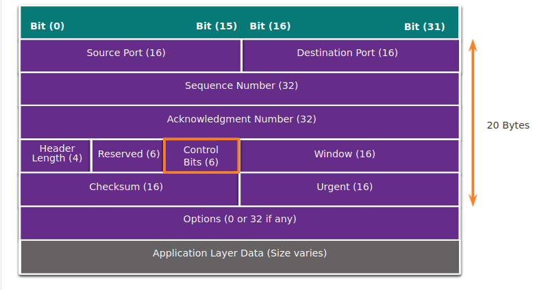
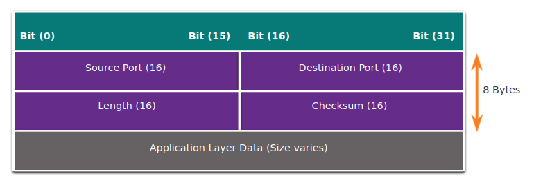

# 16 Attacking The Foundation

**Protocols are the foundation of data communications**. For this reason **they have been a target of threat actors for a very long time**. Cybersecurity analysts must understand how threat actors use features of common protocols in cyberattacks.

## IP PDU Details (IPv4 and IPv6)

IP was designed as a Layer 3 connectionless protocol. It provides the necessary functions to deliver a packet from a source host to a destination host over an interconnected system of networks. The protocol was not designed to track and manage the flow of packets. These functions, if required, are performed primarily by TCP at Layer 4.

**IP makes no effort to validate whether the source IP address contained in a packet actually came from that source.**

For this reason, threat actors can send packets using a spoofed source IP address. In addition, threat actors can tamper with the other fields in the IP header to carry out their attacks. Therefore, it is important for security analysts to understand the different fields in both the IPv4 and IPv6 headers.

### IPv4 Packet Header

|IPv4 Header Field|Description|
|-----------------|-----------|
|Version|    Contains a 4-bit binary value set to 0100 that identifies this as an IPv4 packet|
|Internet Header length| A 4-bit field containing the length of the IP header; The minimum length of an IP header is 20 bytes|
|Differentiated Services or DiffServ (DS)| Formerly called the Type of Service (ToS) field, the DS field is an 8-bit field used to determine the priority of each packet; The six most significant bits of the DiffServ field are the Differentiated Services Code Point (DSCP); The last two bits are the Explicit Congestion Notification (ECN) bits|
|Total length|Specifies the length of the IP packet including the IP header and the user data; The total length field is 2 bytes, so the maximum size of an IP packet is 65,535 bytes however packets are much smaller in practice|
|Identification, Flag, and Fragment offset|As an IP packet moves through the internet, it might need to cross a route that cannot handle the size of the packet; The packet will be divided, or fragmented, into smaller packets and reassembled later; These fields are used to fragment and reassemble packets|
|Time-to-Live (TTL)|Contains an 8-bit binary value that is used to limit the lifetime of a packet; The packet sender sets the initial TTL value, and it is decreased by one each time the packet is processed by a router; If the TTL field decrements to zero, the router discards the packet and sends an Internet Control Message Protocol (ICMP) Time Exceeded message to the source IP address|
|Protocol|Field is used to identify the next level protocol; This 8-bit binary value indicates the data payload type that the packet is carrying, which enables the network layer to pass the data to the appropriate upper-layer protocol; Common values include ICMP (1), TCP (6), and UDP (17)|
|Header checksum|A value that is calculated based on the contents of the IP header; Used to determine if any errors have been introduced during transmission|
|Source IPv4 Address|Contains a 32-bit binary value that represents the source IPv4 address of the packet|
|Destination IPv4 Address| Contains a 32-bit binary value that represents the destination IPv4 address of the packet|
|Options and Padding|This is a field that varies in length from 0 to a multiple of 32 bits; If the option values are not a multiple of 32 bits, 0s are added or padded to ensure that this field contains a multiple of 32 bits|

### IPv6 Packet Header

|IPv6 Header Field|Description|
|-----------------|-----------|
|Version|    This field contains a 4-bit binary value set to 0110 that identifies this as an IPv6 packet|
|Traffic Class|     This 8-bit field is equivalent to the IPv4 Differentiated Services (DS) field|
|Flow Label|    This 20-bit field suggests that all packets with the same flow label receive the same type of handling by routers|
|Payload Length|    This 16-bit field indicates the length of the data portion or payload of the IPv6 packet|
|Next Header|This 8-bit field is equivalent to the IPv4 Protocol field; It indicates the data payload type that the packet is carrying, enabling the network layer to pass the data to the appropriate upper-layer protocol|
|Hop Limit|This 8-bit field replaces the IPv4 TTL field; This value is decremented by a value of 1 by each router that forwards the packet; When the counter reaches 0, the packet is discarded, and an ICMPv6 Time Exceeded message is forwarded to the sending host, indicating that the packet did not reach its destination because the hop limit was exceeded|
|Source IPv6 Address|    This 128-bit field identifies the IPv6 address of the sending host.|
|Destination IPv6 Address|    This 128-bit field identifies the IPv6 address of the receiving host.|

**An IPv6 packet may also contain extension headers (EH) that provide optional network layer information. Extension headers are optional and are placed between the IPv6 header and the payload. EHs are used for fragmentation, security, to support mobility, and more.**

**Unlike IPv4, routers do not fragment routed IPv6 packets.**

## IP Vulnerabilities

|IP Attacks|Description|
|----------|-----------|
|ICMP attacks|Threat actors use Internet Control Message Protocol (ICMP) echo packets (pings) to discover subnets and hosts on a protected network, to generate DoS flood attacks, and to alter host routing tables|
|Denial-of-Service (DoS) attacks|Threat actors attempt to prevent legitimate users from accessing information or services|
|Distributed Denial-of-Service (DDoS) attacks|Similar to a DoS attack, but features a simultaneous, coordinated attack from multiple source machines|
|Address spoofing attacks|Threat actors spoof the source IP address in an attempt to perform blind spoofing or non-blind spoofing|
|Man-in-the-middle attack (MiTM)|Threat actors position themselves between a source and destination to transparently monitor, capture, and control the communication. They could simply eavesdrop by inspecting captured packets or alter packets and forward them to their original destination|
|Session hijacking|Threat actors gain access to the physical network, and then use an MiTM attack to hijack a session|

### ICMP Attacks

ICMP (**Internet Control Message Protocol**) was developed to carry diagnostic messages and to report error conditions when routes, hosts, and ports are unavailable. ICMP messages are generated by devices when a network error or outage occurs. The ping command is a user-generated ICMP message, called an echo request, that is used to verify connectivity to a destination.

**Threat actors use ICMP for reconnaissance and scanning attacks. Threat actors also use ICMP for DoS and DDoS attacks.**

The table lists common ICMP messages of interest to threat actors.

|ICMP Message|Description|
|ICMP echo request and echo reply|This is used to perform host verification and DoS attacks|
|ICMP unreachable|This is used to perform network reconnaissance and scanning attacks|
|ICMP mask reply|This is used to map an internal IP network|
|ICMP redirects|This is used to lure a target host into sending all traffic through a compromised device and create a MiTM attack|
|ICMP router discovery||

* Networks should have strict ICMP access control list (ACL) filtering on the network edge to avoid ICMP probing from the internet. 
* Security analysts should be able to detect ICMP-related attacks by looking at captured traffic and log files. In the case of large networks, security devices, such as firewalls and intrusion detection systems (IDS), should detect such attacks and generate alerts to the security analysts.

### Amplification and Reflection Attacks

Threat actors often use amplification and reflection techniques to create DoS attacks.

* **Amplification**: the threat actor forward ICMP echo request messages to many hosts. These messages contain the source IP address of the victim.
* **Reflection**: These hosts all reply to the spoofed IP address of the victim to overwhelm it.

Note: Newer forms of amplification and reflection attacks such as DNS-based reflection and amplification attacks and Network Time Protocol (NTP) amplification attacks are now being used.

Threat actors also use resource exhaustion attacks. These attacks consume the resources of a target host to either to crash it or to consume the resources of a network.

### Address Spoofing Attacks

IP address spoofing attacks occur when a threat actor creates packets with false source IP address information to either hide the identity of the sender, or to pose as another legitimate user. The threat actor can then gain access to otherwise inaccessible data or circumvent security configurations. Spoofing is usually incorporated into another attack such as a Smurf attack.

Spoofing attacks can be non-blind or blind:

* **non-blind spoofing**: The threat actor can see the traffic that is being sent between the host and the target. The threat actor uses non-blind spoofing to inspect the reply packet from the target victim. Non-blind spoofing determines the state of a firewall and sequence-number prediction. It can also hijack an authorized session.
* **blind spoofing**: The threat actor cannot see the traffic that is being sent between the host and the target. Blind spoofing is used in DoS attacks.

MAC address spoofing attacks are used when threat actors have access to the internal network. Threat actors alter the MAC address of their host to match another known MAC address of a target host, as shown in the figure. The attacking host then sends a frame throughout the network with the newly-configured MAC address. When the switch receives the frame, it examines the source MAC address.

## Check Your Understanding - IP Vulnerabilities and Threats

1. Which attack is being used when threat actors position themselves between a source and destination to transparently monitor, capture, and control the communication?
   MiTM attack is when threat actors position themselves between a source and destination to transparently monitor, capture, and control the communication.
   **MiTM Attack**

2. Which attack is being used when threat actors gain access to the physical network, and then use an MiTM attack to capture and manipulate a legitimate user’s traffic?
   A session hijacking attack is when threat actors gain access to the physical network, and then use an MiTM attack to capture and manipulate traffic, hijacking a legitimate user’s session.
   **Session Hijacking**

3. Which attack is being used when threat actors initiate a simultaneous, coordinated attack from multiple source machines?
   In an amplification attack, the threat actor forwards ICMP echo request messages to many hosts. These messages contain the source IP address of the victim. All of these hosts then reply to the spoofed IP address of the victim to overwhelm it, creating a reflection attack.
   **Amplification and Reflection Attacks**
   
4. Which attack is being used when threat actors use pings to discover subnets and hosts on a protected network, to generate flood attacks, and to alter host routing tables?
   In ICMP attacks, threat actors use pings to discover subnets and hosts on a protected network, to generate flood attacks, and to alter host routing tables
   **ICMP Attack**
   
5. Which attack being used is when a threat actor creates packets with false source IP address information to either hide the identity of the sender, or to pose as another legitimate user?
   An example of an address spoofing attack is when a threat actor creates packets with false source IP address information to either hide the identity of the sender, or to pose as another legitimate user. The threat actor can then gain access to otherwise inaccessible data or circumvent security configurations.
   **Address Spoofing Attack**

## TCP and UDP Vulnerabilities

### TCP Segment Header

TCP segment information appears immediately after the IP header.

The six control bits of the TCP segment:

* URG: Urgent pointer field significant
* ACK: Acknowledgment field significant
* PSH: Push function
* RST: Reset the connection
* SYN: Synchronize sequence numbers
* FIN: No more data from sender

### TCP Services

TCP provides these services:

* **Reliable delivery**: TCP incorporates acknowledgments to guarantee delivery, instead of relying on upper-layer protocols to detect and resolve errors. If a timely acknowledgment is not received, the sender retransmits the data. **Requiring acknowledgments of received data can cause substantial delays**. Examples of application layer protocols that make use of TCP reliability include **HTTP**, **SSL/TLS**, **FTP**, **DNS zone transfers**, and others.
* **Flow control**: TCP implements flow control to address this issue. Rather than acknowledge one segment at a time, multiple segments can be acknowledged with a single acknowledgment segment.
* **Stateful communication**: TCP stateful communication between two parties occurs during the TCP three-way handshake. Before data can be transferred using TCP, a three-way handshake opens the TCP connection, as shown in the figure. If both sides agree to the TCP connection, data can be sent and received by both parties using TCP.

#### TCP Three-Way Handshake

1. Send SYN (SEQ=100, CTL=SYN)
   1. SYN Received
2. SEND SYN, ACK (SEQ=300, ACK=101, CTL=SYN,ACK)
   1. SYN, ACK received
3. Established (SEQ=101, ACK=301, CTL=ACK)

1. The initiating client requests a client-to-server communication session with the server
2. The server acknowledges the client-to-server communication session requests a server-to-client communication session
3. The initiating client acknowledge the server-to-client communication session

### TCP Attacks

Network applications use TCP or UDP ports. Threat actors conduct port scans of target devices to discover which services they offer.

#### TCP SYN Flood Attack

The TCP SYN Flood attack exploits the TCP three-way handshake.  a threat actor continually sending TCP SYN session request packets with a randomly spoofed source IP address to a target. The target device replies with a TCP SYN-ACK packet to the spoofed IP address and waits for a TCP ACK packet. Those responses never arrive. Eventually the target host is overwhelmed with half-open TCP connections, and TCP services are denied to legitimate users.

1. The threat actor sends multiple SYN requests to a web server.
2. The web server replies with SYN-ACKs for each SYN request and waits to complete the three-way handshake. The threat actor does not respond to the SYN-ACKs
3. A valid user cannot access the web server because the web server has too many half-opened TCP connections.

#### TCP Reset Attack

A TCP reset attack can be used to terminate TCP communications between two hosts. A TCP uses a four-way exchange to close the TCP connection using a pair of FIN and ACK segments from each TCP endpoint. A TCP connection terminates when it receives an RST bit. This is an abrupt way to tear down the TCP connection and inform the receiving host to immediately stop using the TCP connection. A threat actor could do a TCP reset attack and send a spoofed packet containing a TCP RST to one or both endpoints.

1. When the client has no more data to send in the stream, it sends a segment with the FIN flag set.
2. The server sends an ACK to acknowledge the receipt of the FIN to terminate the session from client to server.
3. The server sends a FIN to the client to terminate the server-to-client session.
4. The client responds with an ACK to acknowledge the FIN from the server.

#### TCP Session Hijacking

TCP session hijacking is another TCP vulnerability. Although difficult to conduct, a threat actor takes over an already-authenticated host as it communicates with the target. The threat actor must spoof the IP address of one host, predict the next sequence number, and send an ACK to the other host. If successful, the threat actor could send, but not receive, data from the target device.

## UDP Segment Header and Operation

UDP is commonly used by DNS, DHCP, TFTP, NFS, and SNMP. It is also used with real-time applications such as media streaming or VoIP. UDP is a connectionless transport layer protocol.

It has much lower overhead than TCP because it is not connection-oriented and does not offer the sophisticated retransmission, sequencing, and flow control mechanisms that provide reliability. The UDP segment structure is much smaller than TCP’s segment structure.

Note: UDP actually divides data into datagrams. However, the generic term "segment" is commonly used

Although UDP is normally called unreliable, in contrast to TCP’s reliability, this does not mean that applications that use UDP are always unreliable, nor does it mean that UDP is an inferior protocol. It means that these functions are not provided by the transport layer protocol and must be implemented elsewhere if required.

**The low overhead of UDP makes it very desirable for protocols that make simple request and reply transactions**. For example, **using TCP for DHCP would introduce unnecessary network traffic. If no response is received, the device resends the request**.

### UDP Attacks

UDP is not protected by any encryption. You can add encryption to UDP, but it is not available by default. The lack of encryption means that anyone can see the traffic, change it, and send it on to its destination. Changing the data in the traffic will alter the 16-bit checksum, but the checksum is optional and is not always used. When the checksum is used, the threat actor can create a new checksum based on the new data payload, and then record it in the header as a new checksum. The destination device will find that the checksum matches the data without knowing that the data has been altered. This type of attack is not widely used.

#### UDP Flood Attacks

You are more likely to see a UDP flood attack. In a UDP flood attack, all the resources on a network are consumed. The threat actor must use a tool like UDP Unicorn or Low Orbit Ion Cannon. These tools send a flood of UDP packets, often from a spoofed host, to a server on the subnet. The program will sweep through all the known ports trying to find closed ports. This will cause the server to reply with an ICMP port unreachable message. Because there are many closed ports on the server, this creates a lot of traffic on the segment, which uses up most of the bandwidth. The result is very similar to a DoS attack.

## Check Your Understanding - TCP and UDP Vulnerabilities

1. Which attack exploits the three-way handshake?
   The TCP SYN flood attack exploits the TCP three-way handshake.
   **TCP SYN Flood attack**

2. Two hosts have established a TCP connection and are exchanging data. A threat actor sends a TCP segment with the RST bit set to both hosts informing them to immediately stop using the TCP connection. Which attack is this?
   A TCP reset attack can be used to terminate TCP communications between two hosts using a pair of FIN and ACK segments from each endpoint.
   **TCP reset attack**
   
3. Which attack is being used when the threat actor spoofs the IP address of one host, predicts the next sequence number, and sends an ACK to the other host?
   TCP session hijacking is where the threat actor spoofs the IP address of one host, predicts the next sequence number, and sends an ACK to the other host. If successful, the threat actor could send data to, but not receive data from, the target device.
   **TCP session hijacking**
   
4. A program sends a flood of UDP packets from a spoofed host to a server on the subnet sweeping through all the known UDP ports looking for closed ports. This will cause the server to reply with an ICMP port unreachable message. Which attack is this?
   A UDP flood attack sends a flood of UDP packets to the target’s closed ports causing the target to reply with ICMP port unreachable messages. Because there are many closed ports on the server, this creates a lot of traffic on the segment, which uses up most of the bandwidth. The result is very similar to a DoS attack.
   **UDP flood attack**

## Attacking the Foundation Summary

* **IP PDU Details**: IP was designed as a Layer 3 connectionless protocol. The IPv4 header consists of several fields while the IPv6 header contains fewer fields. It is important for security analysts to understand the different fields in both the IPv4 and IPv6 headers.

* **IP Vulnerabilities**: There are different types of attacks that target IP. Common IP-related attacks include:

    ICMP attacks
    Denial-of-Service (DoS) attacks
    Distributed Denial-of-Service (DoS) attacks
    Address spoofing attacks
    Man-in-the-middle attack (MiTM)
    Session hijacking

ICMP was developed to carry diagnostic messages and to report error conditions when routes, hosts, and ports are unavailable. Threat actors use ICMP for reconnaissance and scanning attacks. Threat actors also use ICMP for DoS and DDoS attacks. Threat actors often use amplification and reflection techniques to create DoS attacks. Threat actors also use resource exhaustion attacks to consume the resources of a target host to either crash it or to consume the resources of a network. IP address spoofing attacks occur when a threat actor creates packets with false source IP address information to either hide the identity of the sender, or to pose as another legitimate user. Address spoofing attacks can be non-blind spoofing to hijack a session, or blind spoofing to create a DoS attack. MAC address spoofing attacks are used when threat actors have access to the internal network.

* **TCP and UDP Vulnerabilities**: TCP segment and UDP datagram information appear immediately after the IP header. It is important to understand Layer 4 headers and their functions in data communication. TCP provides reliable delivery, flow control, and stateful communication. TCP stateful communication between two parties occurs during the TCP three-way handshake. Threat actors can conduct a variety of TCP related attacks:

    TCP port scans
    TCP SYN Flood attack
    TCP Reset Attack
    TCP Session Hijacking attack

The UDP segment (i.e., datagram) is much smaller than the TCP segment, which makes it very desirable for use by protocols that make simple request and reply transactions such as DNS, DHCP, SNMP, and others. Threat actors can conduct UDP flood attacks which sweep through all the known UDP ports on a server trying to find closed ports. This can create a DoS situation.

## Module 16: Attacking the Foundation Quiz

1. Users in a company have complained about network performance. After investigation, the IT staff has determined that an attacker has used a specific technique that affects the TCP three-way handshake. What is the name of this type of network attack?
   Topic 16.3.0 - The TCP SYN flood attack exploits the TCP three-way handshake. The threat actor continually sends TCP SYN session request packets with a randomly spoofed source IP address to an intended target.
   **SYN Flood**

2. Which type of attack involves the unauthorized discovery and mapping of network systems and services?
   Topic 16.2.0 - Network reconnaissance attacks involve the unauthorized discovery and mapping of the network and network systems. Access attacks and trust exploitation involve unauthorized manipulation of data, access to systems or user privileges. DoS, or Denial of Service attacks, are intended to prevent legitimate users and devices from accessing network resources.
   **RECONNAISSANCE**

3. In which TCP attack is the cybercriminal attempting to overwhelm a target host with half-open TCP connections?
   Topic 16.3.0 - In a TCP SYN flood attack, the attacker sends to the target host a continuous flood of TCP SYN session requests with a spoofed source IP address. The target host responds with a TCP-SYN-ACK to each of the SYN session requests and waits for a TCP ACK that will never arrive. Eventually the target is overwhelmed with half-open TCP connections.
   **SYN Flood attack**

4. What kind of ICMP message can be used by threat actors to map an internal IP network?
   Topic 16.2.0 - Common ICMP messages of interest to threat actors include these:

    ICMP echo request and echo reply: used to perform host verification and DoS attacks
    ICMP unreachable: used to perform network reconnaissance and scanning attacks
    ICMP mask reply: used to map an internal IP network
    ICMP redirects: used to lure a target host into sending all traffic through a compromised device and create a man-in-the-middle attack
    ICMP router discovery: used to inject bogus route entries into the routing table of a target host 
    **ICMP mask reply**

5. What is involved in an IP address spoofing attack?
   Topic 16.2.0 - In an IP address spoofing attack, the IP address of a legitimate network host is hijacked and used by a rogue node. This allows the rogue node to pose as a valid node on the network.
   **A legitimate network IP address is hijacked by a rogue node.**
   
6. How is optional network layer information carried by IPv6 packets?
   Topic 16.1.0 - IPv6 uses extension headers to carry optional network layer information. Extension headers are not part of the main IPv6 header but are separate headers placed between the IPv6 header and the payload.
   **Inside an extension header attached to the main IPv6 packet header.**

7. An attacker is using a laptop as a rogue access point to capture all network traffic from a targeted user. Which type of attack is this?
   Topic 16.2.0 - An access attack tries to gain access to a resource using a hijacked account or other means. The five types of access attacks include the following:

    password - a dictionary is used for repeated login attempts
    trust exploitation - uses granted privileges to access unauthorized material
    port redirection - uses a compromised internal host to pass traffic through a firewall
    man-in-the-middle - an unauthorized device positioned between two legitimate devices in order to redirect or capture traffic
    buffer overflow - too much data sent to a memory location that already contains data 
    **MAN-IN-THE-MIDDLE**

8. A disgruntled employee is using some free wireless networking tools to determine information about the enterprise wireless networks. This person is planning on using this information to hack the wireless network. What type of attack is this?
   Topic 16.2.0 - A reconnaissance attack is the unauthorized discovery and documentation of various computing networks, network systems, resources, applications, services, or vulnerabilities.
   **RECONNAISSANCE**
   
9.  Which term describes a field in the IPv4 packet header used to detect corruption in the IPv4 header?
    Topic 16.1.0 - The header checksum is used to determine if any errors have been introduced during transmission.
    **HEADER CHECKSUM**

10. Which field in the IPv4 header is used to prevent a packet from traversing a network endlessly?
    Topic 16.1.0 - The value of the Time-to-Live (TTL) field in the IPv4 header is used to limit the lifetime of a packet. The sending host sets the initial TTL value; which is decreased by one each time the packet is processed by a router. If the TTL field decrements to zero, the router discards the packet and sends an Internet Control Message Protocol (ICMP) Time Exceeded message to the source IP address. The Differentiated Services (DS) field is used to determine the priority of each packet. Sequence Number and Acknowledgment Number are two fields in the TCP header.
    **Time-to-live**

11. Which field in an IPv6 packet is used by the router to determine if a packet has expired and should be dropped?
    Topic 16.1.0 - ICMPv6, like IPv4, sends a Time Exceeded message if the router cannot forward an IPv6 packet because the packet has expired. However, the IPv6 packet does not have a TTL field. Instead, it uses the Hop Limit field to determine if the packet has expired.
    **Hop Limit**

12. A threat actor uses a program to launch an attack by sending a flood of UDP packets to a server on the network. The program sweeps through all of the known ports trying to find closed ports. It causes the server to reply with an ICMP port unreachable message and is similar to a DoS attack. Which two programs could be used by the threat actor to launch the attack? (Choose two.)
    Topic 16.3.0 - A threat actor can use a tool like UDP Unicorn or Low Orbit Ion Cannon to send a flood of UDP packets to launch a UDP flood attack that causes all the resources on a network to become consumed. These types of programs will sweep through all the known ports trying to find closed ports. This causes the server to reply with an ICMP port unreachable message. Because of the many closed ports on the server, there is so much traffic on the segment that almost all the bandwidth gets used. The end result is very similar to a DoS attack.
    **Low orbit Ion Cannon / UDP Unicorn**
    
13. A threat actor wants to interrupt a normal TCP communication between two hosts by sending a spoofed packet to both endpoints. Which TCP option bit would the threat actor set in the spoofed packet?
    Topic 16.3.0 - A TCP reset attack can be used to terminate TCP communications between two hosts by sending a spoofed TCP RST packet. A TCP connection is torn down when it receives an RST bit.
    **RST**

