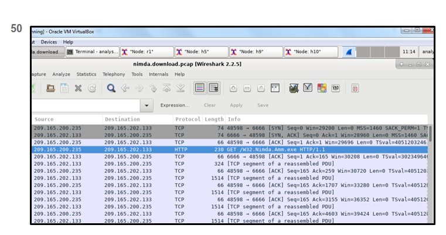

# First shot

28 What is the purpose of ICMP messages? 

to provide feedback of IP packet transmissions

The purpose of ICMP messages is to provide feedback about issues that are related to the processing of IP packets.
1.7.1 ICMP

45 What is the result of an ARP poisoning attack?
Client information is stolen.

ARP poisoning is a technique used by an attacker to reply to an ARP request for an IPv4 address belonging to another device, such as the default gateway. The attacker, who is effectively doing an MITM attack, pretends to be the default gateway and sends an ARP reply to the transmitter of the ARP request. The receiver of the ARP reply will add the wrong MAC address to the ARP table and will send the packets to the attacker. Therefore, all traffic to the default gateway will funnel through the attacker device. 

1.8.3 ARP Issues 

50 Refer to the exhibit. A network security analyst is examining captured data using Wireshark. The captured frames indicate that a host is downloading malware from a server. Which source port is used by the host to request the download? 

48598
During the TCP three-way handshake process, the output shows that the host uses source port 48598 to initiate the connection and request the download.

1.9.2 Transport Session Establishment 