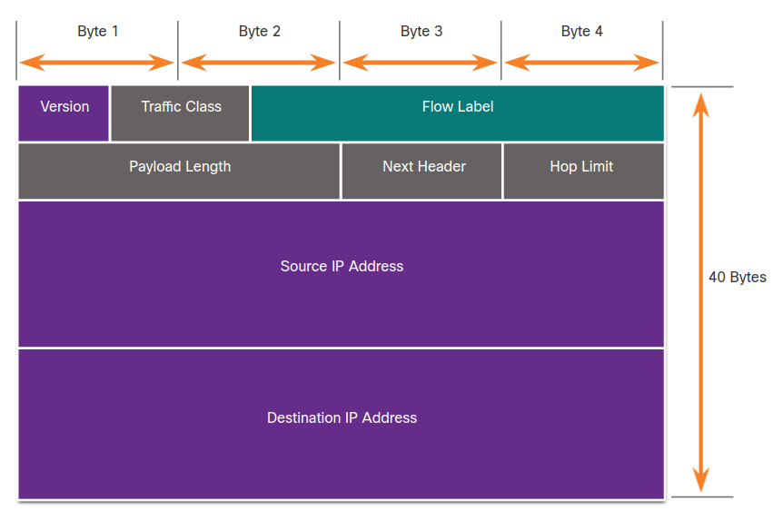
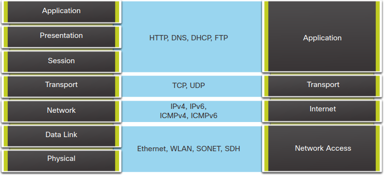
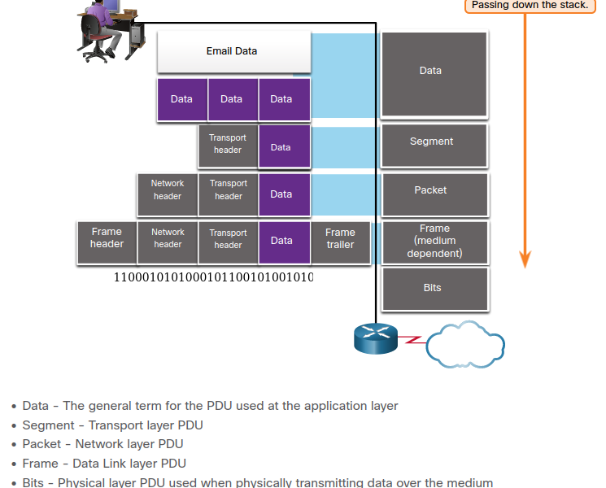
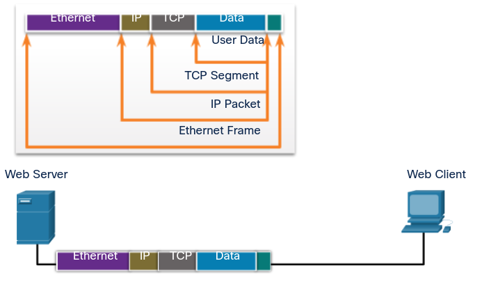

# Network protocols

## Network Communications Process

### Networks of many sizes

Networks come in all sizes.

* **Simple home networks** let you share resources, such as printers, documents, pictures, and music, among a few local end devices.
* **Small office and home office (SOHO)** networks allow people to work from home, or a remote office. Many self-employed workers use these types of networks to advertise and sell products, order supplies, and communicate with customers.
* **Businesses and large organizations** use networks to provide consolidation, storage, and access to information on network servers. Networks provide email, instant messaging, and collaboration among employees. Many organizations use their network’s connection to the internet to provide products and services to customers.

**The internet is the largest network in existence**. In fact, the term internet means a “network of networks”. It is a collection of interconnected private and public networks.

In small businesses and homes, many computers function **as both the servers and clients on the network**. **This type of network is called a peer-to-peer network**.

### Client-server communications

**All computers that are connected to a network and that participate directly in network  communication are classified as hosts**. **Hosts are also called end devices, endpoints, or nodes**. **Much of the interaction between end devices is client-server traffic**.

**Servers are simply computers with specialized software**. This software enables servers **to provide information to other end devices on the network**. A server **can be single-purpose**, **providing only one service**. **A server can be multipurpose**, **providing a variety of services such as web pages**.

**Client computers have software installed**, such as web browsers, email clients, and file transfers applications. **This software enables them to request and display the information obtained from the server**. A single computer can also run multiple types of client software. 

### Tracing the Path

Just like a car’s mechanic knows the details of how a car operates, **cybersecurity analysts need to have a deep understanding of how networks operate**.

Because of different relationships between ISPs and telecommunications companies, traffic from a computer to an internet server can take many paths.

**Cybersecurity analysts must be able to determine the origin of traffic that enters the network, and the destination of traffic that leaves it. Understanding the path that network traffic takes is essential to this**.

## Communications protocols

### what are protocols?

Simply having a wired or wireless physical connection between end devices is not enough to enable communication. **For communication to occur, devices must know “how” to communicate**. 

Protocols determine:
* message encoding
* message formatting and encapsulation
* message size
* message timing
* message delivery options

### network protocols

Network protocols provide the means for computers to communicate on networks. Network protocols dictate the **message encoding, formatting, encapsulation, size, timing, and delivery options**. Networking protocols define **a common format and set of rules for exchanging messages between devices**. **Some common networking protocols are Hypertext Transfer Protocol (HTTP)**, **Transmission Control Protocol (TCP)**, and **Internet Protocol (IP)**. 

**As a cybersecurity analyst, you must be very familiar with the structure of protocol data and how the protocols function in network communications**.

### The TCP/IP Protocol Suite

#### summary
**TCP/IP Layers**
1. **Application**:
    * name system: DNS
    * host config: dhcpv4, dhcpv6, slaac
    * email: smtp, pop3, imap
    * file transfer: ftp, sftp. tftp
    * web and web service: http, https, rest
1. **Transport**:
    * connection-oriented: tcp
    * connectionless: udp
1. **Internet**:
    * internet protocol: ipv4, ipv6, nat
    * messaging: icmpv4, icmpv6, icmpv6 nd
    * routing protocols: ospf, eigrp, bgp
1. **Network Access**:
    * address resolution: arp
    * data link protocols: ethernet, wlan

**Application Layer**
**Name System**
**DNS** - Domain Name System. Translates domain names such as cisco.com, into IP addresses.

**Host Config**
**DHCPv4** - Dynamic Host Configuration Protocol for IPv4. A DHCPv4 server dynamically assigns IPv4 addressing information to DHCPv4 clients at start-up and allows the addresses to be re-used when no longer needed.
**DHCPv6** - Dynamic Host Configuration Protocol for IPv6. DHCPv6 is similar to DHCPv4. A DHCPv6 server dynamically assigns IPv6 addressing information to DHCPv6 clients at start-up.
**SLAAC** - Stateless Address Autoconfiguration. A method that allows a device to obtain its IPv6 addressing information without using a DHCPv6 server.

**Email**
**SMTP** - Simple Mail Transfer Protocol. Enables clients to send email to a mail server and enables servers to send email to other servers.
**POP3** - Post Office Protocol version 3. Enables clients to retrieve email from a mail server and download the email to the client's local mail application.
**IMAP** - Internet Message Access Protocol. Enables clients to access email stored on a mail server as well as maintaining email on the server.

**File Transfer**
**FTP** - File Transfer Protocol. Sets the rules that enable a user on one host to access and transfer files to and from another host over a network. FTP is a reliable, connection-oriented, and acknowledged file delivery protocol.
**SFTP** - SSH File Transfer Protocol. As an extension to Secure Shell (SSH) protocol, SFTP can be used to establish a secure file transfer session in which the file transfer is encrypted. SSH is a method for secure remote login that is typically used for accessing the command line of a device.
**TFTP** - Trivial File Transfer Protocol. A simple, connectionless file transfer protocol with best-effort, unacknowledged file delivery. It uses less overhead than FTP.

**Web and Web Service**
**HTTP** - Hypertext Transfer Protocol. A set of rules for exchanging text, graphic images, sound, video, and other multimedia files on the World Wide Web.
**HTTPS** - HTTP Secure. A secure form of HTTP that encrypts the data that is exchanged over the World Wide Web.
**REST** - Representational State Transfer. A web service that uses application programming interfaces (APIs) and HTTP requests to create web applications.

**Transport layer**

**Connection-Oriented**
**TCP** - Transmission Control Protocol. Enables reliable communication between processes running on separate hosts and provides reliable, acknowledged transmissions that confirm successful delivery.
**Connectionless**
**UDP** - User Datagram Protocol. Enables a process running on one host to send packets to a process running on another host. However, UDP does not confirm successful datagram transmission.

**Internet Layer**
**Internet Protocol**
**IPv4** - Internet Protocol version 4. Receives message segments from the transport layer, packages messages into packets, and addresses packets for end-to-end delivery over a network. IPv4 uses a 32-bit address.
**IPv6** - IP version 6. Similar to IPv4 but uses a 128-bit address.
**NAT** - Network Address Translation. Translates IPv4 addresses from a private network into globally unique public IPv4 addresses.

**Messaging**
**ICMPv4** - Internet Control Message Protocol for IPv4. Provides feedback from a destination host to a source host about errors in packet delivery.
**ICMPv6** - ICMP for IPv6. Similar functionality to ICMPv4 but is used for IPv6 packets.
**ICMPv6 ND** - ICMPv6 Neighbor Discovery. Includes four protocol messages that are used for address resolution and duplicate address detection.

Routing Protocols
**OSPF** - Open Shortest Path First. Link-state routing protocol that uses a hierarchical design based on areas. OSPF is an open standard interior routing protocol.
**EIGRP** - EIGRP - Enhanced Interior Gateway Routing Protocol. An open standard routing protocol developed by Cisco that uses a composite metric based on bandwidth, delay, load and reliability.
**BGP** - Border Gateway Protocol. An open standard exterior gateway routing protocol used between Internet Service Providers (ISPs). BGP is also commonly used between ISPs and their large private clients to exchange routing information.

**Network Access Layer**
**Address Resolution**
**ARP** - Address Resolution Protocol. Provides dynamic address mapping between an IPv4 address and a hardware address. Nte: **You may see other documentation state that ARP operates at the Internet Layer (OSI Layer 3)**. However, **in this course we state that ARP operates at the Network Access layer (OSI Layer 2) because it's primary purpose is the discover the MAC address of the destination. A MAC address is a Layer 2 address.**
**Data Link Protocols**
**Ethernet** - Defines the rules for wiring and signaling standards of the network access layer.
**WLAN** - Wireless Local Area Network. Defines the rules for wireless signaling across the 2.4 GHz and 5 GHz radio frequencies.

### Message Formatting and Encapsulation

A message that is sent over a computer network follows specific format rules for it to be delivered and processed.

**Internet Protocol (IP)** is a protocol with a similar function to the envelope example. The fields of the Internet Protocol version 6 (IPv6) packet identify the source of the packet and its destination. IP is responsible for sending a message from the message source to destination over one or more networks.

### Message Size

Likewise, when a long message is sent from one host to another over a network, **it is necessary to break the message into smaller pieces**. The rules that govern the size of the pieces, or frames, communicated across the network are very strict. They can also be different, **depending on the channel used**. **Frames that are too long or too short are not delivered**.

The size restrictions of frames require the source host to break a long message into individual pieces that meet both the minimum and maximum size requirements. The long message will be sent in separate frames, with each frame containing a piece of the original message. Each frame will also have its own addressing information. At the receiving host, the individual pieces of the message are reconstructed into the original message.

### Message Timing

Message timing includes the following:

* **Flow Control**: This is the **process of managing the rate of data transmission**. Flow control defines **how much information can be sent and the speed at which it can be delivered**. In network communication, there are **network protocols** used by the source and destination devices **to negotiate and manage the flow of information**.
* **Response Timeout**: Hosts on the network use network protocols that specify **how long to wait for responses and what action to take if a response timeout occurs**.
* **Access method**: when a device **wants to transmit on a wireless LAN**, it is necessary for the WLAN network interface card (NIC) **to determine whether the wireless medium is available**.

### Unicast, Multicast, and Broadcast

* **unicast**: A one-to-one delivery option is referred to as a unicast, meaning there is only a single destination for the message. **For instance: source: 172.16.4.1/24; destination: 172.16.4.253/24**
* **multicast**: When a host needs to send messages using a one-to-many delivery option, it is referred to as a multicast. For instance, source: 172.16.4.1/24; destination: 224.10.10.5.
* **broadcast**: If all hosts on the network need to receive the message at the same time, a broadcast may be used. Broadcasting represents a one-to-all message delivery option. For instance, source 172.16.4.1/24, destination: 255.255.255.255.

### The Benefits of Using a Layered Model

Complex concepts such as how a network operates can be difficult to explain and understand. For this reason, **a layered model is used to modularize the operations of a network into manageable layers**. These are the benefits of using a layered model to describe network protocols and operations:

* Assisting in protocol design because protocols that operate at **a specific layer have defined information that they act upon and a defined interface to the layers above and below**
* **Fostering competition** because products from different vendors can work together
* **Preventing technology or capability changes in one layer from affecting other layers above and below**
* **Providing a common language **to describe networking functions and capabilities

There are two layered models that are used to describe network operations:
* Open System Interconnection (OSI) Reference Model
* TCP/IP Reference Model

### The OSI Reference Model

**This type of model provides consistency within all types of network protocols and services by describing what must be done at a particular layer, but not prescribing how it should be accomplished**.

It also **describes the interaction of each layer with the layers directly above and below**. The TCP/IP protocols discussed in this course are structured **around both the OSI and TCP/IP models**. 

**OSI Model Layer** 
  * 7 - **Application**: The application layer contains protocols used for process-to-process communications
  * 6 - **Presentation**: The presentation layer provides for common representation of the data transferred between application layer services
  * 5 - **Session**: The session layer provides services to the presentation layer to organize its dialogue and to manage data exchange
  * 4 - **Transport**: The transport layer defines services to segment, transfer, and reassemble the data for individual communications between the end devices
  * 3 - **Network**: The network layer provides services to exchange the individual pieces of data over the network between identified end devices
  * 2 - **Data Link**: The data link layer protocols describe methods for exchanging data frames between devices over a common media 
  * 1 - **Physical**: The physical layer protocols describe the mechanical, electrical, functional, and procedural means to activate, maintain, and de-activate physical connections for a bit transmission to and from a network device 

Note: Whereas the TCP/IP model layers are referred to only by name, the seven OSI model layers are more often referred to by number rather than by name. For instance, the physical layer is referred to as Layer 1 of the OSI model, data link layer is Layer 2, and so on.

### The TCP/IP Protocol Model

**The TCP/IP model is a protocol model because it describes the functions that occur at each layer of protocols within the TCP/IP suite**. **TCP/IP is also used as a reference model**.

* **TCP/IP Model Layer**
    * **4 - Application**: Represents data to the user, plus encoding and dialog control.
    * **3 - Transport**:  Supports communication between various devices across diverse networks. 
    * **2 - Internet**: Determines the best path through the network.
    * **1 - Network Access**: Controls the hardware devices and media that make up the network.

**The definitions of the standard and the TCP/IP protocols are discussed in a public forum and defined in a publicly available set of IETF request for comment (RFC) documents.** An RFC is authored by networking engineers and sent to other IETF members for comments.

### Data encapsulation

#### segmenting messages

**A single communication could be sent across a network from a source to a destination as one massive, uninterrupted stream of bits**. However, **this would create problems for other devices needing to use the same communication channels or links**. These large streams of data would result in significant delays. If any link in the interconnected network infrastructure failed during the transmission, the complete message would be lost and would have to be retransmitted in full.

A better approach **is to divide the data into smaller, more manageable pieces to send over the network**. **Segmentation is** the process of dividing a stream of data into smaller units for transmissions over the network. **Segmentation is** necessary because data networks use the TCP/IP protocol suite send data in individual IP packets. **Each packet is sent separately, similar to sending a long letter as a series of individual postcards. Packets containing segments for the same destination can be sent over different paths**.

This leads to segmenting messages having two primary benefits:
* **Increases speed**: Because a large data stream is segmented into packets, large amounts of data can be sent over the network without tying up a communications link. This allows many different conversations to be interleaved on the network called multiplexing.
* **Increases efficiency**: If a single segment fails to reach its destination due to a failure in the network or network congestion, only that segment needs to be retransmitted instead of resending the entire data stream.

### Sequencing

**The challenge to using segmentation and multiplexing to transmit messages across a network is the level of complexity that is added to the process**. In network communications, each segment of the message must go through a similar process to ensure that it gets to the correct destination and can be reassembled into the content of the original message. **TCP is responsible for sequencing the individual segments**.

### Protocol Data Units

As application **data is passed down the protocol stack on its way to be transmitted across the network media**, various protocol information is added at each level. **This is known as the encapsulation process**.

Note: Although the UDP PDU is called datagram, IP packets are sometimes also referred to as IP datagrams.

The **form that a piece of data takes at any layer is called a protocol data unit (PDU)**. **During encapsulation**, each succeeding layer encapsulates the PDU that it receives from the layer above in accordance with the protocol being used. At each stage of the process, a PDU has a different name to reflect its new functions. Although there is no universal naming convention for PDUs, in this course, the PDUs are named according to the protocols of the TCP/IP suite.

### Three Addresses

**Network protocols require that addresses be used for network communication. Addressing is used by the client to send requests and other data to a server. The server uses the client’s address to return the requested data to the client that requested it.**

**The OSI transport, network, and data link layers all use addressing in some form**.

The **transport layer uses protocol addresses** in the form of **port numbers to identify network applications that should handle client and server data**.
The **network layer specifies addresses** that **identify the networks that clients and servers are attached to and the clients and servers themselves**.
The **data link layer** specifies **the devices on the local LAN** **that should handle data frames**. All three addresses are required for client-server communication.

### 5.3.5 Encapsulation Example

When messages are being sent on a network, the encapsulation process works from top to bottom. At each layer, the upper layer information is considered data within the encapsulated protocol. For example, the TCP segment is considered data within the IP packet.

### 5.3.6  De-encapsulation Example

This process is reversed at the receiving host and is known as de-encapsulation. De-encapsulation is the process used by a receiving device to remove one or more of the protocol headers. The data is de-encapsulated as it moves up the stack toward the end-user application.

### Check Your Understanding - Data Encapsulation

1. What is the process of dividing a large data stream into smaller pieces prior to transmission?
   Segmentation
1. What is the PDU associated with the transport layer? 
   Segment
2. Which protocol stack layer encapsulates data into frames? 
   data link
3. What is the name of the process of adding protocol information to data as it moves down the protocol stack? 
   Encapsulation

### What Did I Learn in this Module?

**Network Communications**

Networks come in all sizes and can be found in homes, businesses, and other organizations. The internet is the largest network in existence . All computers that connect to a network are known as hosts or end devices. Much of the interaction between hosts is client-server traffic. Hosts can operate as clients or servers or **both clients and servers in peer-to-peer networks**. **Servers are hosts that use specialized software to enable them to respond to requests for different types of data from clients**. Clients are hosts that use software applications such as web browsers, email clients, or file transfer applications to request data from servers. When we use the internet, we use a combination of copper and fiber optic cables or wireless and satellite communications to carry our data traffic. Connections to the internet are through internet service providers that connect to each other using global Tier 1 and Tier 2 ISPs that connect to each other through Internet Exchange Points (IXP). Larger businesses may connect to Tier 2 ISPs through a Point of Presence (POP). Tier 3 ISPs connect homes and businesses to the internet. Traffic between a computer and an internet server can take many different paths. Some paths can be very direct, but others may seem to go out of the way. In addition, data that is sent between a computer and server may be sent on a different path from that on which it is received.

**Communications Protocols**

Data communications requires more than just connections. Devices must know how to communicate. For this devices use **communications rules or protocols**, just as face-to-face communications between people use rules. **Network protocols specify many features of network communication such as message encoding, message formatting and encapsulation, message size, message timing, and delivery options**. Examples of networking protocols include Hypertext Transfer Protocol (HTTP), Transmission Control Protocol (TC), and Internet Protocol (IP). **It is very important that a cybersecurity analyst know the structure of protocol data and how protocols function on the network.** **Protocols specify how messages are structured and the way that networking devices share information about pathways to other networks.** They also specify how and when error and system messages are passed between devices. In addition, **protocols specify how data transfer sessions are setup and terminated. The TCP/IP protocol suite is used by the internet and data networks in homes, businesses, and other organizations.** The TCP/IP suite is a family of protocols that conform to freely available open-source standards that are endorsed by the networking industry and approved by standards organizations. This enables devices from different manufacturers to work together. **The TCP/IP protocol suite has four layers of protocols that work together when messages are sent and received**. **Common protocols at the application layer of the suite are DNS, DHCP, POP3, and HTTPS, among others**. **Transport layer protocols are TCP and UDP.** **Examples of internet layer protocols are IPv4, IPv6, ICMP, and EIGRP**. **Messages are formatted to conform to protocols standards. Protocol data is encapsulated by putting higher layer data within lower layer data when the data is sent.** The reverse process occurs when the data is received. **Protocol standards specify the size of messages and how the messages are encoded to be sent over network connections as radio waves, pulses of light, or electrical signals**. The receiving host decodes the messages. **Protocol standards also specify the rate at which data is sent (flow control), the time that a host waits to receive a response from the destination (response timeout), and the way in which hosts determine when they can send data on a shared-media network (access method)**. Unicast messages are sent to one destination host. Multicast messages are sent to a group of hosts. Broadcasts are sent to all hosts in the same area of the network. Layered communication models have a number of benefits. Models assist in protocol and device design.**They also increase competition between manufacturers because devices must work together.**Finally, **models prevent changes at one layer from impacting other layers and provide a common way to describe network operation**. Two models are the OSI and TCP/IP reference models. The OSI model has seven layers. The different layers have different functions. The TCP/IP model has four layers.

**Data Encapsulation**

**Messages that consist of large amounts of data can not be sent across the network as one massive stream of bits. This is because other people would need to wait for the entire communication to complete before they could use the network, and if the communication failed, the entire message would need to be sent again.** Instead, **data is broken into a series of smaller pieces and sent over the network.** **This is called segmentation.** **Segmentation is required by the TCP/IP protocol suite. Data is sent as packets. Each packet is separately addressed and can take different paths through a network to reach the destination.** **Segmentation increases the speed and efficiency of data networks.** Increased speed is gained because many data conversations can happen at the same time on the network. **This is called multiplexing**. **Efficiency is gained because only data that is not received by a destination needs to be re-sent.** Messages are segmented to be sent, and must be recombined when they are received. **As data is passed down the protocol stack to be sent, different information is added by each layer. This process is called encapsulation.** **The form that data takes at different layer is called a protocol data unit (PDU).** During encapsulation, **the PDUs are encapsulated within PDUs in the next layer down the stack when the data is sent.** The reverse process occurs when the data is received. At the OSI application layer, the PDU is generally referred to simply as data. **The data is encapsulated into segments or datagrams at the transport layer. The network layer PDU is called a packet, it encapsulates segments. The data link layer encapsulates packets into frames.** Finally, **the physical layer transmits bits across the network.** **The OSI transport, network, and data link layers all use addressing.** **The transport layer uses protocol addresses in the form of port numbers. The network layer uses IP addresses to identify hosts and networks, Finally, the data link layer uses hardware addresses to identify which hosts on the local network should handle frames.** These addresses identify the source of the data and the destination of the data. After the data is received, it is de-encapsulated so that the data can be used by the client applications that requested it.

### Module 5: Network Protocols Quiz

1. A host is transmitting a broadcast. Which host or hosts will receive it? 
   **All hosts in the same network.** Topic 5.2.0 - A broadcast is delivered to every host that has an IP address within the same network.

2. Which statement describes a characteristic of cloud computing? 
   **Applications can be accessed over the Internet by individual users or businesses using device, anywhere in the world** Topic 5.1.0 - Cloud computing allows users to access applications, back up and store files, and perform tasks without needing additional software or servers. Cloud users access resources through subscription-based or pay-per-use services, in real time, using nothing more than a web browser.

3. A network administrator can successfully ping the server at www.cisco.com, but cannot ping the company web server located at an ISP in another city. Which tool or command would help identify the specific router where the packet was lost or delayed? 
   **traceroute** Topic 5.1.0 - The traceroute command provides connectivity information about the path a packet takes to reach the destination and about every router (hop) along the way. It also indicates how long a packet takes to get from the source to each hop and back.

4. Which OSI model layer contains protocols for process-to-process communication? 
   **application***  Topic 5.2.0 - The application layer of the OSI model is responsible for communication between processes. Examples of protocols at the application layer are DHCP, DNS, and HTTP.

5. At which OSI layer is a destination port number added to a PDU during the encapsulation process?
   **transport layer**

6. What process involves placing one PDU inside of another PDU? 
   **encapsulation** Topic 5.3.0 - When a message is placed inside of another message, this is known as encapsulation. On networks, encapsulation takes place when one protocol data unit is carried inside of the data field of the next lower protocol data unit.

7. Which statement accurately describes a TCP/IP encapsulation process when a PC is sending data to the network? 
   **segments are sent from the transport layer to the internet layer** Topic 5.3.0 - When the data is traveling from the PC to the network, the transport layer sends segments to the internet layer. The internet layer sends packets to the network access layer, which creates frames and then converts the frames to bits. The bits are released to the network media.

8. A web client is receiving a response for a web page from a web server. From the perspective of the client, what is the correct order of the protocol stack that is used to decode the received transmission? 
   **ethernet, IP, TCP, HTTP** Topic 5.3.0 - 1. HTTP governs the way that a web server and client interact. 2. TCP manages individual conversations between web servers and clients. 3. IP is responsible for delivery across the best path to the destination. 4. Ethernet takes the packet from IP and formats it for transmission.

9.  How does BYOD change the way in which businesses implement networks? 
    **BYOD provides flexibility in where and how users can access network resources** Topic 5.1.0 - A BYOD environment requires an organization to accommodate a variety of devices and access methods. Personal devices, which are not under company control, may be involved, so security is critical. Onsite hardware costs will be reduced, allowing a business to focus on delivering collaboration tools and other software to BYOD users.

10. In computer communication, what is the purpose of message encoding? 
    **to convert information to the appropriate form for transmission** Topic 5.2.0 - Before a message is sent across a network it must first be encoded. Encoding is the process of converting the data message into another format suitable for transmission across the physical medium. Each bit of the message is encoded into a pattern of sounds, light waves, or electrical impulses depending on the network media over which the bits are transmitted. The destination host receives and decodes the signals in order to interpret the message.

11. Which statement is true about the TCP/IP and OSI models?​ 
    **the TCP/IP transport layer and OSI layer 4 provide similar services and functions** Topic 5.2.0 - The TCP/IP internet layer provides the same function as the OSI network layer. The transport layer of both the TCP/IP and OSI models provides the same function. The TCP/IP application layer includes the same functions as OSI Layers 5, 6, and 7.

12. What method can be used by two computers to ensure that packets are not dropped because too much data is being sent too quickly?
    **flow control** Topic 5.2.0 - In order for two computers to be able to communicate effectively, there must be a mechanism that allows both the source and destination to set the timing of the transmission and receipt of data. Flow control allows for this by ensuring that data is not sent too fast for it to be received properly.