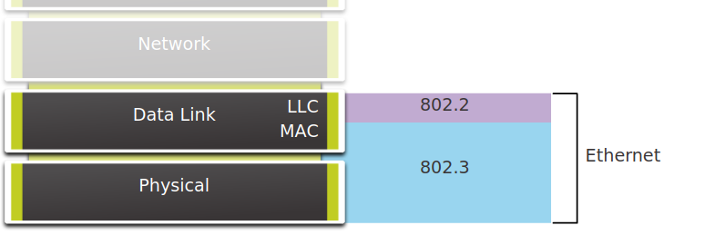
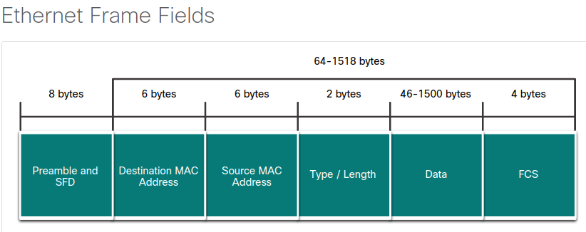
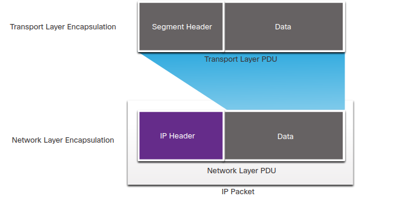
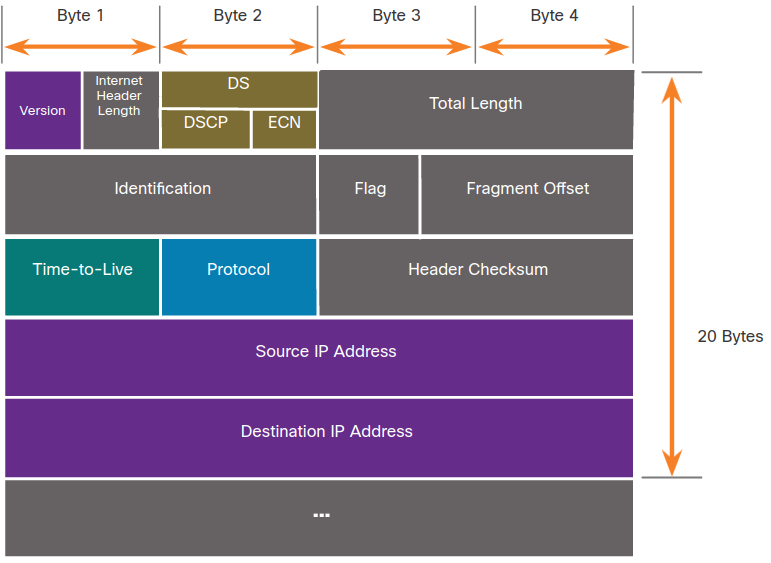
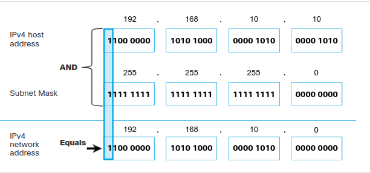

# 6.0.0 Ethernet and Internet Protocol (IP)

## 6.0.0 Introduction

### 6.0.1 Why Should I Take this Module?

**Cybersecurity analysts work** to **identify and analyze the indicators of network security incidents**. **These indicators consist of records of network events**. These events, which are recorded in log files from various devices, are primarily **composed of details of network protocol operations**. Addresses identify which hosts have connected to each other, either within an organization, or to distant hosts on the Internet. Addresses that are held in log files also identify which external hosts connected with, or attempted to connect with, hosts within an organization.

**It is crucial for a cybersecurity analyst to know everything they can about Ethernet and IP addresses.**

### 6.1.0 Ethernet

### 6.1.1 Ethernet Encapsulation

Ethernet and wireless LANs (WLANs) are the two most commonly deployed LAN technologies. Unlike wireless, Ethernet uses wired communications, including twisted pair, fiber-optic links, and coaxial cables.

Ethernet operates in the data link layer and the physical layer. It is a family of networking technologies **defined in the IEEE 802.2 and 802.3 standards**. Ethernet supports the following data bandwidths:

* 10 Mbps
* 100 Mbps
* 1000 Mbps (1 Gbps)
* 10,000 Mbps (10 Gbps)
* 40,000 Mbps (40 Gbps)
* 100,000 Mbps (100 Gbps)

Ethernet is defined by data link layer and physical layer protocols.

### 6.1.2 Ethernet Frame Fields

**The minimum Ethernet frame size is 64 bytes and the maximum is 1518 bytes**. This includes **all bytes from the destination MAC address field through the frame check sequence (FCS) field**. **The preamble field is not included when describing the size of the frame**.

**Any frame less than 64 bytes in length is considered a “collision fragment” or “runt frame” and is automatically discarded by receiving stations. Frames with more than 1500 bytes of data are considered “jumbo” or “baby giant frames”**.

**If the size of a transmitted frame is less than the minimum, or greater than the maximum,** **the receiving device drops the frame**. Dropped frames are likely to be the result of collisions or other unwanted signals. They are considered invalid. However, the Fast Ethernet and Gigabit Ethernet interfaces of some Cisco Catalyst switches can be configured to support larger jumbo frames.

1. **Preamble and Start Frame Delimiter Fields**: The Preamble (7 bytes) and Start Frame Delimiter (SFD), also called the Start of Frame (1 byte), **fields are used for synchronization between the sending and receiving devices**. These first eight bytes of the frame are used to **get the attention of the receiving nodes**. Essentially, the first few bytes tell the receivers to get ready to receive a new frame.
1. **Destination MAC Address Field**: This 6-byte field **is the identifier for the intended recipient**. As you will recall, **this address is used by Layer 2 to assist devices in determining if a frame is addressed to them**. The address in the frame is compared to the MAC address in the device. **If there is a match, the device accepts the frame. Can be a unicast, multicast or broadcast address.**
1. **Source MAC Address Field**: This 6-byte field **identifies the originating NIC **or interface of the frame. **A source MAC address can only be a unicast address**.
1. **Type / Length**: This 2-byte field identifies the upper layer protocol encapsulated in the Ethernet frame. Common values are, **in hexadecimal, 0x800 for IPv4, 0x86DD for IPv6 and 0x806 for ARP**. 
1. **Data Field**: This field (46 - 1500 bytes) **contains the encapsulated data from a higher layer**, **which is a generic Layer 3 PDU, or more commonly, an IPv4 packet**. All frames must be at least 64 bytes long. If a small packet is encapsulated, additional bits called a pad are used to increase the size of the frame to this minimum size.
1. **Frame Check Sequence Field**: The Frame Check Sequence (FCS) field (4 bytes) **is used to detect errors in a frame**. **It uses a cyclic redundancy check (CRC)**. The sending device includes the results of a CRC in the FCS field of the frame. The receiving device receives the frame and generates a CRC to look for errors. If the calculations match, no error occurred. Calculations that do not match are an indication that the data has changed; therefore, the frame is dropped. A change in the data could be the result of a disruption of the electrical signals that represent the bits.

### 6.1.3 MAC Address Format

| Decimal | Binary | Hexadecimal |
|:-------:|:------:|:-----------:|
|    0    |  0000  |     0       |
|    1    |  0001  |     1       |
|    2    |  0010  |     2       |
|    3    |  0011  |     3       |
|    4    |  0100  |     4       |
|    5    |  0101  |     5       |
|    6    |  0110  |     6       |
|    7    |  0111  |     7       |
|    8    |  1000  |     8       |
|    9    |  1001  |     9       |
|    10   |  1010  |     A       |
|    11   |  1011  |     B       |
|    12   |  1100  |     C       |
|    13   |  1101  |     D       |
|    14   |  1110  |     E       |
|    15   |  1111  |     F       |

**An Ethernet MAC address is a 48-bit binary value expressed as 12 hexadecimal digits (4 bits per hexadecimal digit)**. Hexadecimal digits uses the numbers 0 to 9 and the letters A to F. The figure shows the equivalent decimal and hexadecimal values for binary 0000 to 1111. Hexadecimal is commonly used to represent binary data. IPv6 addresses are another example of hexadecimal addressing.

Depending on the device and the operating system, you will see various representations of MAC addresses, as displayed in the figure below.

With dashes: 00-60-2F-3A-07-BC
WIth colons: 00:60:2F:3A:07:BC
WIth colons: 0060.2F3A.07BC

### 6.1.4 Check Your Understanding - Ethernet Frame Fields

1. Which Ethernet frame field assists a host in determining if the frame that is received is addressed to it? **destination address**
1. Which Ethernet frame field notifies destinations to get ready for a new frame? **preambule**
1. Which Ethernet frame field describes the higher-layer protocol that is encapsulated? **Type/Length**
1. Which part of the Ethernet frame helps a destination detect if there are errors in a frame? **frame check sequence**

### 6.2.0 IPv4

### 6.2.1 The network layer

The **network layer**, **or OSI Layer 3**, **provides services to allow end devices to exchange data across networks**. **IP version 4 (IPv4) and IP version 6 (IPv6) are the principle network layer communication protocols**. Other network layer protocols **include routing protocols such as Open Shortest Path First (OSPF)** and **messaging protocols such as Internet Control Message Protocol (ICMP)**.

To **accomplish end-to-end communications** across network boundaries, network layer protocols perform four basic operations:

1. **Addressing end devices**: End devices must be configured with a unique IP address for identification on the network.
1. **Encapsulation**: The **network layer encapsulates the protocol data unit (PDU) from the transport layer into a packet**. The **encapsulation process adds IP header information**, such as the **IP address of the source (sending) and destination (receiving) hosts**. The encapsulation process is performed by the source of the IP packet.
1. **Routing**: The **network layer provides services to direct the packets to a destination host on another network**. To travel to other networks, the **packet must be processed by a router**. The **role of the router is to select the best path and direct packets toward the destination host in a process known as routing**. A **packet may cross many routers before reaching the destination host**. **Each router a packet crosses to reach the destination host is called a hop**.
1. **De-encapsulation**: When the packet arrives at the network layer of the destination host, the host checks the IP header of the packet. If the destination IP address within the header matches its own IP address, the IP header is removed from the packet. After the packet is de-encapsulated by the network layer, the resulting Layer 4 PDU is passed up to the appropriate service at the transport layer. The de-encapsulation process is performed by the destination host of the IP packet.

**Unlike the transport layer (OSI Layer 4)**, **which manages the data transport between the processes running on each host, network layer communication protocols (i.e., IPv4 and IPv6) specify the packet structure and processing used to carry the data from one host to another host**. Operating without regard to the data carried in each packet allows the network layer to carry packets for multiple types of communications between multiple hosts.

### 6.2.2 IP Encapsulation

**IP encapsulates the transport layer segment or other data by adding an IP header**. The **IP header is used to deliver the packet to the destination host**. 

The **process of encapsulating data layer by layer** **enables the services at the different layers to develop and scale without affecting the other layers**. This means the transport layer segments can be readily packaged by IPv4 or IPv6 or by any new protocol that might be developed in the future.

**The IP header is examined by Layer 3 devices** (i.e., **routers and Layer 3 switches**) as it travels across a network to its destination. **It is important to note, that the IP addressing information remains the same from the time the packet leaves the source host until it arrives at the destination host**, **except when translated by the device performing Network Address Translation (NAT) for IPv4**.

**Routers implement routing protocols to route packets between networks**. The **routing performed by these intermediary devices examines the network layer addressing in the packet header**. In all cases, **the data portion of the packet**, that is, the **encapsulated transport layer PDU or other data**, **remains unchanged during the network layer processes**.

### 6.2.3 Characteristics of IP

**IP was designed as a protocol with low overhead**. It **provides only the functions that are necessary to deliver a packet from a source to a destination over an interconnected system of networks**. The **protocol was not designed to track and manage the flow of packets**. **These functions** **are performed by other protocols at other layers**, **primarily TCP at Layer 4**.

These are the basic characteristics of IP:

* **Connectionless**: There is no connection with the destination established before sending data packets.
* **Best Effort**: IP is inherently unreliable because packet delivery is not guaranteed.
* **Media Independent**: Operation is independent of the medium (i.e., copper, fiber-optic, or wireless) carrying the data.

### 6.2.4 Connectionless

**IP is connectionless, meaning that no dedicated end-to-end connection is created by IP before data is sent. IP requires no initial exchange of control information to establish an end-to-end connection before packets are forwarded.**

### 6.2.5 Best Effort

IP also **does not require additional fields in the header to maintain an established connection**. This **process greatly reduces the overhead of IP**. However, with no pre-established end-to-end connection, senders are unaware whether destination devices are present and functional when sending packets, nor are they aware if the destination receives the packet, or if the destination device is able to access and read the packet.

**The IP protocol does not guarantee that all packets that are delivered are, in fact, received.** Other protocols manage the process of tracking packets and ensuring their delivery.

### 6.2.6 Media Independent

**Unreliable means that IP does not have the capability to manage and recover from undelivered or corrupt packets**. This is because **while IP packets are sent with information about the location of delivery**, they **do not contain information that can be processed to inform the sender whether delivery was successful**. **Packets may arrive at the destination corrupted**, **out of sequence**, or not at all. **IP provides no capability for packet retransmissions if errors occur**.

If out-of-order packets are delivered, or packets are missing, then **applications using the data, or upper layer services, must resolve these issues**. This allows IP to function very efficiently. In the TCP/IP protocol suite, reliability is the role of the TCP protocol at the transport layer.

**IP operates independently of the media that carry the data at lower layers of the protocol stack**. **IP packets can be communicated as electronic signals over copper cable, as optical signals over fiber, or wirelessly as radio signals**.

The **OSI data link layer is responsible for taking an IP packet and preparing it for transmission over the communications medium**. This means that the **delivery of IP packets is not limited to any particular medium**.

There is, however, **one major characteristic of the media that the network layer considers**: **the maximum size of the PDU that each medium can transport**. This **characteristic is referred to as the maximum transmission unit (MTU)**. **Part of the control communication between the data link layer and the network layer is the establishment of a maximum size for the packet**. **The data link layer passes the MTU value up to the network layer**. **The network layer then determines how large packets can be**.

In some cases, **an intermediate device**, usually a router, must split up an IPv4 packet when forwarding it from one medium to another medium with a smaller MTU. This process is called fragmenting the packet, or fragmentation. **Fragmentation causes latency**. **IPv6 packets cannot be fragmented by the router**.

### 6.2.7 Check Your Understanding - IP Characteristics

1. Which OSI layer sends segments to be encapsulated in an IPv4 or IPv6 packet? **transport layer, or, OSI L4**
1. Which layer is responsible for taking an IP packet and preparing it for transmission over the communications medium? **data link, or, L2**
1. What is the term for splitting up an IP packet when forwarding it from one medium to another medium with a smaller MTU? **fragmentation**
1. Which delivery method does not guarantee that the packet will be delivered fully without errors? **best effort**

### 6.2.9 IPv4 Packet Header Fields

**The binary values of each field identify various settings of the IP packet**. Protocol header diagrams, which are read left to right, and top down, provide a visual to refer to when discussing protocol fields. 

#### Fields in the IPv4 Packet Header

* **version**: contains a 4-bit binary value set to 0100 that identifies this as an IPv4 packet.
* **differentiated services of diffserv (ds)**: formerly called the type of service (ToS), the DS field is an 8-bit field used to determine the priority of each packet. The six most significant bits of the dissserv field are the differentiated services code point (DSCP) bits and the las two bits are the explicit congestion notification (ECN) bits.
* **header checksum**: this is used to detect corruption in the IPv4 header.
* **time to live (ttl)**: ttl contains an 8-bit binary value that is used to limit the lifetime of a packet. The source device of the IPv4 packet sets the initial ttl value. It is decreased by one each time the packet is processed by a router. If the ttl field decrements to zero, **the router discards the packet and sends an internet control message protocol (icmp)** time exceeded message to the source IP address. Because the router decrements the TTL of each packet, the router must aldo recalculate the header checksum.
* **protocol**: this field is used to identify the next level protocol. This 8-bit binary value indicates the data payload type that the packet is carrying, which enables the network layer to pass the data to the appropriate upper-layer protocol. **Common values include icmp (1), tcp (6), udp (17)**.
* **source IPv4 address**: this contains a 32-bit binary value that represents the source ipv4 address of the packet. The source IPv4 address is always a unicast address.
* **destination IPv4 address**: this contains a 32-bit binary value that represents the destination ipv4 address of the packet. The destinations IPv4 address is a unicast, multicast, or broadcast address.

The two most commonly referenced fields **are the source and destination IP addresses**. These fields identify where the packet is coming from and where it is going. Typically, these addresses do not change while travelling from the source to the destination.

**The Internet Header Length (IHL), Total Length, and Header Checksum fields are used to identify and validate the packet.**

Other fields are used to reorder a fragmented packet. Specifically, the IPv4 packet uses Identification, Flags, and Fragment Offset fields to keep track of the fragments. A router may have to fragment an IPv4 packet when forwarding it from one medium to another with a smaller MTU.

The Options and Padding fields are rarely used and are beyond the scope of this module.

### 6.2.10 Check Your Understanding - IPv4 Packet

1. What are the two most commonly referenced fields in an IPv4 packet header that indicate where the packet is coming from and where it is going? (Choose two.) **source and destination IP address**
1. Which statement is correct about IPv4 packet header fields? **the source and destination IPv4 addresss remain the same while travelling from source to destination**
1. Which field is used to detect corruption in the IPv4 header? **header checksum**
1. Which field includes common values such as ICMP (1), TCP (6), and UDP (17)? **protocol**

### 6.3.0 IP Addressing Basics

### 6.3.1 Network and Host Portions

An IPv4 address **is a 32-bit hierarchical address that identifies a network and a host on the network**. **When determining the network portion versus the host portion, you must look at the 32-bit stream**.

IPv4 address        : 192      . 168      . 10       . 10           /24
IPv4 32-bit stream  : 11000000 . 10101000 . 00001010 . 00001010     /24
                                     network portion | host portion

The bits within the network portion of the address must be identical for all devices that reside in the same network. The bits within the host portion of the address must be unique to identify a specific host within a network. If two hosts have the same bit-pattern in the specified network portion of the 32-bit stream, those two hosts will reside in the same network.

**But how do hosts know which portion of the 32-bits identifies the network and which identifies the host? That is the role of the subnet mask.**

### 6.3.2 he Subnet Mask

* **IPv4 address**: this is the unique IPv4 address of the host
* **subnet mask**: this is used to identify the network/host portion of the IPv4 address.

Note: **A default gateway IPv4 address is required to reach remote networks and DNS server IPv4 addresses are required to translate domain names to IPv4 addresses**.

**The IPv4 subnet mask is used to differentiate the network portion from the host portion of an IPv4 address**. When an IPv4 address is assigned to a device, the **subnet mask is used to determine the network address of the device**. The **network address represents all the devices on the same network**.

#### Subnet mask

submet mask         : 255      . 255      . 255       . 0           /24
IPv4 32-bit stream  : 11111111 . 11111111 . 11111111 . 00000000     /24
                                     network portion | host portion

**Notice how the subnet mask is a consecutive sequence of 1 bits followed by a consecutive sequence of 0 bits.**                                     

To identify the network and host portions of an IPv4 address, the subnet mask is compared to the IPv4 address bit for bit, from left to right.

IPv4 address        : 192      . 168      . 10       . 10           /24
IPv4 32-bit stream  : 11000000 . 10101000 . 00001010 . 00001010     /24

submet mask         : 255      . 255      . 255       . 0           /24
IPv4 32-bit stream  : 11111111 . 11111111 . 11111111 . 00000000     /24

Note that the subnet mask does not actually contain the network or host portion of an IPv4 address, it just tells the computer where to look for the part of the IPv4 address that is the network portion and which part is the host portion.

The actual process used to identify the network portion and host portion is called ANDing.

### 6.3.3 The Prefix Length

The **prefix length is** the **number of bits set to 1 in the subnet mask**. **It is written in “slash notation”, which is noted by a forward slash (/) followed by the number of bits set to 1.** Therefore, **count the number of bits in the subnet mask and prepend it with a slash**.

|Subnet Mask|32-bit Address|Prefix Length|
|-------:  |:--------:    |:--------:   |
|255.0.0.0|11111111.00000000.00000000.00000000      |/8|
|255.255.0.0|11111111.11111111.00000000.00000000    |/16|
|255.255.255.0|11111111.11111111.11111111.00000000  |/24|
|255.255.255.128|11111111.11111111.11111111.10000000|/25|
|255.255.255.192|11111111.11111111.11111111.11000000|/26|
|255.255.255.224|11111111.11111111.11111111.11100000|/27|
|255.255.255.240|11111111.11111111.11111111.11110000|/28|
|255.255.255.248|11111111.11111111.11111111.11111000|/29|
|255.255.255.252|11111111.11111111.11111111.11111100|/30|

Note: **A network address is also referred to as a prefix or network prefix.** Therefore, the **prefix length is the number of 1 bits in the subnet mask**.

When representing an IPv4 address using a prefix length, the IPv4 address is written followed by the prefix length with no spaces. For example, 192.168.10.10 255.255.255.0 would be written as 192.168.10.10/24. Using various types of prefix lengths will be discussed later. For now, the focus will be on the /24 (i.e. 255.255.255.0) prefix

### 6.3.4 Determining the Network: Logical AND

A **logical AND is one of three Boolean operations used in Boolean or digital logic**. The other **two are OR and NOT**. The **AND operation is used in determining the network address**.

Logical AND is the comparison of two bits that produce the results shown below. Note **how only a 1 AND 1 produces a 1**. **Any other combination results in a 0**.

* 1 AND 1 = 1
* 0 AND 1 = 0
* 1 AND 0 = 0
* 0 AND 0 = 0

Note: In digital logic, **1 represents True and 0 represents False. When using an AND operation, both input values must be True (1) for the result to be True (1)**.

To identify the network address of an IPv4 host, the IPv4 address is logically ANDed, bit by bit, with the subnet mask. ANDing between the address and the subnet mask yields the network address.

Using the first sequence of bits as an example, notice the AND operation is performed on the 1-bit of the host address with the 1-bit of the subnet mask. This results in a 1 bit for the network address. 1 AND 1 = 1.

The AND operation between an IPv4 host address and subnet mask results in the IPv4 network address for this host. In this example, the AND operation between the host address of 192.168.10.10 and the subnet mask 255.255.255.0 (/24), results in the IPv4 network address of 192.168.10.0/24. This is an important IPv4 operation, as it tells the host what network it belongs to.

### 6.3.6 Subnetting Broadcast Domains

The **192.168.10.0/24 network can support 254 hosts**. **Larger networks, such as 172.16.0.0/16, can support many more host addresses (over 65,000)**. However, **this can potentially create a larger broadcast domain**. **A problem with a large broadcast domain is that these hosts can generate excessive broadcasts and negatively affect the network**. **That much broadcast traffic can slow down network operations**. **It can also slow device operations because each device must accept and process each broadcast packet**.

The **solution is to reduce the size of the network to create smaller broadcast domains in a process called subnetting**. **These smaller network spaces are called subnets**.

For instance: a LAN 172.16.0.0/16 has 400 users. If it is divided into two subnets, each subnet supports now 200 users, with two subnets, which are: 172.16.0.0/24, 172.16.1.0/24

**Subnetting reduces overall network traffic and improves network performance**. **It also enables an administrator to implement security policies that control which subnets are permitted to communicate with each other**, for example.

**A cybersecurity analyst does not need to know how to subnet. However, it is important to know the meaning of the subnet mask and that hosts with addresses on different subnets come from different physical or virtual places in a network**.

### 6.3.7 Check Your Understanding - IPv4 Address Structure

1. Which two statements are correct about an IPv4 address? (Choose two.) **it constains a network portion; it contains a host portion**
1. Which two statements are correct about an IPv4 subnet mask? (Choose two.) **it differentiates the network portion from the host portion of an IPv4 address; the 1 bits determine the network portion of an IPv4 address, and the 0 bits determine the host portion**
1. Which three statements are correct about the AND operation? (Choose three.) **the AND operation is performed between an IPv4 address and subnet mask; 1 AND 0 results in a 0; it is used to determine the network and host portions of an IPv4.**

1. What is the result of a logical AND operation of: 10.128.17.4 255.255.240.0?

IP  ADDRESS: 10.128.17.4   -> 00001010.10000000.00010001.00000100

NET ADDRESS: 255.255.240.0 -> 11111111.11111111.11110000.00000000

AND                        -> 00001010.10000000.00010000.00000000

                           -> 10.128.16.0

### 6.4.0 Types of IPv4 Addresses

### 6.4.1 IPv4 Address Classes and Default Subnet Masks

There are various types and classes of IPv4 addresses. While address classes are becoming less important in networking, they are still used and referred to commonly in network documentation.

In 1981, IPv4 addresses were assigned using classful addressing as defined in RFC 790. Customers were allocated a network address based on one of three classes, A, B, or C. The RFC divided the unicast ranges into specific classes:

* **Class A (0.0.0.0/8 to 127.0.0.0/8)**: Designed to support extremely large networks with more than 16 million host addresses. It used a fixed /8 prefix with the first octet to indicate the network address and the remaining three octets for host addresses.
* **Class B (128.0.0.0 /16 – 191.255.0.0 /16)**: Designed to support the needs of moderate to large size networks with up to approximately 65,000 host addresses. It used a fixed /16 prefix with the two high-order octets to indicate the network address and the remaining two octets for host addresses.
* **Class C (192.0.0.0 /24 – 223.255.255.0 /24)**: Designed to support small networks with a maximum of 254 hosts. It used a fixed /24 prefix with the first three octets to indicate the network and the remaining octet for the host addresses.

Note: There is also **a Class D multicast block consisting of 224.0.0.0 to 239.0.0.0 and a Class E experimental address block consisting of 240.0.0.0 – 255.0.0.0**.

The classful system allocated 50% of the available IPv4 addresses to 128 Class A networks, 25% of the addresses to Class B and then Class C shared the remaining 25% with Class D and E. Although appropriate at the time, as the internet grew it was obvious that this method was wasting addresses and depleting the number of available IPv4 network addresses.

### 6.4.2 Reserved Private Addresses

**Public IPv4 addresses are addresses which are globally routed between ISP routers**. However, **not all available IPv4 addresses can be used on the internet**. **There are blocks of addresses called private addresses that are used by most organizations to assign IPv4 addresses to internal hosts**.

In the mid-1990s, **private IPv4 addresses were introduced because of the depletion of IPv4 address space**. **Private IPv4 addresses are not unique and can be used by any internal network**.

These are the private address blocks:
* 10.0.0.0 /8 or 10.0.0.0 to 10.255.255.255
* 172.16.0.0 /12 or 172.16.0.0 to 172.31.255.255
* 192.168.0.0 /16 or 192.168.0.0 to 192.168.255.255

**It is important to know that addresses within these address blocks are not allowed on the internet and must be filtered (discarded) by internet routers.**  **The ISP routers would see that the source IPv4 addresses in the packets are from private addresses and would, therefore, discard the packets.**

Most organizations use private IPv4 addresses for their internal hosts. However, these RFC 1918 addresses are not routable on the internet and must be translated to a public IPv4 addresses. Network Address Translation (NAT) is used to translate between private IPv4 and public IPv4 addresses. This is usually done on the router that connects the internal network to the ISP's network.

Home routers provide the same capability. For instance, most home routers assign IPv4 addresses to their wired and wireless hosts from the private address of 192.168.1.0 /24. The home router interface that connects to the Internet service provider (ISP) network is often assigned a public IPv4 address to use on the internet.

### 6.5.0 The Default Gateway

### 6.5.1 Host Forwarding Decision

With both IPv4 and IPv6, **packets are always created at the source host**. The **source host must be able to direct the packet to the destination host**. To do this, **host end devices create their own routing table**.

Another role of the network layer is to direct packets between hosts. A host can send a packet to the following:

* **Itself**: A host can ping itself by sending a packet to a special IPv4 address of 127.0.0.1 or an IPv6 address ::/1, which is referred to as the loopback interface. Pinging the loopback interface tests the TCP/IP protocol stack on the host.
* **Local host**: This is a destination host that is on the same local network as the sending host. The source and destination hosts share the same network address.
* **Remote host**: This is a destination host on a remote network. The source and destination hosts do not share the same network address.

**Whether a packet is destined for a local host or a remote host is determined by the source end device**. The **source end device determines whether the destination IP address is on the same network that the source device itself is on**. The method of determination varies by IP version:

* **in ipv4**: The source device uses its own subnet mask along with its own IPv4 address and the destination IPv4 address to make this determination.
* **in ipv6**: The local router advertises the local network address (prefix) to all devices on the network.

**In a home or business network**, you may **have several wired and wireless devices interconnected together using an intermediary device**, such as a LAN switch or a wireless access point (WAP). This intermediary device provides interconnections between local hosts on the local network. Local hosts can reach each other and share information without the need for any additional devices. If a host is sending a packet to a device that is configured with the same IP network as the host device, the packet is simply forwarded out of the host interface, through the intermediary device, and to the destination device directly.

Of course, in most situations we want our devices to be able to connect beyond the local network segment, such as out to other homes, businesses, and the internet. Devices that are beyond the local network segment are known as remote hosts. When a source device sends a packet to a remote destination device, then the help of routers and routing is needed. Routing is the process of identifying the best path to a destination. The router connected to the local network segment is referred to as the default gateway.

### 6.5.2 Default Gateway

The **default gateway is the network device** (i.e., **router or Layer 3 switch**) **that can route traffic to other networks**. If you use the analogy that a network is like a room, then the default gateway is like a doorway. If you want to get to another room or network you need to find the doorway.

On a network, a default gateway is usually a router with these features:

* It has a local IP address in the same address range as other hosts on the local network.
* It can accept data into the local network and forward data out of the local network.
* It routes traffic to other networks.

A default gateway is required to send traffic outside of the local network. Traffic cannot be forwarded outside the local network if there is no default gateway, the default gateway address is not configured, or the default gateway is down.

### 6.5.3 A Host Routes to the Default Gateway

A **host routing table will typically include a default gateway**. In IPv4, the **host receives the IPv4 address of the default gateway either dynamically from Dynamic Host Configuration Protocol (DHCP) or configured manually**. In IPv6, the **router advertises the default gateway address or the host can be configured manually**.

Having **a default gateway configured creates a default route in the routing table of the PC**. A **default route is the route or pathway your computer will take when it tries to contact a remote network**.

### 6.5.4 Host Routing Tables

**On a Windows host**, the route print or **netstat -r command** can be used to display the host routing table. Both commands generate the same output. The output may seem overwhelming at first, but is fairly simple to understand.

IPv4 Routing Table for PC1

C:\Users\PC1> netstat -r
(output omitted)
IPv4 Route Table
===========================================================================
Active Routes:
Network Destination         Netmask       Gateway       Interface    Metric
          0.0.0.0           0.0.0.0   192.168.10.1   192.168.10.10       25
        127.0.0.0         255.0.0.0       On-link        127.0.0.1      306
        127.0.0.1   255.255.255.255       On-link        127.0.0.1      306
  127.255.255.255   255.255.255.255       On-link        127.0.0.1      306
     192.168.10.0     255.255.255.0       On-link    192.168.10.10      281
    192.168.10.10   255.255.255.255       On-link    192.168.10.10      281
   192.168.10.255   255.255.255.255       On-link    192.168.10.10      281
        224.0.0.0         240.0.0.0       On-link        127.0.0.1      306
        224.0.0.0         240.0.0.0       On-link    192.168.10.10      281
  255.255.255.255   255.255.255.255       On-link        127.0.0.1      306
  255.255.255.255   255.255.255.255       On-link    192.168.10.10      281
(output omitted)

Entering the **netstat -r command** or the equivalent route print command displays three sections related to the current TCP/IP network connections:

* **Interface List**: Lists the Media Access Control (MAC) address and assigned interface number of every network-capable interface on the host, including Ethernet, Wi-Fi, and Bluetooth adapters.
* **IPv4 Route Table**: Lists all known IPv4 routes, including direct connections, local network, and local default routes.
* **IPv6 Route Table**: Lists all known IPv6 routes, including direct connections, local network, and local default routes.

### 6.5.5 Check Your Understanding - How a Host Routes

1. Which statement about host forwarding decisions is true? **local hosts can reach each other without the need of a router**
1. Which default gateway statement is true? **the default gateway address is the IP address of the router on the local network**
1. Which two commands could be entered on a Windows host to view its IPv4 and IPv6 routing table? (Choose two.) **netstat -r; route print**

### 6.6.1 Need for IPv6

**You already know that IPv4 is running out of addresses. That is why you need to learn about IPv6.**

**IPv6 is designed to be the successor to IPv4. IPv6 has a larger 128-bit address space, providing 340 undecillion (i.e., 340 followed by 36 zeroes) possible addresses. However, IPv6 is more than just larger addresses.**

When the IETF began its development of a successor to IPv4, it used this opportunity to fix the limitations of IPv4 and include enhancements. **One example is Internet Control Message Protocol version 6 (ICMPv6), which includes address resolution and address autoconfiguration not found in ICMP for IPv4 (ICMPv4)**.

The depletion of IPv4 address space has been the motivating factor for moving to IPv6. As Africa, Asia and other areas of the world become more connected to the internet, there are not enough IPv4 addresses to accommodate this growth. As shown in the figure, four out of the five RIRs have run out of IPv4 addresses.

IPv4 has a theoretical maximum of 4.3 billion addresses. Private addresses in combination with Network Address Translation (NAT) have been instrumental in slowing the depletion of IPv4 address space. However, NAT is problematic for many applications, creates latency, and has limitations that severely impede peer-to-peer communications.

With the ever-increasing number of mobile devices, mobile providers have been leading the way with the transition to IPv6. The top two mobile providers in the United States report that over 90% of their traffic is over IPv6.

Most top ISPs and content providers such as YouTube, Facebook, and NetFlix, have also made the transition. Many companies like Microsoft, Facebook, and LinkedIn are transitioning to IPv6-only internally. In 2018, broadband ISP Comcast reported a deployment of over 65% and British Sky Broadcasting over 86%.

**With an increasing internet population, a limited IPv4 address space, issues with NAT and the IoT, the time has come to begin the transition to IPv6.**

### 6.6.2 IPv6 Addressing Formats

The first step to learning about IPv6 in networks is to understand the way an IPv6 address is written and formatted. IPv6 addresses are much larger than IPv4 addresses, which is why we are unlikely to run out of them.

IPv6 addresses **are 128 bits in length and written as a string of hexadecimal values**. Every four bits is represented by a single hexadecimal digit; for a total of 32 hexadecimal values, as shown in the figure. IPv6 addresses are not case-sensitive and can be written in either lowercase or uppercase.

#### 16-bit Segments or Hextets

4 hexadecimal digits = 16 binary digits

  X  :  X   :   X  :  X   :   X  :   X  :   X:    X    = 8 x 4 hexadecimal digits
0000 : 0000 : 0000 : 0000 : 0000 : 0000 : 0000 : 0000 | x 16 = 128 bits
ffff : ffff : ffff : ffff : ffff : ffff : ffff : ffff

The preferred format for writing an IPv6 address is x:x:x:x:x:x:x:x, with each “x” consisting of four hexadecimal values. The term octet refers to the eight bits of an IPv4 address. In IPv6, a **hextet is the unofficial term used to refer to a segment of 16 bits**, or four hexadecimal values. Each “x” is a single hextet which is 16 bits or four hexadecimal digits.

Preferred format means that you write IPv6 address using all 32 hexadecimal digits. It does not necessarily mean that it is the ideal method for representing the IPv6 address. In this module, you will see two rules that help to reduce the number of digits needed to represent an IPv6 address.

2001 : 0db8 : 0000 : 1111 : 0000 : 0000 : 0000: 0200 
2001 : 0db8 : 0000 : 00a3 : abcd : 0000 : 0000: 1234 
2001 : 0db8 : 000a : 0001 : c012 : 9aff : fe9a: 19ac 
2001 : 0db8 : aaaa : 0001 : 0000 : 0000 : 0000: 0000 
fe80 : 0000 : 0000 : 0000 : 0123 : 4567 : 89ab: cdef 
fe80 : 0000 : 0000 : 0000 : 0000 : 0000 : 0000: 0001 
fe80 : 0000 : 0000 : 0000 : c012 : 9aff : fe9a: 19ac 
fe80 : 0000 : 0000 : 0000 : 0123 : 4567 : 89ab: cdef 
0000 : 0000 : 0000 : 0000 : 0000 : 0000 : 0000: 0001 
0000 : 0000 : 0000 : 0000 : 0000 : 0000 : 0000: 0000 

### 6.6.3 Rule 1 – Omit Leading Zeros

The first rule to help reduce the notation of IPv6 addresses **is to omit any leading 0s (zeros) in any hextet**. Here are four examples of ways to omit leading zeros:

* **01ab can be represented as 1ab**
* **09f0 can be represented as 9f0**
* **0a00 can be represented as a00**
* **00ab can be represented as ab**

This rule **only applies to leading 0s, NOT to trailing 0s**, otherwise the address would be ambiguous. For example, the hextet “abc” could be either “0abc” or “abc0”, but these do not represent the same value.

Preferred    : 2001 : 0db8 : 0000 : 1111 : 0000 : 0000 : 0000 : 0200
No leading 0s: 2001 :  db8 :    0 : 1111 :    0 :    0 :    0 :  200

Preferred    : 2001 : 0db8 : 0000 : 00a3 : ab00 : 0ab0 : 00ab : 1234
No leading 0s: 2001 :  db8 :    0 :   a3 : ab00 :  ab0 :   ab : 1234

Preferred    : 2001 : 0db8 : 000a : 0001 : c012 : 90ff : fe90 : 0001
No leading 0s: 2001 :  db8 :    a :    1 : c012 : 90ff : fe90 :    1

Preferred    : 2001 : 0db8 : aaaa : 0001 : 0000 : 0000 : 0000 : 0000
No leading 0s: 2001 :  db8 : aaaa :    1 :    0 :    0 :    0 :    0

Preferred    : fe80 : 0000 : 0000 : 0000 : 0123 : 4567 : 89ab : cdef
No leading 0s: fe80 :    0 :    0 :    0 :  123 : 4567 : 89ab : cdef

Preferred    : fe80 : 0000 : 0000 : 0000 : 0000 : 0000 : 0000 : 0001
No leading 0s: fe80 :    0 :    0 :    0 :    0 :    0 :    0 :    1

Preferred    : 0000 : 0000 : 0000 : 0000 : 0000 : 0000 : 0000 : 0001
No leading 0s:    0 :    0 :    0 :    0 :    0 :    0 :    0 :    1

Preferred    : 0000 : 0000 : 0000 : 0000 : 0000 : 0000 : 0000 : 0000
No leading 0s:    0 :    0 :    0 :    0 :    0 :    0 :    0 :    0

### 6.6.4 Rule 2- Double Colon

The **second rule to help reduce the notation of IPv6 addresses is that a double colon (::) can replace any single**, **contiguous string of one or more 16-bit hextets consisting of all zeros**. For example, 2001:db8:cafe:1:0:0:0:1 (leading 0s omitted) could be represented as 2001:db8:cafe:1::1. The double colon (::) is used in place of the three all-0 hextets (0:0:0).

The **double colon (::) can only be used once within an address**, otherwise **there would be more than one possible resulting address**. When used with the omitting leading 0s technique, the notation of IPv6 address can often be greatly reduced. This is commonly known as the compressed format.

Here is an example of the incorrect use of the double colon: 2001:db8::abcd::1234.

The double colon is used twice in the example above. Here are the possible expansions of this incorrect compressed format address:

* 2001:db8::abcd:0000:0000:1234
* 2001:db8::abcd:0000:0000:0000:1234
* 2001:db8:0000:abcd::1234
* 2001:db8:0000:0000:abcd::1234

If **an address has more than one contiguous string of all-0 hextets, best practice is to use the double colon (::) on the longest string**. If **the strings are equal, the first string should use the double colon (::).**

Preferred         : 2001 : 0db8 : 0000 : 1111 : 0000 : 0000 : 0000 : 0200
Compressed/spaces : 2001 :  db8 :    0 : 1111 :                    :  200
Compressed        : 2001:db8:0:1111::200

Preferred         : 2001 : 0db8 : 0000 : 0000 : ab00 : 0000 : 0000 : 0000
Compressed/spaces : 2001 :  db8 :    0 :    0 : ab00 :: 
Compressed        : 2001:db8:0:0:ab00::

Preferred         : 2001 : 0db8 : aaaa : 0001 : 0000 : 0000 : 0000 : 0000
Compressed/spaces : 2001 :  db8 : aaaa :    1 ::
Compressed        : 2001:db8:aaaa:1::

Preferred         : fe80 : 0000 : 0000 : 0000 : 0123 : 4567 : 89ab : cdef
Compressed/spaces : fe80 :                    :  123 : 4567 : 89ab : cdef
Compressed        : fe80::123:4567:89ab:cdef

Preferred         : fe80 : 0000 : 0000 : 0000 : 0000 : 0000 : 0000 : 0001
Compressed/spaces : fe80 :                                         :    1
Compressed        : fe80::0

Preferred         : 0000 : 0000 : 0000 : 0000 : 0000 : 0000 : 0000 : 0001
Compressed/spaces : ::                                                  1
Compressed        : ::1

Preferred         : 0000 : 0000 : 0000 : 0000 : 0000 : 0000 : 0000 : 0000
Compressed/spaces : ::
Compressed        : ::

### 6.6.5 IPv6 Prefix Length

**The prefix, or network portion, of an IPv4 address can be identified by a dotted-decimal subnet mask or prefix length (slash notation). For example, an IPv4 address of 192.168.1.10 with dotted-decimal subnet mask 255.255.255.0 is equivalent to 192.168.1.10/24.**

In **IPv4 the /24 is called the prefix**. In **IPv6 it is called the prefix length**. **IPv6 does not use the dotted-decimal subnet mask notation**. Like IPv4, **the prefix length is represented in slash notation and is used to indicate the network portion of an IPv6 address**.

The **prefix length can range from 0 to 128**. The **recommended IPv6 prefix length for LANs and most other types of networks is /64**, as shown in the figure.

First 64 bits represent prefix
last 64 bits represent interface ID

2001:-db8:000a:0000 || 0000:0000:0000:0000

It is strongly recommended to use a 64-bit Interface ID for most networks. This is because stateless address autoconfiguration (SLAAC) uses 64 bits for the Interface ID. It also makes subnetting easier to create and manage.

### 6.7.0 Ethernet and IP Protocol Summary

### 6.7.1 What Did I Learn in this Module?

**Ethernet**

**Ethernet and wireless LANs (WLANs) are the two most popular LAN technologies**. Ethernet operates **at the physical and data link layers of the OSI model** and **are defined in the IEEE 802.2 and 802.3 standards**. Ethernet supports bandwidths from 10 Mbps to 100,000 Mbps. **It is important to know the Ethernet frame fields.** An Ethernet MAC address is a **48-bit binary value** expressed as 12 hexadecimal digits (4 bits per hexadecimal digit). The MAC address can be represented using dashes, colons, or periods between the groups of digits.

**IPv4**

Network layer protocols allow end devices to exchange data across networks and the internet. **IP version 4 (IPv4) and IP version 6 (IPv6) are the principle network layer communication protocols**. **To accomplish end-to-end communications across network boundaries, network layer protocols perform four basic operations:** **addressing end devices, encapsulation, routing, and de-encapsulation.** **IP encapsulates the transport layer segment by adding an IP header which is used to deliver the packet**, which is examined by Layer 3 devices (i.e., routers and Layer 3 switches), to reach the destination host. **IP is connectionless, best effort, and media Independent**. **It is important to be familiar with the structure of the IP packet**.

**IP Addressing Basics**

An IPv4 address **is a 32-bit hierarchical address** that identifies **a network and a host on the network**. The bits within the network portion of the address must be identical for all devices that reside in the same network. The bits within the host portion of the address must be unique to identify a specific host within a network. **A host is assigned an IPv4 address and a subnet mask**. The **IPv4 subnet mask is used to differentiate the network portion from the host portion of an IPv4 address**. The network address represents all the devices on the same network. The prefix length is the number of bits that are set to 1 in the subnet mask. It is written in “slash notation”, which is noted by a forward slash (/) followed by the number of bits that are set to 1. The process that is used to identify the network portion and host portion is called ANDing. Subnetting creates smaller broadcast domains to reduce overall network traffic, improve network performance, and implement security policies. Subnets can be used to group devices by location, department, or device type.

Types of IPv4 Addresses

Early implementations of IPv4 provided globally routable network addresses based on the classful system using Class A, Class B, and Class C, each of which has different ranges of IP addresses. However, the classful addressing system was flawed and quickly depleted available network addresses and was therefore replaced by the classless addressing system. There are public IPv4 addresses and private IPv4 addresses. Private addresses are to be used by organizations and are not propagated on the internet. There are three private address blocks available.

The Default Gateway

Whether a packet is destined for a local host or a remote host is determined by the source end device. In IPv4 networks, the source device uses its own subnet mask along with its own IPv4 address and the destination IPv4 address to make this determination. In an IPv6 network, the local router advertises the local network address (prefix) to all devices on the network. The router that is connected to the local network segment is referred to as the default gateway. It has a local IP address in the same address range as other hosts on the local network. It can accept data into the local network and forward data out of the local network. It also routes traffic to other networks. A default route is the route or pathway your computer will take when it tries to contact a remote network. On a Windows host, the route print or netstat -r command can be used to display the host routing table.

IPv6

An IPv6 address is a 128-bit hierarchical address. The 128-bit address space provides a much larger pool of publicly available IP addresses (i.e., 340 undecillion) than IPv4 (i.e., 4.3 billion). IPv6 also includes Internet Control Message Protocol version 6 (ICMPv6), which provides address resolution and address autoconfiguration. These features are not found in ICMPv4. IPv6 addresses are written as a string of hexadecimal values. Every four bits is represented by a single hexadecimal digit; for a total of 32 hexadecimal values. There are two rules that help to reduce the number of digits that are needed to represent an IPv6 address. The first rule is to omit the leading 0s (zeros) in any hextet. The second rule is that a double colon (::) can replace any single, contiguous string of one or more 16-bit hextets that consist of all zeros. IPv6 uses the prefix length in slash notation to indicate the network portion of an IPv6 address. The prefix length can range from 0 to 128. The recommended IPv6 prefix length for LANs and most other types of networks is /64. This is because stateless address autoconfiguration (SLAAC) uses 64 bits for the Interface ID. It also makes subnetting easier to create and manage.

### 6.7.2 Module 6: Ethernet and IP Protocol Quiz

1. Which two characteristics describe Ethernet technology? (Choose two.) 
**it is supported by IEEE 802.3 standards; it uses the CSMA/CD access control method.** 
Topic 6.1.0 - The 802.3 Ethernet standard specifies that a network implement the CSMA/CD access control method. 

1. What are two services provided by the OSI network layer? (Choose two.) 
**encapsulating PDUs from the transport layer; routing packets toward the destination** 
Topic 6.2.0 - The OSI network layer provides several services to allow communication between devices: addressing,  encapsulation, routing, de-encapsulation; Error detection, placing frames on the media, and collision detection are all functions of the data ink layer.

1. How do hosts ensure that their packets are directed to the correct network destination? **they have to keep their own local routing table that contains a route to the loopback interface, a local network route, and a remote default route** 
Topic 6.5.0 - Hosts must maintain their own local routing table to ensure that network layer packets are directed to the correct destination network. This local table typically contains a route to the loopback interface, a route to the network that the host is connected to, and a local default route, which represents the route that packets must take to reach all remote network addresses.

1. A technician uses the ping 127.0.0.1 command. What is the technician testing? 
**the TCP/IP stack on a network host** 
Topic 6.4.0 - 127.0.0.1 is the local loopback address on any TCP/IP network device. By pinging this address, the technician is verifying the TCP/IP protocol stack on that particular device.

1. What is the correct compressed format of the IPv6 address  2001:0db8:eeff:000a:0000:0000:0000:0001?
**2001:db8:eeff:a::1** Topic 6.6.0 - There are two rules for IPv6 address compression. Rule 1: leading zeros in any hextet can be removed. Rule 2: contiguous hextets of all zeros can be compressed to a double colon. Rule two can only be applied once.

1. Which function or operation is performed by the LLC sublayer?
**it communicates with upper protocol layers**
Topic 6.1.0 - The Ethernet LLC sublayer has the responsibility to handle communication between the upper layers and the lower layers of the protocol stack. The LLC is implemented in software and communicates with the upper layers of the application to transition the packet to the lower layers for delivery.

1. How many usable IP addresses are available on the 192.168.1.0/27 network? 
**30**
Topic 6.3.0 - A /27 mask is the same as 255.255.255.224. This leaves 5 host bits. With 5 host bits, 32 IP addresses are possible, but one address represents the subnet number and one address represents the broadcast address. Thus, 30 addresses can then be used to assign to network devices.

1. What is the command netstat -r used for?
**to display the host routing table**
Topic 6.5.0 - The command netstat -r displays the host routing table to verify the routes and costs that a computer uses to communicate to certain networks.

1. A device has an IPv6 address of 2001:0DB8:75a3:0214:0607:1234:aa10:ba01 /64. What is the host identifier of the device?
**0607:1234:aa10:ba01**
Topic 6.6.0 - An IPv6 address is made up of 128 bits that are represented as eight blocks of four hexadecimal digits that are called hextets. Because each hexadecimal digit represents four bits, each hextet represents 16 bits. The /64 network prefix indicates that the first 64 bits, or first four hextets, represent the network portion of the address. Because there are 128 bits in an IPv6 address, this leaves the last 64 bits, or last four hextets, to represent the host identifier. The value for the last four hextets is 0607:1234:aa10:ba01.

1. Which statement describes a MAC address?
**it is a physical address assigned to an Ethernet NIC by the manufacturer**
Topic 6.1.0 - The Media Access Control (MAC) address is a physical address assigned to each Ethernet NIC by manufacturers. It is 48-bits in length. The MAC address is used to identify the source and destination on a local Ethernet network. It cannot be routed to remote networks.

1. Why does a Layer 3 device perform the ANDing process on a destination IP address and subnet mask? 
**to identify the network address of the destination network**
Topic 6.3.0 - ANDing allows us to identify the network address from the IP address and the network mask.

1. What are two characteristics of IP? (Choose two.)
**operates independently of the network media; does not require a dedicated end-to-end connection**
Topic 6.2.0 - The Internet Protocol (IP) is a connectionless, best effort protocol. This means that IP requires no end-to-end connection nor does it guarantee delivery of packets. IP is also media independent,  which means it operates independently of the network media carrying the packets.

1. Which three IP addresses are private ? (Choose three.)
**10.1.1.1; 172.16.4.4;192.168.5.5**
Topic 6.4.0 - The private IP addresses are within these three ranges:
10.0.0.0 - 10.255.255.255
172.16.0.0 - 172.31.255.255
192.168.0.0 - 192.168.255.255