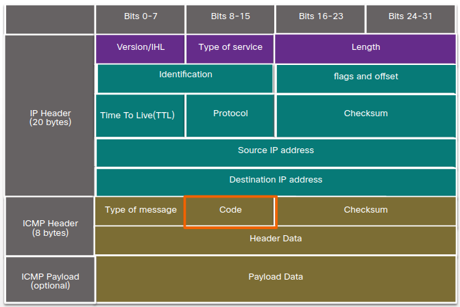

# 7.0.0 Connectivity Verification

## 7.0.1 Why Should I Take this Module?

**Do networks ever break?** Of course **they do**. Fortunately, **the developers of the IP protocols  included a testing protocol called ICMP**. **ICMP tools create special packets that test networks**. 
**Cybersecurity analysts must understand the network that normal data travels on so that they can detect abnormal behavior. ICMP can help you understand both normal and abnormal network behavior**.

## 7.1.0 ICMP

### 7.1.1 ICMPv4 messages

**Although IP is only a best-effort protocol**, the TCP/IP suite does provide for messages to be sent **in the event of certain errors**. These messages are sent using the services of ICMP. 

**The purpose of these messages is** to **provide feedback about issues related to the processing of IP packets under certain conditions**, **not to make IP reliable**.

**ICMP messages are not required and are often not allowed within a network for security reasons**.

The types of ICMP messages and the reasons why they are sent, are extensive. We will discuss some of the more common messages. **ICMP messages common to both ICMPv4 and ICMPv6 include:**

**Host confirmation**

An **ICMP Echo Message** can be used to **determine if a host is operational**. **The local host sends an ICMP Echo Request to a host. If the host is available, the destination host responds with an Echo Reply**. **This use of the ICMP Echo messages is the basis of the ping utility.**

**Destination or Service Unreachable**

When **a host or gateway receives a packet that it cannot deliver, it can use an ICMP Destination Unreachable message to notify the source that the destination or service is unreachable**. The message will include a code that indicates why the packet could not be delivered. These are some of the Destination Unreachable codes for ICMPv4:

* 0 - Net unreachable
* 1 - Host unreachable
* 2 - Protocol unreachable
* 3 - Port unreachable

**Note: ICMPv6 has similar but slightly different codes for Destination Unreachable messages.**

**Time exceeded**

**An ICMPv4 Time Exceeded message is used by a router to indicate that a packet cannot be forwarded because the Time to Live (TTL) field of the packet was decremented to 0**. If a router receives a packet and decrements the TTL field in the IPv4 packet to zero, **it discards the packet and sends a Time Exceeded message to the source host**. ICMPv6 also sends a Time Exceeded message if the router cannot forward an IPv6 packet because the packet has expired. **IPv6 does not have a TTL field. It uses the hop limit field to determine if the packet has expired.**

**Route redirection**

### 7.1.2 ICMPv6 RS and RA Messages

The informational and error messages found in ICMPv6 are very similar to the control and error messages implemented by ICMPv4. However, ICMPv6 has new features and improved functionality not found in ICMPv4. ICMPv6 messages are encapsulated in IPv6.

**ICMPv6 includes four new protocols as part of the Neighbor Discovery Protocol (ND or NDP).**

Messaging between an **IPv6 router and an IPv6 device**:
* Router Solicitation (RS) message
* Router Advertisement (RA) message

Messaging between IPv6 devices:
* Neighbor Solicitation (NS) message
* Neighbor Advertisement (NA) message

**Router solicitation**

* **RA messages are sent by routers to provide addressing information to hosts using Stateless Address Autoconfiguration (SLAAC)**. The **RA message can include addressing information for the host such as the prefix, prefix length, DNS address, and domain name.** **A router will send an RA message periodically or in response to an RS message**. **A host using SLAAC will set its default gateway to the link-local address of the router that sent the RA**.
* When a host is configured to obtain its **addressing information automatically using SLAAC**, the host will send an **RS message to the router requesting an RA message**.

**Address resolution**

* **NA messages are sent when a device knows the IPv6 address of a device but does not know its MAC address**. **This is equivalent to an ARP Request for IPv4**.
* **NA messages are sent in response to an NS message and match the target IPv6 address in the NS**. The **NA message includes the device’s Ethernet MAC address**. This is equivalent to an ARP Reply in IPv4.

**Duplicate Address Detection**

When **a device is assigned a global unicast or link-local unicast address, it is recommended that DAD is performed on the address to ensure that it is unique**. To check the uniqueness of an address, **the device will send an NS message with its own IPv6 address as the targeted IPv6 address**. **If another device on the network has this address, it will respond with an NA message**. This **NA message will notify the sending device that the address is in use**. If a corresponding **NA message is not returned within a certain period of time**, the **unicast address is unique and acceptable for use**.

Note: DAD is not required, but RFC 4861 recommends that DAD is performed on unicast addresses.

### 7.2.2 Ping - Test Connectivity

**Ping is an IPv4 and IPv6 testing utility that uses ICMP echo request and echo reply messages to test connectivity between hosts**.

To **test connectivity to another host on a network, an echo request is sent to the host address using the ping command**. If **the host at the specified address receives the echo request, it responds with an echo reply**. As **each echo reply is received, ping provides feedback on the time between when the request was sent and when the reply was received**. **This can be a measure of network performance**.

**Ping has a timeout value for the reply**. If a reply is not received within the timeout, **ping provides a message indicating that a response was not received**. This **may indicate that there is a problem**, but could also indicate that **security features blocking ping messages have been enabled on the network**. It is common for the first ping to timeout if address resolution (ARP or ND) needs to be performed before sending the ICMP Echo Request.

Type of connectivity tests performed with ping include the following:
* Pinging the local loopback
* Pinging the default gateway
* Pinging the remote host

### 7.2.3 Ping the Loopback

Ping can be used to test the internal configuration of IPv4 or IPv6 on the local host. To perform this test, ping the local loopback address of 127.0.0.1 for IPv4 (::1 for IPv6). A response indicates that IP is properly installed on the host. **This response comes from the network layer**. **This response is not, however, an indication that the addresses, masks, or gateways are properly configured**. **Nor does it indicate anything about the status of the lower layer of the network stack**. This simply **tests IP down through the network layer of IP**. An error message indicates **that TCP/IP is not operational on the host**.

### 7.2.4 Ping the Default Gateway

You can also **use ping to test the ability of a host to communicate on the local network**. This is generally done **by pinging the IP address of the default gateway of the host**. **A successful ping to the default gateway indicates that the host and the router interface serving as the default gateway are both operational on the local network**.

For this test, **the default gateway address is most often used because the router is normally always operational**. If **the default gateway address does not respond, a ping can be sent to the IP address of another host on the local network that is known to be operational**.

### 7.2.5 Ping a Remote Host

Ping can also be used to test **the ability of a local host to communicate across an internetwork**. The **local host can ping an operational IPv4 host of a remote network**. The **router uses its IP routing table to forward the packets**. If **this ping is successful**, the **operation of a large piece of the internetwork can be verified**. A **successful ping across the internetwork confirms communication on the local network**, the **operation of the router serving as the default gateway**, and **the operation of all other routers that might be in the path between the local network and the network of the remote host**.

The **functionality of the remote host can be verified**. If **the remote host could not communicate outside of its local network**, it would not have responded.

**Note: Many network administrators limit or prohibit the entry of ICMP messages into the corporate network; therefore, the lack of a ping response could be due to security restrictions.**

### 7.2.6 Traceroute - Test the Path

**Ping is used to test connectivity between two hosts but does not provide information about the details of devices between the hosts**. **Traceroute (tracert) is a utility that generates a list of hops that were successfully reached along the path**. This **list can provide important verification and troubleshooting information**.

**If the data reaches the destination**, then **the trace lists the interface of every router in the path between the hosts**. **If the data fails at some hop along the way**, **the address of the last router that responded to the trace can provide an indication of where the problem or security restrictions are found**.

#### Round Trip Time (RTT)

Using **traceroute provides round-trip time for each hop along the path and indicates if a hop fails to respond**. The **round-trip time is the time a packet takes to reach the remote host and for the response from the host to return**. **An asterisk (*) is used to indicate a lost or unreplied packet**.

This information **can be used to locate a problematic router in the path or may indicate that the router is configured not to reply**. If **the display shows high response times or data losses from a particular hop**, this **is an indication that the resources of the router or its connections may be overused**.

#### IPv4 TTL and IPv6 Hop Limit

Traceroute makes use of a function of the TTL field in IPv4 and the Hop Limit field in IPv6 in the **Layer 3 headers**, along with the ICMP Time Exceeded message. 

The **first sequence of messages sent from traceroute will have a TTL field value of 1**. **This causes the TTL to time out the IPv4 packet at the first router. This router then responds with an ICMPv4 Time Exceeded message. Traceroute now has the address of the first hop**.

**Traceroute then progressively increments the TTL field (2, 3, 4...) for each sequence of messages**. **This provides the trace with the address of each hop as the packets time out further down the path**. The **TTL field continues to be increased until the destination is reached, or it is incremented to a predefined maximum**.

After the final destination is reached, the host responds with either an ICMP Port Unreachable message or an ICMP Echo Reply message instead of the ICMP Time Exceeded message.

### 7.2.7 ICMP Packet Format

**ICMP is encapsulated directly into IP packets**. In this sense, **it is almost like a transport layer protocol, because it is encapsulated into a packet, however it is considered to be a Layer 3 protocol**. **ICMP acts as a data payload within the IP packet**. It has a special header data field.

**ICMP uses message codes to differentiate between different types of ICMP messages**. These are some common message codes:

* 0: Echo reply (response to a ping)
* 3: Destination Unreachable
* 5: Redirect (use another route to your destination)
* 8: Echo request (for ping)
* 11: Time Exceeded (TTL became 0)

**A cybersecurity analyst knows that the optional ICMP payload field can be used in an attack vector to exfiltrate data**.

## 7.3.0 Connectivity Verification Summary

### 7.3.1 What Did I Learn in this Module?

ICMP

The **TCP/IP suite sends ICMP messages when IP packets encounter forwarding problems**. However, **ICMP messages are not required and are often not allowed within a network for security reasons**. **ICMPv4 is the messaging protocol for IPv4, while ICMPv6 provides these same services for IPv6 and includes additional functionality**. ICMP messages that are common to both ICMPv4 and ICMPv6 include host confirmation, destination or service unreachable, time exceeded, and route redirection. **ICMPv6 includes the additional four ICMPv6 messages for the Neighbor Discovery Protocol (NDP)**. **These messages are router solicitation (RS) and router advertisements (RA) messages that are sent between IPv6 routers and IPv6 hosts**, and neighbor solicitation (NS) and neighbor advertisement (NA) messages that are sent between IPv6 devices.

Ping and Traceroute Utilities

**Ping is an IPv4 and IPv6 testing utility that uses ICMP echo request and echo reply messages to test connectivity between hosts**. Some of the types of connectivity tests that are performed with ping include **pinging the local loopback, pinging the default gateway, and pinging a remote host**. **Traceroute (tracert) is a utility that generates a list of the router hops that were successfully reached along a path. This provides important verification and troubleshooting information**. **Traceroute makes use of a function of the TTL field in IPv4 and the Hop Limit field in the IPv6 Layer 3 headers**, along with the ICMP Time Exceeded message. ICMP is encapsulated directly into IP packets as the data payload. The ICMP data payload contains special header data fields.

### 7.3.2 Module 7: Connectivity Verification Quiz

*1 What is indicated by a successful ping to the ::1 IPv6 address? **IP is properly installed on the host**. Topic 7.2.0 - The IPv6 address ::1 is the loopback address. A successful ping to this address means that the TCP/IP stack is correctly installed. It does not mean that any addresses are correctly configured.

* A user complains that the workstation cannot access the network. The network technician asks the user to issue the ping 127.0.0.1 command. What is the purpose of using this command? **to verify that the TCP/IP stack is operational**. Topic 7.2.0 - The ping 127.0.0.1 command is used to verify the proper operation of the TCP/IP protocol stack from the network layer to the physical layer - and back. This operation of this command does not  actually put a signal on the network media.

* What process is used in ICMPv6 for a host to verify that an IPv6 address is unique before configuring it on an interface? **DAD (Duplicate Address Detection)**. Topic 7.1.0 - Before an IPv6 host can enable and use an assigned IPv6 address, the host must verify that the address is unique on the network. To verify that no other hosts are using the IPv6 address, the host performs the duplicate address detection (DAD) process by sending a Neighbor Solicitation (NS) message to the IPv6 address. 

* A network administrator can successfully ping the server at www.cisco.com, but cannot ping the company web server located at an ISP in another city. Which tool or command would help identify the specific router where the packet was lost or delayed? **traceroute**. Topic 7.2.0 - The traceroute command provides connectivity information about the path a packet takes to reach the destination and about every router (hop) along the way. It also indicates how long a packet takes to get from the source to each hop and back.

* A user executes a traceroute over IPv6. At what point would a router in the path to the destination device drop the packet? **when the value of the HOP Limite Field reaches zero**. Topic 7.2.0 - When a traceroute is performed, the value in the Hop Limit field of an IPv6 packet determines how many router hops the packet can travel. Once the Hop Limit field reaches a value of zero, it can no longer be forwarded and the receiving router will drop the packet.

1. Which ICMPv6 message is sent when the IPv6 hop limit field of a packet is decremented to zero and the packet cannot be forwarded? **time exceeded**. Topic 7.1.0 - ICMPv6 uses the hop limit field in the IPv6 packet header to determine if the packet has expired. If the hop limit field has reached zero, a router will send a time exceeded message back towards the source indicating that the router cannot forward the packet.

1. What message is sent by a host to check the uniqueness of an IPv6 address before using that address? **NS (Neighbor solicitation)**. Topic 7.1.0 - In IPv6, Duplicate Address Detection (DAD) is used in place of ARP. An IPv6 host performs DAD by sending a neighbor solicitation (NS) message to its own IPv6 address to ensure the uniqueness of the address prior to using it.

1. Which protocol is used by ping to test connectivity between network hosts? **ICMP**. Topic 7.1.0 - The Internet Control Message Protocol (ICMP) is used by ping to test connectivity between network hosts. The Address Resolution Protocol (ARP) is used to map IP addresses to MAC addresses. The Dynamic Host Configuration Protocol (DHCP) is used to dynamically assign IP addresses to network hosts. The Transmission Control Protocol (TCP) is considered a reliable protocol that segments the application layer data into segments for transmission.

1. A user issues a ping 2001:db8:3040:114::88 command and receives a response that includes a code of 3. What does this code represent? **port unreachable**. Topic 7.1.0 -
When a host or gateway receives a packet that it cannot deliver, it can use an ICMP Destination Unreachable message to notify the source that the destination or service is unreachable. The message will include a code that indicates why the packet could not be delivered. These are some of the Destination Unreachable codes for ICMPv4:

    0 : net unreachable
    1 : host unreachable
    2 : protocol unreachable
    3 : port unreachable 

1. A user issues a ping 192.168.219.8 command and receives a response that includes a code of 0. What does this code represent? **network unreachable**. Topic 7.1.0 -
When a host or gateway receives a packet that it cannot deliver, it can use an ICMP Destination Unreachable message to notify the source that the destination or service is unreachable. The message will include a code that indicates why the packet could not be delivered. These are some of the Destination Unreachable codes for ICMPv4:

    0 : net unreachable
    1 : host unreachable
    2 : protocol unreachable
    3 : port unreachable 

1. What characterizes a traceroute utility? **it identifies the routers in the path from a source host to a destination host**. Topic 7.2.0 - Traceroute is a utility that generates a list of hops (or routers) along the path from a source host to the destination host.

1. Why would a manager need to use the tracert command? **to display a list of the near-side router interfaces between the source device and the destination device**. Topic 7.2.0 - Tracert is a utility that generates a list of hops that were successfully reached along the path. This list can provide important verification and troubleshooting information. If the data reaches the destination, then the trace lists the interface of every router in the path between the hosts. If the data fails at some hop along the way, the address of the last router that responded to the trace can provide an indication of where the problem or security restrictions are found.

1. Which protocol supports Stateless Address Autoconfiguration (SLAAC) for dynamic assignment of IPv6 addresses to a host? **ICMPv6**. Topic 7.1.0 - SLAAC uses ICMPv6 messages when dynamically assigning an IPv6 address to a host. DHCPv6 is an alternate method of assigning an IPv6 addresses to a host. ARPv6 does not exist. Neighbor Discovery Protocol (NDP) provides the functionality of ARP for IPv6 networks. UDP is the transport layer protocol used by DHCPv6.