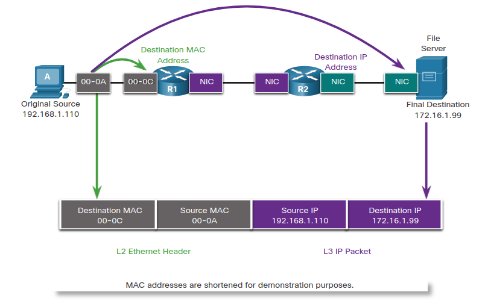

# 8.0.0 Address Resolution Protocol

## 8.0.1 Introduction

**Did you ever wonder how information that you send gets delivered to the correct device?** 

This module will explain **how the combination of a logical address and a physical address enable communication between two hosts**. You will learn **how ARP (Address Resolution Protocol) is used in an IPv4 network to create this association**.

## 8.1.0 MAC and IP

### 8.1.1 Destination on same network

**There are two primary addresses** assigned to a device on an Ethernet LAN:

1. Physical address (MAC address): this is used for **Ethernet NIC to Ethernet NIC** communication on the same network.
1. Logical address (IP address): This is used **to send the packet from the original source to the final destination**. **IP addresses are used to identify the address of the original source device and the final destination device**. The **destination IP address may be on the same IP network as the source or may be on a remote network**.

Note: Most applications use DNS (Domain Name System) to determine the IP address when given a domain name such as www.cisco.com. DNS is discussed in a later module.

**Ethernet MAC addresses, have a different purpose**. These addresses are used **to deliver the data link frame with the encapsulated IP packet from one NIC to another NIC on the same network**. If **the destination IP address is on the same network**, **the destination MAC address will be that of the destination device**.

The **Layer 2** **Ethernet frame** contains:
* **Destination MAC address**: if the destination is in the same network, the MAC address will be from this host. Otherwise, will be from that can send the message, which router.
* **Source MAC address**

The **Layer 3 IP packet** contains:
* **Source IP address**: who send.
* **Destination IP address**: who will receive.

### 8.1.2 Destination on Remote Network

When the destination IP address **is on a remote network**, the **destination MAC address will be the address of the host’s default gateway**. 

The default gateway address **is the address of the router’s NIC**. 

**When the router receives the Ethernet frame**, **it de-encapsulates the Layer 2 information**. **Using the destination IP address, it determines the next-hop device, and then encapsulates the IP packet in a new data link frame for the outgoing interface**. Along each link in a path, an IP packet is encapsulated in a frame specific to the particular data link technology associated with that link, such as Ethernet. If the next-hop device is the final destination, the destination MAC address will be that of the device’s Ethernet NIC.

How **are the IPv4 addresses of the IPv4 packets in a data flow associated with the MAC addresses on each link along the path to the destination?** This is done through **a process called Address Resolution Protocol (ARP)**.

## 8.2.0 ARP

### 8.2.1 ARP Overview

If your network is using the IPv4 communications protocol, the Address Resolution Protocol, or ARP, **is what you need to map IPv4 addresses to MAC addresses**. 

**Every IP device on an Ethernet network has a unique Ethernet MAC address**. **When a device sends an Ethernet Layer 2 frame, it contains these two addresses**:

* **Destination MAC address**: The Ethernet MAC address of the **destination device on the same local network segment**. If the destination host is on another network, then the destination address **in the frame would be that of the default gateway **(i.e., router).
* **Source MAC address**: The MAC address of the Ethernet NIC on the source host.

To send a packet to another host on the same local IPv4 network, a host must know the IPv4 address and the MAC address of the destination device. Device destination IPv4 addresses are either known or resolved by device name. However, **MAC addresses must be discovered**.

**A device uses Address Resolution Protocol (ARP)** **to determine the destination MAC address of a local device when it knows its IPv4 address**.

**ARP provides two basic functions**:
* Resolving IPv4 addresses to MAC addresses
* Maintaining a table of IPv4 to MAC address mappings

### 8.2.2 ARP Functions

When a packet is sent **to the data link layer** to be encapsulated into an Ethernet frame, the **device refers to a table in its memory to find the MAC address that is mapped to the IPv4 address**. This table is stored temporarily in RAM memory and called the ARP table or the ARP cache.

* If the packet’s destination IPv4 address **is on the same network as the source IPv4 address**, the device will search the ARP table for the destination IPv4 address.
* If the destination IPv4 address **is on a different network than the source IPv4 address**, the device will search the ARP table for the IPv4 address of the **default gateway**.

The ARP table** temporarily saves (caches) the mapping** for the devices on the LAN.

If the device locates the IPv4 address, its corresponding MAC address is used as the destination MAC address in the frame. **If there is no entry is found, then the device sends an ARP request**.

### 8.2.3 ARP Operation - ARP Request

An **ARP request is sent when a device needs to determine the MAC address that is associated with an IPv4 address**, and it does not have an entry for the IPv4 address in its ARP table.

ARP messages are encapsulated directly within an Ethernet frame. There is no IPv4 header. The ARP request is encapsulated in an Ethernet frame using the following header information:

* **Destination MAC address**: **This is a broadcast address FF-FF-FF-FF-FF-FF requiring all Ethernet NICs on the LAN to accept and process the ARP request**.
* **Source MAC address**: This is MAC address of the sender of the ARP request.
* **Type**: ARP messages have a type field of 0x806. This informs the receiving NIC that the **data portion of the frame needs to be passed to the ARP process**.

**Because ARP requests are broadcasts**, **they are flooded out all ports by the switch, except the receiving port**. **All Ethernet NICs on the LAN process broadcasts and must deliver the ARP request to its operating system for processing**. Every device must process the ARP request to see if the target IPv4 address matches its own. A router will not forward broadcasts out other interfaces.

Only one device on the LAN will have an IPv4 address that matches the target IPv4 address in the ARP request. All other devices will not reply.

### 8.2.4 ARP Operation - ARP Reply

Only the device with the target IPv4 address associated with the ARP request will respond with an ARP reply. The ARP reply is encapsulated in an Ethernet frame using the following header information:

* **Destination MAC address**: This is the MAC address of **the sender of the ARP request**.
* **Source MAC address**: This is the MAC address of **the sender of the ARP reply**.
* **Type**: ARP messages have a type field of 0x806. This informs the receiving NIC that the data portion of the frame needs to be passed to the ARP process.

**Only the device that originally sent the ARP request will receive the unicast ARP reply**. After the ARP reply is received, the device will **add the IPv4 address and the corresponding MAC address to its ARP table**. Packets destined for that IPv4 address can now be encapsulated in frames using its corresponding MAC address.

**If no device responds to the ARP request, the packet is dropped because a frame cannot be created.**

**Entries in the ARP table are time stamped**. If a device does not receive a frame from a particular device before the timestamp expires, the entry for this device is removed from the ARP table.

Additionally, static map entries can be entered in an ARP table, but this is rarely done. Static ARP table entries do not expire over time and must be manually removed.

**Note: IPv6 uses a similar process to ARP for IPv4, known as ICMPv6 Neighbor Discovery (ND). IPv6 uses neighbor solicitation and neighbor advertisement messages, similar to IPv4 ARP requests and ARP replies.**

### 8.2.5 ARP Role in Remote Communication

**When the destination IPv4 address is not on the same network , the source device needs to send the frame to its default gateway**. This is the interface of the local router. **Whenever a source device has a packet with an IPv4 address on another network, it will encapsulate that packet in a frame using the destination MAC address of the router**.

The IPv4 address of the default gateway is stored in the IPv4 configuration of the hosts. When a host creates a packet for a destination, it compares the destination IPv4 address and its own IPv4 address to determine if the two IPv4 addresses are located on the same Layer 3 network. If the destination host is not on its same network, the source checks its ARP table for an entry with the IPv4 address of the default gateway. If there is not an entry, it uses the ARP process to determine a MAC address of the default gateway.

### 8.2.6 Removing Entries from an ARP Table

For each device, an ARP cache timer removes ARP entries that have not been used for a specified period of time. The times differ depending on the operating system of the device. For example, newer Windows operating systems store ARP table entries between 15 and 45 seconds.

### 8.2.7 ARP Tables on Networking Devices

**On a Cisco router**, the **show ip arp command** is used to display the ARP table.

**On a Windows 10 PC**, the **arp –a command** is used to display the ARP table.

## ARP Issues

### ARP Issues - ARP Broadcasts and ARP Spoofing

**As a broadcast frame**, an ARP request is received and processed by every device on the local network. On a typical business network, these broadcasts would probably have minimal impact on network performance. However, **if a large number of devices were to be powered up and all start accessing network services at the same time**, there could be some reduction in performance for a short period of time. After the devices send out the initial ARP broadcasts and have learned the necessary MAC addresses, any impact on the network will be minimized.

In some cases, the **use of ARP can lead to a potential security risk**. A **threat actor can use ARP spoofing to perform an ARP poisoning attack**. This is a technique **used by a threat actor to reply to an ARP request for an IPv4 address that belongs to another device, such as the default gateway**. **The threat actor sends an ARP reply with its own MAC address**. **The receiver of the ARP reply will add the wrong MAC address to its ARP table and send these packets to the threat actor**.

Enterprise level switches include mitigation techniques known as dynamic ARP inspection (DAI). DAI is beyond the scope of this course.

## 8.4.0 Address Resolution Protocol Summary

### 8.4.1 What Did I Learn in this Module?

MAC and IP

There are two primary addresses that are assigned to a device on an Ethernet LAN; the IP address, which is logically assigned, and the MAC address which is physically assigned and is unique to the network interface. IP addresses are used to identify the address of the original source device and the final destination device. The destination IP address may be on the same IP network as the source or may be on a remote network. Layer 2 or physical addresses, such as Ethernet MAC addresses, have a different purpose. These addresses are used to deliver the data link frame with the encapsulated IP packet from one NIC to another NIC on the same network. If the destination IP address is on the same network, the destination MAC address will be that of the destination device.

ARP

When using IPv4 for network communication, ARP is used to map the logical IPv4 address with the Layer 2 MAC address. In order to build an Ethernet frame, the destination MAC address must be known. When the destination IPv4 address is on the same network as the source, the ARP process sends the IPv4 address to all hosts on the network so that the host with the matching IPv4 address can reply with the corresponding MAC address. The sending device now has all of the information that is necessary to build the Layer 2 Ethernet frame. ARP provides two basic functions: resolving IPv4 addresses to MAC addresses and maintaining a table of IPv4 to MAC address mappings. The sending device will search its ARP table for a destination IPv4 address and a corresponding MAC address. If the packet’s destination IPv4 address is on the same network as the source IPv4 address, the device will search the ARP table for the destination IPv4 address. If it does not have an entry for the IPv4 address in its ARP table, the sending device sends out an ARP request to determine the destination MAC address. Only the device with the target IPv4 address associated with the ARP request will respond with an ARP reply. The ARP reply is encapsulated in an Ethernet frame using the following header information: the destination MAC address of the requesting host, the source MAC address of the replying host, and the type, which is a code that identifies the data as being for the ARP process. ARP messages have a type field value of 0x806. If the destination IPv4 address is on a different network than the source IPv4 address, the device will search the ARP table for the IPv4 address of the default gateway. IPv6 uses a similar process to ARP in IPv4. It is known as ICMPv6 Neighbor Discovery (ND). IPv6 uses neighbor solicitation and neighbor advertisement messages, similar to IPv4 ARP requests and ARP replies.

ARP Issues

As a broadcast frame, an ARP request is received and processed by every device on the local network. On a typical business network, these broadcasts would probably have minimal impact on network performance. If a large number of devices were to be powered up and all start accessing network services at the same time, there could be some reduction in performance for a short period of time. After the devices send out the initial ARP broadcasts and have learned the necessary MAC addresses, any impact on the network will be minimized. Since the ARP request is a broadcast there is are potential security risks imposed. A threat actor can use ARP spoofing to perform an ARP poisoning attack by replying to an ARP request for an IPv4 address belonging to another device, such as the default gateway. The receiver of the ARP reply will add the wrong MAC address to its ARP table and send these packets to the threat actor.

### 8.4.2 Module 8: Address Resolution Protocol Quiz

* A host is transmitting a broadcast. Which host or hosts will receive it? Topic 5.2.0 - A broadcast is delivered to every host that has an IP address within the same network. **All hosts in the same network**

* Which statement describes a characteristic of cloud computing? Topic 5.1.0 - Cloud computing allows users to access applications, back up and store files, and perform tasks without needing additional software or servers. Cloud users access resources through subscription-based or pay-per-use services, in real time, using nothing more than a web browser. **Applications can be accessed over the Internet by individual users or businesses using any device, anywhere in the world.**

* A network administrator can successfully ping the server at www.cisco.com, but cannot ping the company web server located at an ISP in another city. Which tool or command would help identify the specific router where the packet was lost or delayed? Topic 5.1.0 - The **traceroute command** provides connectivity information about the path a packet takes to reach the destination and about every router (hop) along the way. It also indicates how long a packet takes to get from the source to each hop and back.

* Which OSI model layer contains protocols for process-to-process communication? Topic 5.2.0 - The application layer of the OSI model is responsible for communication between processes. Examples of protocols at the application layer are DHCP, DNS, and HTTP. **Application**

* At which OSI layer is a destination port number added to a PDU during the encapsulation process? Topic 5.3.0 -  **Transport Layer**

* What process involves placing one PDU inside of another PDU? Topic 5.3.0 - When a message is placed inside of another message, this is known as encapsulation. On networks, encapsulation takes place when one protocol data unit is carried inside of the data field of the next lower protocol data unit. **Encapsulation**

* Which statement accurately describes a TCP/IP encapsulation process when a PC is sending data to the network? Topic 5.3.0 - When the data is traveling from the PC to the network, the transport layer sends segments to the internet layer. The internet layer sends packets to the network access layer, which creates frames and then converts the frames to bits. The bits are released to the network media. **Segments are sent from the transport layer to the internet layer**

* A web client is receiving a response for a web page from a web server. From the perspective of the client, what is the correct order of the protocol stack that is used to decode the received transmission? Topic 5.3.0 - 1. HTTP governs the way that a web server and client interact.
2. TCP manages individual conversations between web servers and clients.
3. IP is responsible for delivery across the best path to the destination.
4. Ethernet takes the packet from IP and formats it for transmission. **Ethernet, IP, TCP, HTTP**.

* How does BYOD change the way in which businesses implement networks? Topic 5.1.0 - A BYOD environment requires an organization to accommodate a variety of devices and access methods. Personal devices, which are not under company control, may be involved, so security is critical. Onsite hardware costs will be reduced, allowing a business to focus on delivering collaboration tools and other software to BYOD users. **BYOD provides flexibility in where and how users can access network resources**

* In computer communication, what is the purpose of message encoding? Topic 5.2.0 - Before a message is sent across a network it must first be encoded. Encoding is the process of converting the data message into another format suitable for transmission across the physical medium. Each bit of the message is encoded into a pattern of sounds, light waves, or electrical impulses depending on the network media over which the bits are transmitted. The destination host receives and decodes the signals in order to interpret the message. **to convert information to the appropriate form for transmission**

* Which statement is true about the TCP/IP and OSI models? Topic 5.2.0 - The TCP/IP internet layer provides the same function as the OSI network layer. The transport layer of both the TCP/IP and OSI models provides the same function. The TCP/IP application layer includes the same functions as OSI Layers 5, 6, and 7. **the TCP/IP transport layer and OSI Layer 4 provides similar services and functions**

* What method can be used by two computers to ensure that packets are not dropped because too much data is being sent too quickly? Topic 5.2.0 - In order for two computers to be able to communicate effectively, there must be a mechanism that allows both the source and destination to set the timing of the transmission and receipt of data. Flow control allows for this by ensuring that data is not sent too fast for it to be received properly. **flow control**

