# 9.0.0 Transport Layer

## 9.1.0 Transport Layer Characteristics

### 9.1.1 Role of the transport layer

**Application layer programs generate data that must be exchanged between source and destination hosts**. The **transport layer is responsible for logical communications** **between applications running on different hosts**. This may include services such as establishing a temporary session between two hosts and the reliable transmission of information for an application.

**The transport layer has no knowledge of the destination host type, the type of media over which the data must travel, the path taken by the data, the congestion on a link, or the size of the network**.

The transport layer includes two protocols:

* Transmission Control Protocol (TCP)
* User Datagram Protocol (UDP)
  
### 9.1.2 Transport Layer Responsibilities

The transport layer has many responsibilities:

1. **Tracking Individual Conversations**: At the transport layer, **each set of data flowing between a source application and a destination application is known as a conversation** **and is tracked separately**. **It is the responsibility of the transport layer to maintain and track these multiple conversations**. A host may have multiple applications that are communicating across the network simultaneously. Most networks have a limitation on the amount of data that can be included in a single packet. Therefore, **data must be divided into manageable pieces**.
2. **Segmenting Data and Reassembling Segments**: It is the transport layer **responsibility to divide the application data into appropriately sized blocks**. Depending on the transport layer protocol used, the transport layer **blocks are called either segments or datagrams**. The transport layer divides the data into smaller blocks (i.e., segments or datagrams) that are easier to manage and transport.
3. **Add Header Information**: The **transport layer protocol also adds header information containing binary data organized into several fields to each block of data**. It is the values in these fields **that enable various transport layer protocols to perform different functions in managing data communication**. For instance, the header information is used by the receiving host to reassemble the blocks of data into a complete data stream for the receiving application layer program. **The transport layer ensures that even with multiple application running on a device, all applications receive the correct data**.
4. **Identifying the Applications**: The transport layer must be able **to separate and manage multiple communications with different transport requirement needs**. To pass data streams to the proper applications, the **transport layer identifies the target application using an identifier called a port number**. **Each software process that needs to access the network is assigned a port number unique to that host**.
5. **Conversation Multiplexing**: Sending some types of data (e.g., a streaming video) across a network, as one complete communication stream, can consume all the available bandwidth. This would prevent other communication conversations from occurring at the same time. It would also make error recovery and retransmission of damaged data difficult. **The transport layer uses segmentation and multiplexing to enable different communication conversations to be interleaved on the same network**. Error checking can be performed on the data in the segment, to determine if the segment was altered during transmission.

### 9.1.3 Transport Layer Protocols

**IP is concerned only with the structure, addressing, and routing of packets**. **IP does not specify how the delivery or transportation of the packets takes place**. **Transport layer protocols specify how to transfer messages between hosts**, and are responsible for managing reliability requirements of a conversation. The transport layer includes the TCP and UDP protocols.

Different applications have different transport reliability requirements. Therefore, TCP/IP provides two transport layer protocols, as shown in the figure.

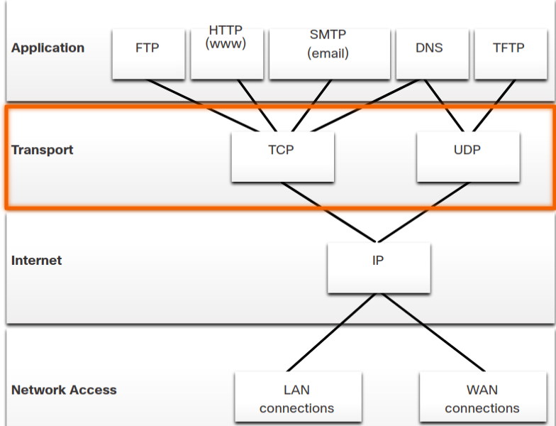

### 9.1.4 Transmission Control Protocol (TCP)

TCP is considered a reliable, full-featured transport layer protocol, which ensures that all of the data arrives at the destination. TCP includes fields which ensure the delivery of the application data. These fields require additional processing by the sending and receiving hosts.

Note: TCP divides data into segments.

TCP **provides reliability and flow control using these basic operations**:

* Number and track data segments transmitted to a specific host from a specific application
* Acknowledge received data
* Retransmit any unacknowledged data after a certain amount of time
* Sequence data that might arrive in wrong order
* Send data at an efficient rate that is acceptable by the receiver

In order to maintain the state of a conversation and track the information, **TCP must first establish a connection between the sender and the receiver**. **This is why TCP is known as a connection-oriented protocol**.

### TCP Header

TCP is a stateful protocol which means **it keeps track of the state of the communication session**. **To track the state of a session, TCP records which information it has sent and which information has been acknowledged**. **The stateful session begins with the session establishment and ends with the session termination**.

A TCP segment adds 20 bytes (i.e., 160 bits) of overhead when encapsulating the application layer data. The figure shows the fields in a TCP header.

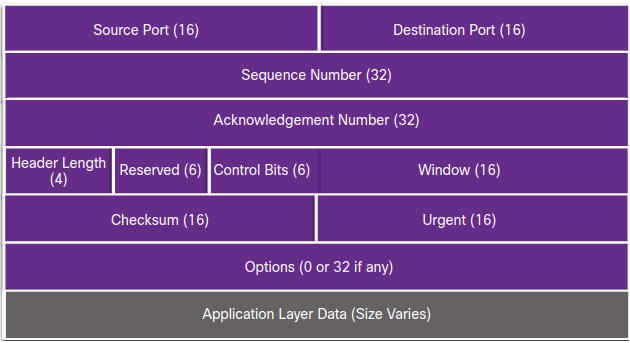

### 9.1.6 TCP Header Fields

|TCP Header Field | Description                                                          |
|-----------------|----------------------------------------------------------------------|
|Source Port      |A 16-bit field used to identify the **source application by port number**|
|Destination Port|A 16-bit field used to identify the **destination application by port number**|
|Sequence Number |A 32-bit field used for **data reassembly purposes**|
|Acknowledgment Number |A 32-bit field used to indicate that **data has been received and the next byte expected from the source**|
|Header Length |A 4-bit field known as ʺdata offsetʺ that **indicates the length of the TCP segment header**|
|Reserved|A 6-bit field that **is reserved for future use**.|
|Control bits |A 6-bit field that **includes bit codes**, or flags, which **indicate the purpose and function of the TCP segment**|
|Window size |A 16-bit field used to **indicate the number of bytes that can be accepted at one time**|
|Checksum |A 16-bit field **used for error checking of the segment header and data**|
|Urgent|A 16-bit field used to **indicate if the contained data is urgent**|

### 9.1.7 User Datagram Protocol (UDP)

**UDP is a simpler transport layer protocol than TCP**. It **does not provide reliability and flow control**, which means **it requires fewer header fields**. Because the sender and the receiver UDP processes **do not have to manage reliability and flow control**, **this means UDP datagrams can be processed faster than TCP segments**. **UDP provides the basic functions for delivering datagrams between the appropriate applications**, with very little overhead and data checking.

Note: UDP divides data into datagrams that are also referred to as segments.

UDP **is a connectionless protocol**. Because **UDP does not provide reliability or flow control**, **it does not require an established connection**. Because **UDP does not track information sent or received between the client and server, UDP is also known as a stateless protocol**.

UDP is also known as a best-effort delivery protocol because there is no acknowledgment that the data is received at the destination. With UDP, there are no transport layer processes that inform the sender of a successful delivery.

UDP is like placing a regular, nonregistered, letter in the mail. The sender of the letter is not aware of the availability of the receiver to receive the letter. Nor is the post office responsible for tracking the letter or informing the sender if the letter does not arrive at the final destination.

### 9.1.8 UDP Header

UDP **is a stateless protocol**, **meaning neither the client, nor the server, tracks the state of the communication session**. **If reliability is required when using UDP as the transport protocol, it must be handled by the application**.

**One of the most important requirements for delivering live video and voice over the network is that the data continues to flow quickly**. Live video and voice applications can tolerate some data loss with minimal or no noticeable effect, and are perfectly suited to UDP.

The blocks of communication in UDP are called datagrams, or segments. These datagrams **are sent as best effort by the transport layer protocol**.

The UDP header is far simpler than the TCP header because it only has four fields and requires 8 bytes (i.e., 64 bits). The figure shows the fields in a UDP header.

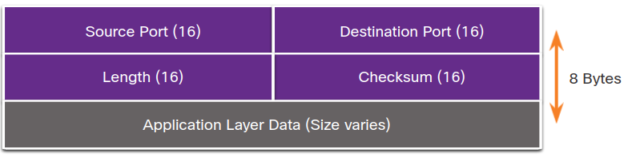

### 9.1.9 UDP Header Fields
|TCP Header Field | Description                                                          |
|-----------------|----------------------------------------------------------------------|
|Source Port      |A 16-bit field used to identify the **source application by port number**|
|Destination Port|A 16-bit field used to identify the **destination application by port number**|
|Lenght |A 16-bit field that indicates the length of the UDP datagram header|
|Checksum|A 16-bit field used for **error checking of the datagram header and data**|

### 9.1.10 Socket Pairs

**The source and destination ports are placed within the segment**. **The segments are then encapsulated within an IP packet**. **The IP packet contains the IP address of the source and destination**. The **combination of the source IP address and source port number, or the destination IP address and destination port number is known as a socket**.

The socket is used to identify the server and service being requested by the client. **A client socket might look like this, with 1099 representing the source port number: 192.168.1.5:1099** **The socket on a web server might be 192.168.1.7:80**.

**Together, these two sockets combine to form a socket pair: 192.168.1.5:1099, 192.168.1.7:80**.

Sockets enable multiple processes, running on a client, to distinguish themselves from each other, and multiple connections to a server process to be distinguished from each other.

The source port number acts as a return address for the requesting application. The transport layer keeps track of this port and the application that initiated the request so that when a response is returned, it can be forwarded to the correct application.

### 9.1.11 Check Your Understanding – Compare TCP and UDP Characteristics

* **UDP**
  * less overhead
  * fast transmission requirements
  * no acknowledgement of receipt
  * connectionless
  * no ordered delivery
* **TPC**
  * guaranteed delivery
  * ordered delivery
  * sequenced message segments
  * flow control
  * session establishment

## 9.2.0 Transport Layer Session Establishment

### 9.2.1 TCP Server Processes

**Each application process running on a server is configured to use a port number**. The **port number is either automatically assigned or configured manually by a system administrator**.
An individual server **cannot have two services assigned to the same port number within the same transport layer services**. For example, a host running a web server application and a file transfer application cannot have both configured to use the same port, such as TCP port 80.
An active server application assigned to a specific port is considered open, which means that the transport layer accepts, and processes segments addressed to that port. Any incoming client request addressed to the correct socket is accepted, and the data is passed to the server application. There can be many ports open simultaneously on a server, one for each active server application.

### 9.2.2 TCP Connection Establishment

**In TCP connections, the host client establishes the connection with the server using the three-way handshake process**.

1. **Step 1**: SYN: The initiating client requests a client-to-server communication session with the server.
2. **Step 2**: The server acknowledges the client-to-server communication session and requests a server-to-client communication session.
3. **Step 3**: The initiating client acknowledges the server-to-client communication session.

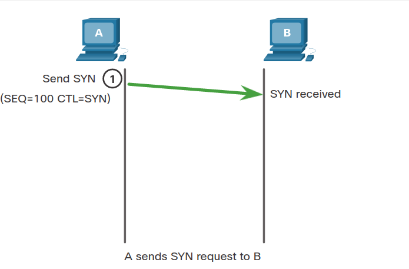
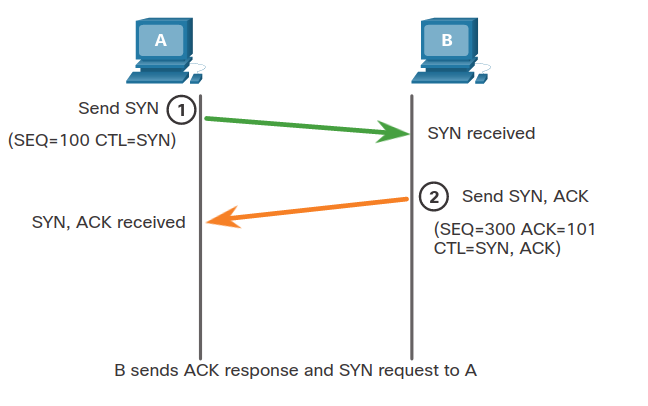
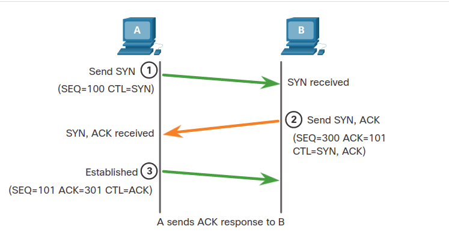

### 9.2.3 Session Termination

**To close a connection**, the **Finish (FIN) control flag must be set in the segment header**. To end each one-way TCP session, **a two-way handshake, consisting of a FIN segment and an Acknowledgment (ACK) segment**, is used. Therefore, to terminate a single conversation supported by TCP, **four exchanges are needed to end both sessions**. Either the client or the server can initiate the termination.

1. **Step 1**: FIN: When the client has no more data to send in the stream, it sends a segment with the FIN flag set.
2. **Step 2**: ACK: The server sends an ACK to acknowledge the receipt of the FIN to terminate the session from client to server.
3. **Step 3**: FIN: The server sends a FIN to the client to terminate the server-to-client session.
4. **Step 4**: ACK: The client responds with an ACK to acknowledge the FIN from the server.

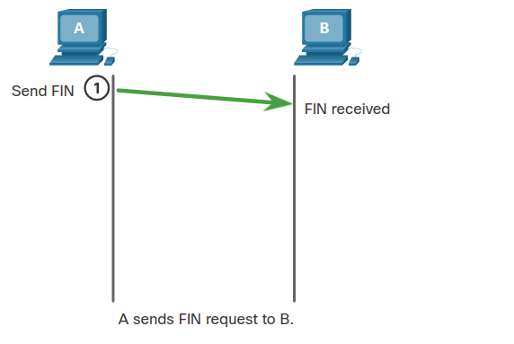
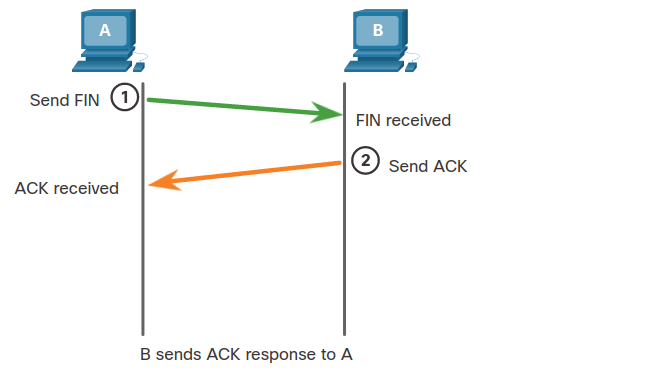
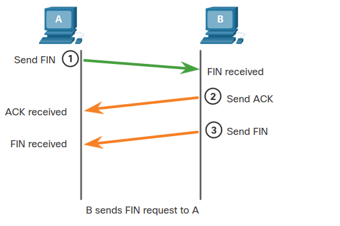
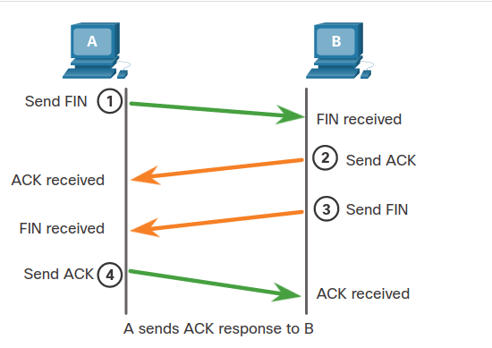

**When all segments have been acknowledged, the session is closed.**

### 9.2.4 TCP Three-way Handshake Analysis

Hosts maintain state, track each data segment within a session, and exchange information about what data is received using the information in the TCP header. **TCP is a full-duplex protocol**, **where each connection represents two one-way communication sessions**. To establish the connection, **the hosts perform a three-way handshake**. **Control bits in the TCP header indicate the progress and status of the connection**.

**These are the functions of the three-way handshake**:

* It establishes that the destination device is present on the network.
* It verifies that the destination device has an active service and is accepting requests on the destination port number that the initiating client intends to use.
* It informs the destination device that the source client intends to establish a communication session on that port number.

After the communication is completed the sessions are closed, and the connection is terminated. The connection and session mechanisms enable TCP reliability function.

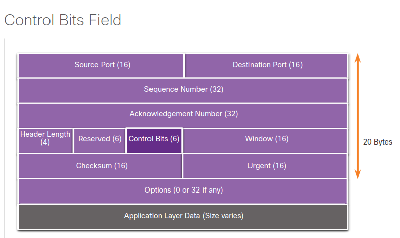

The six bits in the Control Bits field of the TCP segment header are also known as flags. A flag is a bit that is set to either on or off.

The six control bits flags are as follows:

* URG - Urgent pointer field significant
* ACK - Acknowledgment flag used in connection establishment and session termination
* PSH - Push function
* RST - Reset the connection when an error or timeout occurs
* SYN - Synchronize sequence numbers used in connection establishment
* FIN - No more data from sender and used in session termination